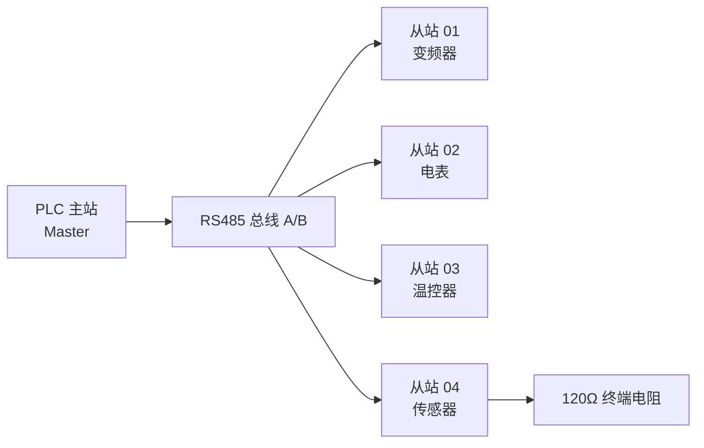
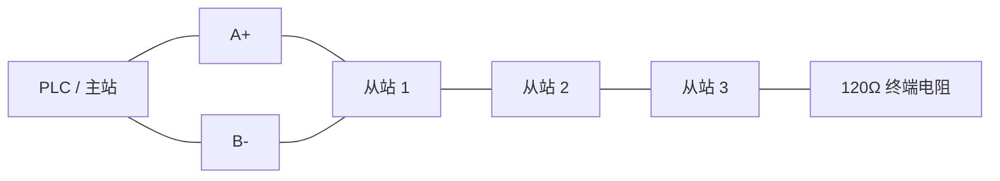
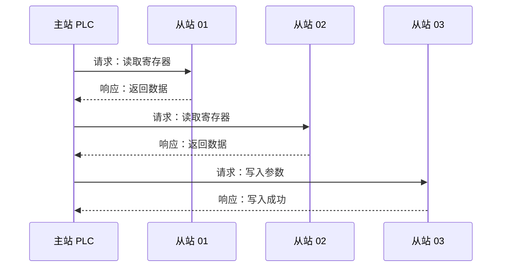
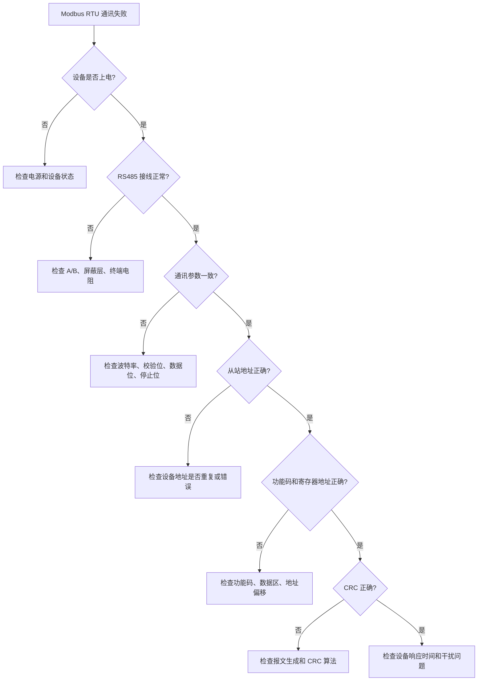
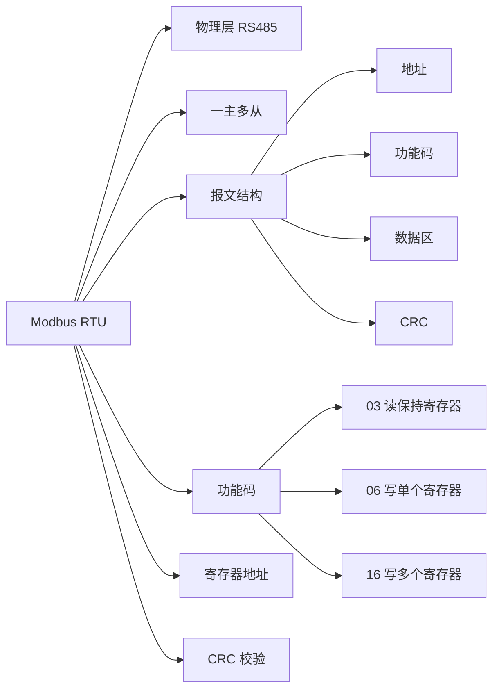

## 01｜核心概念

> [!info] 核心概念
> - **协议类型**：串行通信协议
> - **通讯方式**：主站轮询，从站应答
> - **常用物理层**：RS485 / RS232
> - **典型结构**：一主多从
> - **常见设备**：PLC、变频器、温控器、电表、流量计、传感器
> - **核心动作**：读寄存器、写寄存器、读线圈、写线圈

---

## 02｜Modbus RTU 系统结构图



> [!tip] 结构记忆
> **一个主站发命令，多个从站等点名。点到谁，谁回答。**

---

## 03｜Modbus RTU 报文结构

Modbus RTU 报文由 **从站地址 + 功能码 + 数据区 + CRC 校验** 组成。

```text
┌──────────┬──────────┬──────────────┬────────────┐
│ 从站地址  │ 功能码    │ 数据区        │ CRC 校验   │
│ 1 Byte   │ 1 Byte   │ N Bytes      │ 2 Bytes    │
└──────────┴──────────┴──────────────┴────────────┘
```

> [!example] 标准请求报文
> ```text
> 01 03 00 00 00 01 84 0A
> ```
>
> | 字节 | 含义 |
> |---|---|
> | 01 | 从站地址 |
> | 03 | 功能码：读保持寄存器 |
> | 00 00 | 起始地址 |
> | 00 01 | 读取数量 |
> | 84 0A | CRC 校验，低字节在前 |

---

## 04｜关键参数速查表

| 参数 | 常见值 | 说明 | 易错点 |
|---|---|---|---|
| 从站地址 | 1–247 | 每个设备唯一地址 | 地址重复会通讯异常 |
| 波特率 | 9600 / 19200 / 115200 | 通讯速度 | 主从必须一致 |
| 数据位 | 8 | 通常固定为 8 位 | 部分设备不可改 |
| 校验位 | None / Odd / Even | 无校验 / 奇校验 / 偶校验 | 主从必须一致 |
| 停止位 | 1 / 2 | 常见 1 位 | 无校验时常见 2 位 |
| 接口 | RS485 | 最常用 | A/B 极性厂家可能相反 |
| CRC | CRC16-Modbus | 报文校验 | CRC 低字节先发 |
| 通讯方式 | 半双工 | 收发不能同时进行 | 主站轮询控制节奏 |

---

## 05｜Modbus 四大数据区

| 数据区 | 英文名称 | 地址前缀 | 读写属性 | 常用功能码 | 典型用途 |
|---|---|---|---|---|---|
| 0区 | Coil | 0xxxx | 读写位 | 01 / 05 / 15 | DO 输出、启停控制 |
| 1区 | Discrete Input | 1xxxx | 只读位 | 02 | DI 输入状态 |
| 3区 | Input Register | 3xxxx | 只读字 | 04 | 传感器测量值 |
| 4区 | Holding Register | 4xxxx | 读写字 | 03 / 06 / 16 | 参数设置、运行数据 |

> [!tip] 记忆口诀
> **0 区线圈可读写，1 区输入只读位，3 区输入寄存器，4 区保持最常用。**

---

## 06｜常用功能码详解

> [!example] 01｜读线圈状态
> - **功能码**：`01`
> - **作用**：读取 Coil 线圈状态
> - **数据类型**：位
> - **读写属性**：只读操作
> - **典型场景**：读取 DO 输出状态、继电器状态

---

> [!example] 02｜读离散输入
> - **功能码**：`02`
> - **作用**：读取 Discrete Input 状态
> - **数据类型**：位
> - **读写属性**：只读
> - **典型场景**：读取按钮、限位、光电开关等 DI 状态

---

> [!example] 03｜读保持寄存器
> - **功能码**：`03`
> - **作用**：读取 Holding Register
> - **数据类型**：16 位寄存器
> - **读写属性**：读取
> - **典型场景**：读取变频器频率、电表参数、设备状态

---

> [!example] 04｜读输入寄存器
> - **功能码**：`04`
> - **作用**：读取 Input Register
> - **数据类型**：16 位寄存器
> - **读写属性**：只读
> - **典型场景**：读取温度、压力、流量、电压、电流等测量值

---

> [!example] 05｜写单个线圈
> - **功能码**：`05`
> - **作用**：写入单个 Coil
> - **写 ON**：`FF 00`
> - **写 OFF**：`00 00`
> - **典型场景**：控制继电器、启动停止设备

---

> [!example] 06｜写单个保持寄存器
> - **功能码**：`06`
> - **作用**：写入单个 Holding Register
> - **数据类型**：16 位寄存器
> - **典型场景**：设置变频器频率、修改设备参数

---

> [!example] 15｜写多个线圈
> - **功能码**：`0F`
> - **作用**：批量写入多个 Coil
> - **典型场景**：批量控制多个开关量输出

---

> [!example] 16｜写多个保持寄存器
> - **功能码**：`10`
> - **作用**：批量写入多个 Holding Register
> - **典型场景**：写入多个参数、写入 32 位数据、写入浮点数

---

## 07｜功能码速查表

| 功能码 | 十六进制 | 功能名称 | 数据区 | 读写 |
|---|---|---|---|---|
| 01 | 0x01 | 读线圈 | 0区 Coil | 读 |
| 02 | 0x02 | 读离散输入 | 1区 Discrete Input | 读 |
| 03 | 0x03 | 读保持寄存器 | 4区 Holding Register | 读 |
| 04 | 0x04 | 读输入寄存器 | 3区 Input Register | 读 |
| 05 | 0x05 | 写单个线圈 | 0区 Coil | 写 |
| 06 | 0x06 | 写单个保持寄存器 | 4区 Holding Register | 写 |
| 15 | 0x0F | 写多个线圈 | 0区 Coil | 写 |
| 16 | 0x10 | 写多个保持寄存器 | 4区 Holding Register | 写 |

> [!tip] 重点记忆
> **03 和 06 最常用：03 负责读参数，06 负责写参数。**

---

## 08｜实战报文示例：读取保持寄存器

### 示例目标

读取从站 `01` 的保持寄存器地址 `0000`，读取数量 `1` 个寄存器。

```text
请求报文：
01 03 00 00 00 01 84 0A

字段解释：
01       = 从站地址
03       = 功能码，读取保持寄存器
00 00    = 起始寄存器地址
00 01    = 读取 1 个寄存器
84 0A    = CRC 校验，低字节在前
```

### 响应报文

```text
响应报文：
01 03 02 0B B8 BF 06

字段解释：
01       = 从站地址
03       = 功能码
02       = 返回数据字节数，2 字节
0B B8    = 寄存器数据，十进制为 3000
BF 06    = CRC 校验
```

> [!info] 数据换算
> 如果设备比例系数为 `0.01`：
>
> ```text
> 实际值 = 3000 × 0.01 = 30.00
> ```

---

## 09｜实战报文示例：写入保持寄存器

### 示例目标

向从站 `01` 的保持寄存器地址 `0000` 写入数值 `3000`。

```text
请求报文：
01 06 00 00 0B B8 8E 88

字段解释：
01       = 从站地址
06       = 功能码，写单个保持寄存器
00 00    = 寄存器地址
0B B8    = 写入数据，十进制为 3000
8E 88    = CRC 校验
```

### 正常响应

```text
正常响应：
01 06 00 00 0B B8 8E 88
```

> [!check] 判断写入成功
> 功能码 `06` 写入成功后，从站通常会原样返回请求报文。

---

## 10｜寄存器地址换算

Modbus 设备手册里经常出现 `40001`、`40002` 这类地址，但实际报文中通常从 `0000` 开始。

| 手册地址 | 数据区 | 报文地址 |
|---|---|---|
| 40001 | 保持寄存器 | 0000 |
| 40002 | 保持寄存器 | 0001 |
| 40003 | 保持寄存器 | 0002 |
| 30001 | 输入寄存器 | 0000 |
| 30002 | 输入寄存器 | 0001 |

> [!warning] 易错点
> 很多设备手册写 `40001`，但报文里要填 `0000`。
>
> 这就是常见的 **地址偏移 1** 问题。

---

## 11｜数据类型与字节顺序

Modbus 一个寄存器是 `16 bit`，也就是 `2 Byte`。

| 数据类型 | 占用寄存器 | 示例 |
|---|---|---|
| UINT16 | 1 个寄存器 | 0–65535 |
| INT16 | 1 个寄存器 | -32768–32767 |
| UINT32 | 2 个寄存器 | 计数值、累计量 |
| FLOAT32 | 2 个寄存器 | 温度、压力、频率 |
| ASCII | 多个寄存器 | 设备名称、编号 |

---

### 16 位数据示例

```text
寄存器数据：
0B B8

十六进制：
0x0BB8

十进制：
3000
```

---

### 32 位数据示例

```text
两个寄存器：
12 34 56 78
```

可能存在以下字节序：

| 类型 | 顺序 |
|---|---|
| ABCD | 12 34 56 78 |
| CDAB | 56 78 12 34 |
| BADC | 34 12 78 56 |
| DCBA | 78 56 34 12 |

> [!warning] 易错点
> Modbus 标准规定单个寄存器内部通常是高字节在前，但 32 位数据的两个寄存器顺序，不同厂家可能不一样。

---

## 12｜RS485 接线规范



> [!check] 接线注意事项
> - [ ] 使用双绞屏蔽线
> - [ ] 总线采用手拉手连接
> - [ ] 不建议星型接线
> - [ ] 总线两端加 120Ω 终端电阻
> - [ ] A/B 不通时可以尝试对调
> - [ ] 屏蔽层建议单端接地
> - [ ] 通讯线远离动力线、变频器输出线

---

## 13｜通讯流程



> [!info] 通讯规则
> Modbus RTU 是主站主动发起通讯，从站不会主动上报数据。

---

## 14｜RTU 报文时间规则

| 项目 | 说明 |
|---|---|
| 帧间隔 | 大于 3.5 个字符时间 |
| 字符间隔 | 超过 1.5 个字符时间可能被认为帧中断 |
| 通讯方式 | 半双工 |
| 主站策略 | 发一帧，等一帧，再发下一帧 |
| 超时时间 | 常见 100 ms–1000 ms |

> [!warning] 易错点
> 主站轮询太快、设备响应慢、超时时间太短，都会导致通讯不稳定。

---

## 15｜异常响应格式

当从站无法执行请求时，会返回异常响应。

```text
异常响应格式：
从站地址 + 异常功能码 + 异常码 + CRC
```

异常功能码 = 原功能码 + `0x80`

例如：

```text
请求功能码：
03

异常响应功能码：
83
```

---

## 16｜常见错误代码

| 异常码 | 名称 | 含义 | 常见原因 | 处理方法 |
|---|---|---|---|---|
| 01 | 非法功能码 | 从站不支持该功能码 | 功能码用错 | 查看设备手册 |
| 02 | 非法数据地址 | 地址不存在或越界 | 寄存器地址错误 | 检查地址偏移 |
| 03 | 非法数据值 | 写入值不合法 | 参数超范围 | 检查数据范围 |
| 04 | 从站设备故障 | 设备内部错误 | 设备异常 | 重启或检查设备 |
| 08 | 存储奇偶性错误 | 存储区校验异常 | 存储故障 | 联系厂家或恢复参数 |

---

## 17｜Modbus RTU 排查流程



---

> [!check] 排查清单
> - [ ] 设备是否上电
> - [ ] 从站地址是否正确
> - [ ] 波特率是否一致
> - [ ] 校验位是否一致
> - [ ] 数据位是否一致
> - [ ] 停止位是否一致
> - [ ] A/B 是否接反
> - [ ] 是否使用手拉手接线
> - [ ] 是否加终端电阻
> - [ ] 寄存器地址是否偏移
> - [ ] 功能码是否匹配数据区
> - [ ] CRC 是否正确
> - [ ] 主站超时时间是否太短
> - [ ] 是否存在强电磁干扰

---

## 18｜常见问题对比表

| 现象 | 可能原因 | 排查方向 |
|---|---|---|
| 完全无响应 | 接线错误、地址错误、参数不一致 | 查 A/B、地址、波特率 |
| 偶尔通讯失败 | 干扰、线太长、终端电阻不合适 | 查屏蔽、接地、终端电阻 |
| 返回异常码 02 | 寄存器地址错误 | 查地址偏移、数据区 |
| 返回异常码 03 | 写入值超范围 | 查参数范围 |
| 数据明显不对 | 字节序错误、比例系数错误 | 查高低字节、倍率 |
| 多设备冲突 | 从站地址重复 | 修改设备地址 |
| 读得到写不了 | 寄存器只读或权限限制 | 查手册权限说明 |

---

## 19｜RTU 与 TCP 简单对比

| 对比项 | Modbus RTU | Modbus TCP |
|---|---|---|
| 物理介质 | RS485 / RS232 | 以太网 |
| 通讯方式 | 串口通讯 | TCP/IP |
| 默认端口 | 无 | 502 |
| 校验方式 | CRC16 | TCP 自带校验 |
| 报文头 | 地址 + 功能码 + 数据 + CRC | MBAP + 功能码 + 数据 |
| 速度 | 较慢 | 较快 |
| 成本 | 低 | 较高 |
| 典型应用 | 变频器、仪表、传感器 | SCADA、上位机、网关 |

> [!tip] 选择建议
> - 现场设备多、距离远、成本敏感：优先 RTU  
> - 上位机、以太网、SCADA 系统：优先 TCP

---

## 20｜工程应用建议

> [!tip] 初次调试建议
> - 波特率先用 `9600`
> - 数据位用 `8`
> - 校验位先用 `None`
> - 停止位用 `1`
> - 从站地址从 `1` 开始
> - 每次只接一个从站调试
> - 先读，再写
> - 先读 03，再尝试 06

---

> [!warning] 现场接线建议
> - RS485 总线尽量不要星型接线
> - 变频器附近通讯线要做好屏蔽
> - 线长较长时降低波特率
> - 多设备通讯时必须避免地址重复
> - 终端电阻不是越多越好，只加在总线两端
> - A/B 标识不同厂家可能相反，通讯不通时可尝试对调

---

## 21｜Modbus RTU 快速记忆图



---

## 22｜记忆口诀

> [!tip] Modbus RTU 口诀
> **地址先点名，功能说明令，数据跟后面，CRC 来验明。**
>
> **03 读参数，06 写单个，16 写多个，地址常减一。**
>
> **通讯不稳定，先查线和参；数据不正确，再看倍率和字节序。**

---

## 23｜最终速记卡

- Modbus RTU = 串口版 Modbus，最常见是 RS485。
- 通讯模式是 **一主多从**，从站不会主动发送数据。
- RTU 报文结构：`从站地址 + 功能码 + 数据区 + CRC`。
- 最常用功能码：`03` 读保持寄存器，`06` 写单个保持寄存器，`16` 写多个保持寄存器。
- 常见地址陷阱：手册 `40001` 通常对应报文地址 `0000`。
- CRC16-Modbus 发送顺序是 **低字节在前，高字节在后**。
- 通讯失败优先查：电源、A/B、地址、波特率、校验位、功能码、寄存器地址。
- 数据异常优先查：比例系数、数据类型、字节序、寄存器顺序。