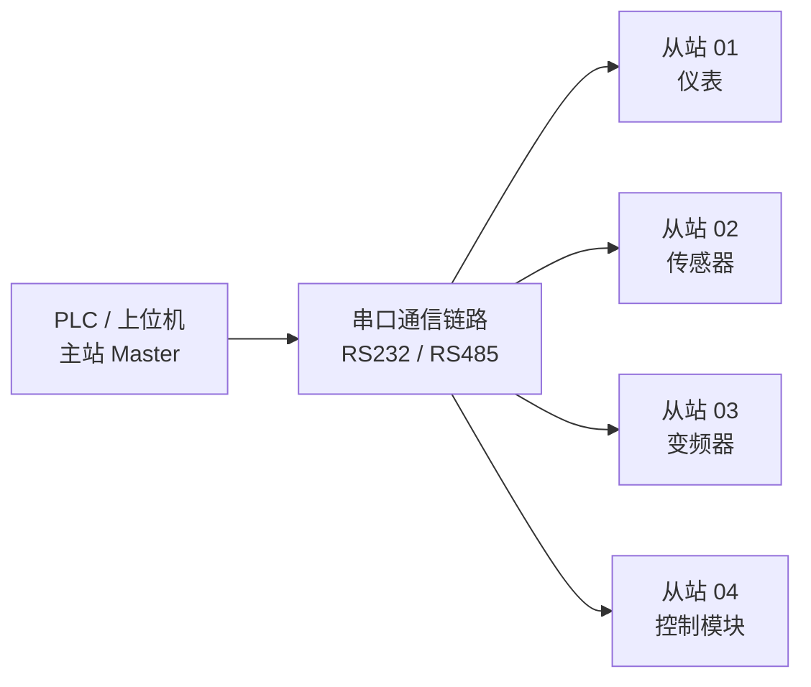
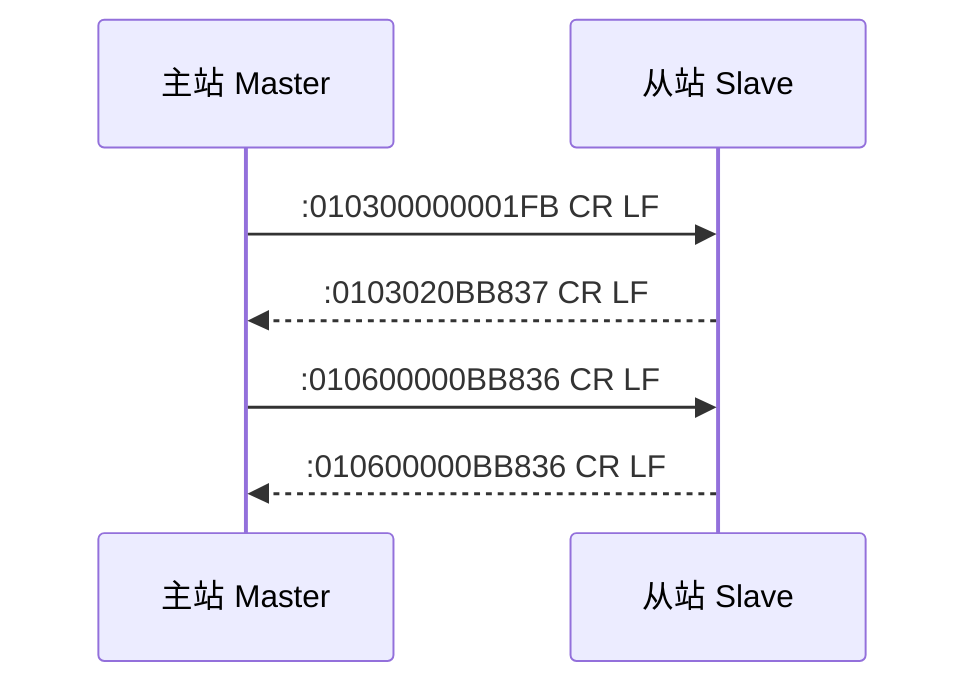
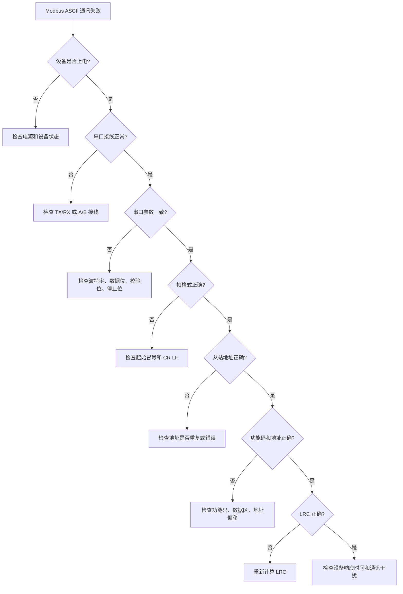
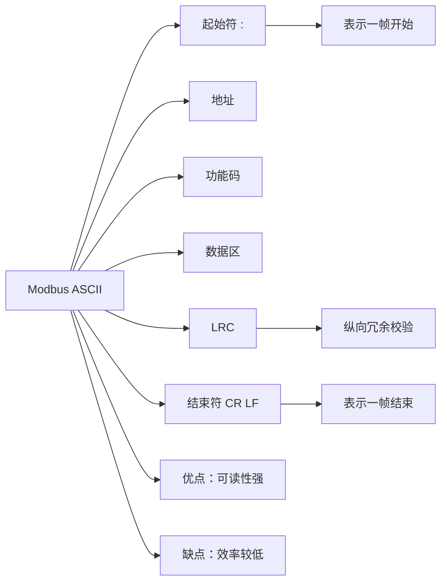

## 01｜核心概念

> [!info] 核心概念
> - **协议类型**：串口 Modbus 协议
> - **传输形式**：ASCII 字符
> - **通讯方式**：主站请求，从站响应
> - **常用物理层**：RS232 / RS485 / RS422
> - **典型结构**：一主多从
> - **校验方式**：LRC 校验
> - **帧起始符**：冒号 `:`
> - **帧结束符**：回车换行 `CR LF`
> - **核心特点**：报文容易阅读，但传输效率较低

---

## 02｜Modbus ASCII 系统结构图



> [!tip] 结构记忆
> **RTU 发的是字节，ASCII 发的是字符。**

---

## 03｜Modbus ASCII 报文结构

Modbus ASCII 报文由 **起始符 + 地址 + 功能码 + 数据区 + LRC + 结束符** 组成。

```text
┌────────┬──────────┬──────────┬──────────────┬────────┬────────┐
│ 起始符 │ 从站地址 │ 功能码   │ 数据区       │ LRC    │ 结束符 │
│ :      │ 2字符    │ 2字符    │ N个字符      │ 2字符  │ CR LF  │
└────────┴──────────┴──────────┴──────────────┴────────┴────────┘
```

> [!example] 标准 ASCII 请求报文
> ```text
> :010300000001FB\r\n
> ```
>
> | 字段 | 含义 |
> |---|---|
> | `:` | 起始符 |
> | `01` | 从站地址 |
> | `03` | 功能码：读保持寄存器 |
> | `0000` | 起始寄存器地址 |
> | `0001` | 读取数量 |
> | `FB` | LRC 校验 |
> | `CR LF` | 结束符 |

---

## 04｜ASCII 与 RTU 的核心区别

| 对比项 | Modbus ASCII | Modbus RTU |
|---|---|---|
| 数据形式 | ASCII 字符 | 二进制字节 |
| 起始标志 | `:` | 无固定起始符 |
| 结束标志 | `CR LF` | 依靠时间间隔 |
| 校验方式 | LRC | CRC16 |
| 报文可读性 | 高 | 低 |
| 传输效率 | 低 | 高 |
| 抗时间间隔干扰 | 较好 | 对帧间隔敏感 |
| 常见程度 | 较少 | 最常见 |
| 典型场景 | 老设备、人工调试、低速串口 | PLC、仪表、变频器 |

> [!tip] 记忆口诀
> **ASCII 靠符号分帧，RTU 靠时间分帧。ASCII 看得懂，RTU 跑得快。**

---

## 05｜关键参数速查表

| 参数 | 常见值 | 说明 | 易错点 |
|---|---|---|---|
| 从站地址 | 1–247 | 每个从站唯一编号 | 地址重复会冲突 |
| 波特率 | 1200 / 2400 / 4800 / 9600 / 19200 | 通讯速度 | 主从必须一致 |
| 数据位 | 7 / 8 | ASCII 常见 7 位或 8 位 | 要看设备手册 |
| 校验位 | Even / Odd / None | 奇偶校验 | 主从必须一致 |
| 停止位 | 1 / 2 | 串口参数 | 与校验位有关 |
| 起始符 | `:` | ASCII 帧开始 | 丢失则无法识别帧 |
| 结束符 | `CR LF` | ASCII 帧结束 | 不是普通字符 `\r\n` 显示问题 |
| 校验方式 | LRC | 纵向冗余校验 | 不同于 RTU 的 CRC |
| 编码形式 | ASCII Hex | 每个字节转成 2 个 ASCII 字符 | 报文长度约为 RTU 的 2 倍 |

---

## 06｜ASCII 报文字符转换

Modbus ASCII 会把每个二进制字节拆成两个十六进制字符传输。

### 原始字节

```text
01 03 00 00 00 01 FB
```

### ASCII 字符形式

```text
:010300000001FB\r\n
```

| 原始字节 | ASCII 表示 |
|---|---|
| `01` | `'0' '1'` |
| `03` | `'0' '3'` |
| `00` | `'0' '0'` |
| `FB` | `'F' 'B'` |

> [!warning] 易错点
> ASCII 报文里的 `01` 不是一个字节 `0x01`，而是两个 ASCII 字符：`'0'` 和 `'1'`。

---

## 07｜常用功能码详解

> [!example] 01｜读线圈状态
> - **功能码**：`01`
> - **作用**：读取 Coil 线圈状态
> - **数据类型**：位
> - **典型场景**：读取继电器输出、DO 状态

---

> [!example] 02｜读离散输入
> - **功能码**：`02`
> - **作用**：读取 Discrete Input 状态
> - **数据类型**：位
> - **典型场景**：读取按钮、限位、传感器开关量输入

---

> [!example] 03｜读保持寄存器
> - **功能码**：`03`
> - **作用**：读取 Holding Register
> - **数据类型**：16 位寄存器
> - **典型场景**：读取变频器频率、仪表参数、设备状态

---

> [!example] 04｜读输入寄存器
> - **功能码**：`04`
> - **作用**：读取 Input Register
> - **数据类型**：16 位寄存器
> - **典型场景**：读取温度、压力、流量、电压、电流

---

> [!example] 05｜写单个线圈
> - **功能码**：`05`
> - **写 ON**：`FF00`
> - **写 OFF**：`0000`
> - **典型场景**：启停设备、控制继电器

---

> [!example] 06｜写单个保持寄存器
> - **功能码**：`06`
> - **作用**：写入单个 Holding Register
> - **典型场景**：设置频率、写入参数、修改设定值

---

> [!example] 16｜写多个保持寄存器
> - **功能码**：`10`
> - **作用**：批量写入多个 Holding Register
> - **典型场景**：写入多个参数、写入 32 位数值、写入浮点数

---

## 08｜功能码速查表

| 功能码 | 十六进制 | 功能名称 | 数据区 | 读写 |
|---|---|---|---|---|
| 01 | 0x01 | 读线圈 | 0区 Coil | 读 |
| 02 | 0x02 | 读离散输入 | 1区 Discrete Input | 读 |
| 03 | 0x03 | 读保持寄存器 | 4区 Holding Register | 读 |
| 04 | 0x04 | 读输入寄存器 | 3区 Input Register | 读 |
| 05 | 0x05 | 写单个线圈 | 0区 Coil | 写 |
| 06 | 0x06 | 写单个保持寄存器 | 4区 Holding Register | 写 |
| 15 | 0x0F | 写多个线圈 | 0区 Coil | 写 |
| 16 | 0x10 | 写多个保持寄存器 | 4区 Holding Register | 写 |

> [!tip] 重点记忆
> ASCII 和 RTU 的功能码基本一致，区别主要在 **帧格式和校验方式**。

---

## 09｜四大数据区

| 数据区 | 英文名称 | 地址前缀 | 读写属性 | 常用功能码 | 典型用途 |
|---|---|---|---|---|---|
| 0区 | Coil | 0xxxx | 读写位 | 01 / 05 / 15 | DO 输出、启停控制 |
| 1区 | Discrete Input | 1xxxx | 只读位 | 02 | DI 输入状态 |
| 3区 | Input Register | 3xxxx | 只读字 | 04 | 传感器测量值 |
| 4区 | Holding Register | 4xxxx | 读写字 | 03 / 06 / 16 | 参数设置、运行数据 |

> [!tip] 记忆口诀
> **0 线圈，1 输入，3 测量，4 参数。**

---

## 10｜实战报文示例：读取保持寄存器

### 示例目标

读取从站 `01` 的保持寄存器地址 `0000`，读取数量 `1` 个寄存器。

### ASCII 请求报文

```text
:010300000001FB\r\n
```

### 字段解释

| 字段 | 含义 |
|---|---|
| `:` | 起始符 |
| `01` | 从站地址 |
| `03` | 功能码，读取保持寄存器 |
| `0000` | 起始地址 |
| `0001` | 读取数量 |
| `FB` | LRC 校验 |
| `CR LF` | 结束符 |

---

### 对应 RTU 原始数据

```text
01 03 00 00 00 01
```

### LRC 计算范围

```text
01 + 03 + 00 + 00 + 00 + 01
```

LRC 只计算 **地址、功能码、数据区**，不包含：

```text
:
CR
LF
```

> [!warning] 易错点
> LRC 计算的是原始字节，不是 ASCII 字符本身。

---

## 11｜响应报文示例

### 响应内容

从站返回 1 个寄存器，数据为 `0B B8`，十进制为 `3000`。

```text
响应报文：
:0103020BB837\r\n
```

### 字段解释

| 字段 | 含义 |
|---|---|
| `:` | 起始符 |
| `01` | 从站地址 |
| `03` | 功能码 |
| `02` | 返回字节数 |
| `0BB8` | 数据，十进制 3000 |
| `37` | LRC 校验 |
| `CR LF` | 结束符 |

> [!info] 数据换算
> 如果设备比例系数为 `0.01`：
>
> ```text
> 实际值 = 3000 × 0.01 = 30.00
> ```

---

## 12｜写单个保持寄存器示例

### 示例目标

向从站 `01` 的保持寄存器地址 `0000` 写入数值 `3000`。

### 原始数据

```text
01 06 00 00 0B B8
```

### ASCII 请求报文

```text
:010600000BB836\r\n
```

### 字段解释

| 字段 | 含义 |
|---|---|
| `:` | 起始符 |
| `01` | 从站地址 |
| `06` | 功能码，写单个保持寄存器 |
| `0000` | 寄存器地址 |
| `0BB8` | 写入值，十进制 3000 |
| `36` | LRC 校验 |
| `CR LF` | 结束符 |

> [!check] 判断写入成功
> 功能码 `06` 写入成功后，从站通常会原样返回请求报文。

---

## 13｜LRC 校验计算方法

LRC 全称是 **Longitudinal Redundancy Check**，即纵向冗余校验。

### 计算步骤

> [!check] LRC 计算流程
> - [ ] 取出地址、功能码、数据区的原始字节
> - [ ] 所有字节相加
> - [ ] 只保留低 8 位
> - [ ] 对结果取二进制补码
> - [ ] 得到 LRC
> - [ ] 将 LRC 转成 2 个 ASCII 十六进制字符

---

### 示例：读取 1 个保持寄存器

原始数据：

```text
01 03 00 00 00 01
```

计算：

```text
01 + 03 + 00 + 00 + 00 + 01 = 05

低 8 位：
05

取补码：
FB
```

最终报文：

```text
:010300000001FB\r\n
```

> [!tip] 快速公式
> ```text
> LRC = ((~SUM + 1) & 0xFF)
> ```
>
> 或：
>
> ```text
> LRC = ((0x100 - SUM) & 0xFF)
> ```

---

## 14｜寄存器地址换算

设备手册中的逻辑地址和报文地址经常存在偏移。

| 手册地址 | 数据区 | 报文地址 |
|---|---|---|
| 40001 | 保持寄存器 | 0000 |
| 40002 | 保持寄存器 | 0001 |
| 40003 | 保持寄存器 | 0002 |
| 30001 | 输入寄存器 | 0000 |
| 30002 | 输入寄存器 | 0001 |
| 00001 | 线圈 | 0000 |
| 10001 | 离散输入 | 0000 |

> [!warning] 易错点
> 手册写 `40001`，报文里通常填 `0000`。  
> 这就是 Modbus 常见的 **地址偏移 1** 问题。

---

## 15｜ASCII 通讯流程



> [!info] 通讯规则
> Modbus ASCII 仍然是主从轮询机制，从站不会主动发送数据。

---

## 16｜ASCII 帧识别规则

| 项目 | 说明 |
|---|---|
| 起始符 | `:` |
| 结束符 | `CR LF` |
| 字符间隔 | 可比 RTU 更宽松 |
| 校验方式 | LRC |
| 字符内容 | 0–9、A–F |
| 帧长度 | 比 RTU 长 |
| 传输效率 | 低于 RTU |

> [!tip] 调试优势
> 使用串口助手时，ASCII 报文更容易人工观察和手动输入。

---

## 17｜异常响应格式

当从站无法执行请求时，会返回异常响应。

```text
异常响应格式：
: 从站地址 异常功能码 异常码 LRC CR LF
```

异常功能码 = 原功能码 + `0x80`

### 示例

如果请求功能码是：

```text
03
```

异常响应功能码为：

```text
83
```

示例异常响应：

```text
:0183027A\r\n
```

| 字段 | 含义 |
|---|---|
| `01` | 从站地址 |
| `83` | 异常功能码 |
| `02` | 异常码：非法数据地址 |
| `7A` | LRC 校验 |

---

## 18｜常见错误代码

| 异常码 | 名称 | 含义 | 常见原因 | 处理方法 |
|---|---|---|---|---|
| 01 | 非法功能码 | 从站不支持该功能码 | 功能码用错 | 查看设备手册 |
| 02 | 非法数据地址 | 地址不存在或越界 | 寄存器地址错误 | 检查地址偏移 |
| 03 | 非法数据值 | 写入值不合法 | 参数超范围 | 检查数据范围 |
| 04 | 从站设备故障 | 设备内部错误 | 设备异常 | 重启或检查设备 |
| 08 | 存储奇偶性错误 | 存储校验异常 | 存储故障 | 恢复参数或联系厂家 |

---

## 19｜ASCII 通讯排查流程



---

> [!check] 排查清单
> - [ ] 设备是否上电
> - [ ] 串口类型是否正确：RS232 / RS485
> - [ ] TX/RX 是否接反
> - [ ] RS485 A/B 是否接反
> - [ ] 波特率是否一致
> - [ ] 数据位是否一致
> - [ ] 校验位是否一致
> - [ ] 停止位是否一致
> - [ ] 从站地址是否正确
> - [ ] 报文是否以 `:` 开始
> - [ ] 报文是否以 `CR LF` 结束
> - [ ] 是否只使用 `0–9` 和 `A–F`
> - [ ] LRC 是否正确
> - [ ] 地址是否存在偏移
> - [ ] 功能码是否被设备支持

---

## 20｜常见问题对比表

| 现象 | 可能原因 | 排查方向 |
|---|---|---|
| 完全无响应 | 串口参数错误、地址错误、接线错误 | 查波特率、地址、TX/RX 或 A/B |
| 报文无法识别 | 缺少 `:` 或 `CR LF` | 检查帧头帧尾 |
| 返回异常码 02 | 寄存器地址错误 | 检查地址偏移 |
| 返回异常码 03 | 写入值不合法 | 检查数据范围 |
| LRC 校验错误 | LRC 算法错误或计算范围错误 | 只计算地址、功能码、数据区 |
| 数据明显不对 | 比例系数或字节序错误 | 查倍率、数据类型 |
| 能读不能写 | 寄存器只读或权限限制 | 查设备手册 |

---

## 21｜Modbus ASCII 与 RTU 报文对照

### 同一个请求：读取 1 个保持寄存器

| 类型 | 报文 |
|---|---|
| RTU 原始字节 | `01 03 00 00 00 01 84 0A` |
| ASCII 字符 | `:010300000001FB\r\n` |

> [!warning] 注意
> RTU 使用 CRC16，ASCII 使用 LRC。  
> 所以两者的校验码不是同一个东西。

---

## 22｜工程应用建议

> [!tip] 初次调试建议
> - 先确认设备是否真的支持 Modbus ASCII
> - 优先使用设备手册推荐的串口参数
> - 使用串口助手时选择 ASCII 发送模式
> - 报文必须包含起始符 `:`
> - 报文必须以 `CR LF` 结尾
> - LRC 只计算原始数据字节，不计算 `:` 和 `CR LF`
> - 初次测试建议先读 `03` 功能码
> - 写参数前先确认寄存器是否可写

---

> [!warning] 现场注意事项
> - ASCII 通讯效率低，不适合高速大量数据采集
> - 老设备可能使用 ASCII，新设备更常见 RTU 或 TCP
> - RS485 多从站时仍要避免地址重复
> - 长距离通讯建议降低波特率
> - 串口助手中 `\r\n` 是否真正发送，要实际确认
> - 有些软件显示 `CR LF`，有些软件需要勾选“发送回车换行”

---

## 23｜Modbus ASCII 快速记忆图



---

## 24｜记忆口诀

> [!tip] Modbus ASCII 口诀
> **冒号开头，回车换行收尾。**
>
> **地址功能跟数据，最后 LRC 校验。**
>
> **ASCII 看得清，RTU 跑得快。**
>
> **LRC 算原始字节，不算冒号和换行。**

---

## 25｜最终速记卡

- Modbus ASCII 是串口版 Modbus 的一种，使用 ASCII 字符传输。
- ASCII 报文以 `:` 开始，以 `CR LF` 结束。
- 报文结构：`起始符 + 从站地址 + 功能码 + 数据区 + LRC + 结束符`。
- ASCII 使用 `LRC` 校验，不使用 RTU 的 `CRC16`。
- 每个原始字节会转换成 2 个 ASCII 十六进制字符。
- ASCII 可读性强，但传输效率低。
- 功能码与 RTU 基本一致，常用 `03` 读保持寄存器，`06` 写单个保持寄存器。
- 调试失败优先检查：起始符、结束符、串口参数、地址、LRC、寄存器地址偏移。