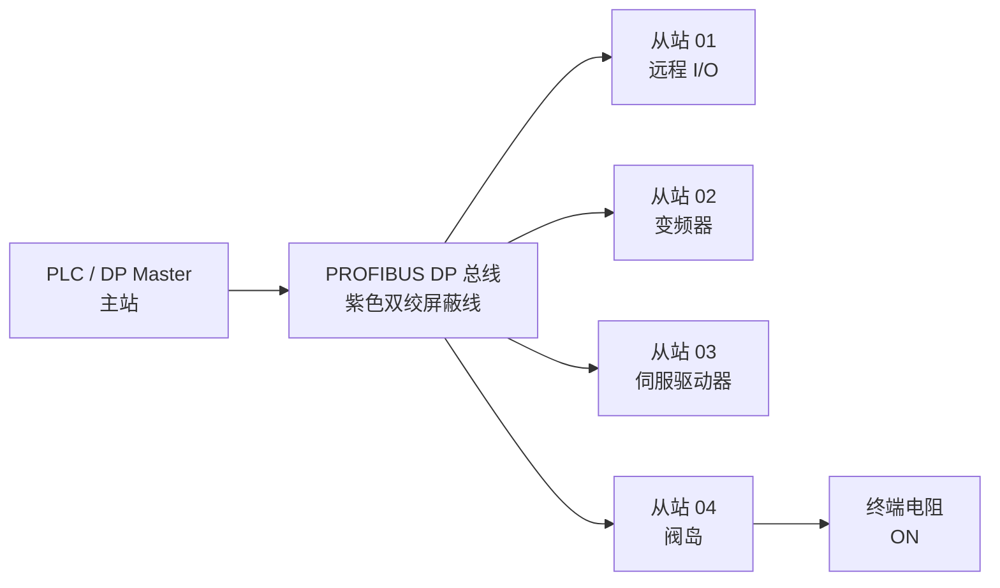
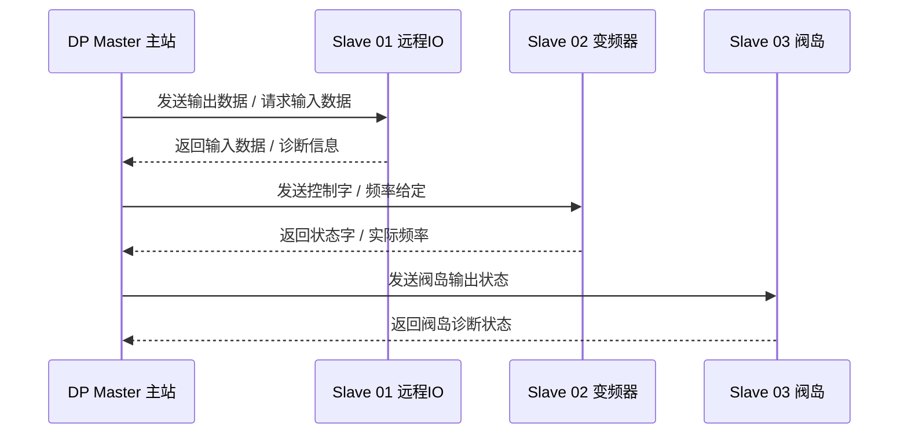
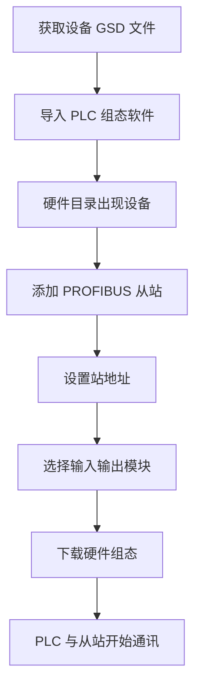
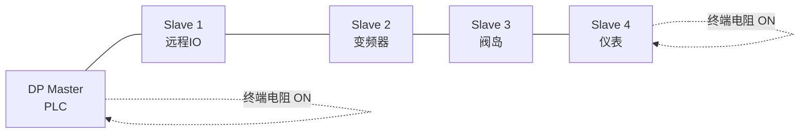
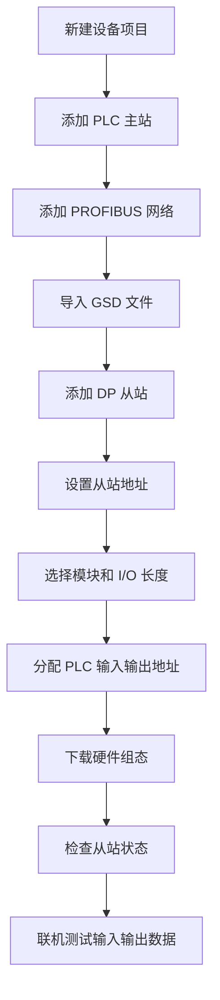
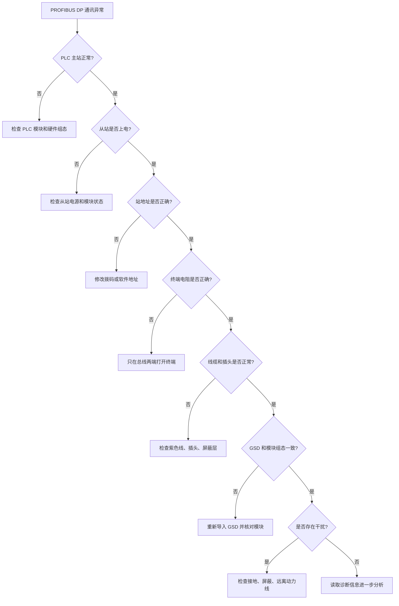
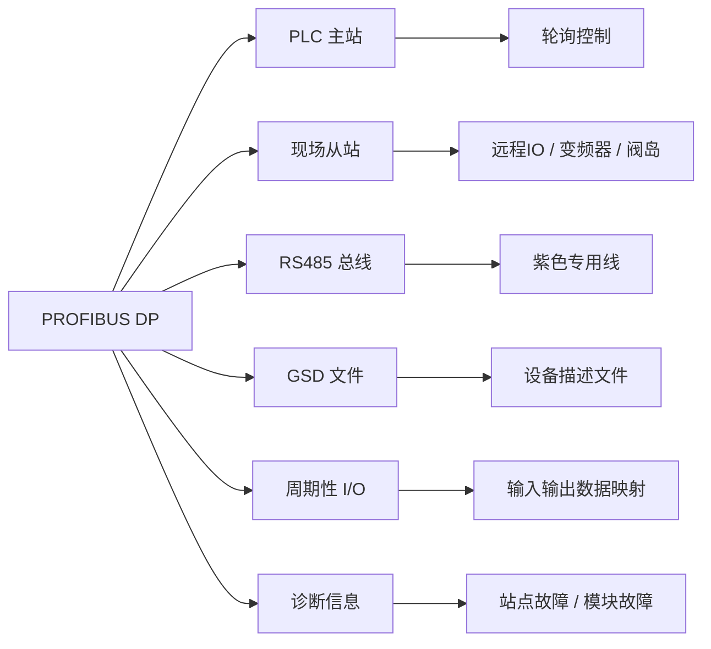

## 01｜核心概念

> [!info] 核心概念
> - **全称**：Process Field Bus - Decentralized Peripherals
> - **中文名称**：过程现场总线 - 分布式外设
> - **通讯对象**：PLC 主站与现场从站设备
> - **典型物理层**：RS485
> - **典型拓扑**：总线型，手拉手连接
> - **通讯方式**：主站轮询，从站响应
> - **主要特点**：高速、稳定、适合实时控制
> - **典型设备**：远程 I/O、变频器、伺服、阀岛、编码器、仪表

---

## 02｜PROFIBUS DP 系统结构图



> [!tip] 结构记忆
> **PLC 是主站，现场设备是从站；主站发问，从站回答。**

---

## 03｜PROFIBUS DP 通讯逻辑

PROFIBUS DP 主要用于 PLC 与分布式现场设备之间进行周期性 I/O 数据交换。



> [!info] 通讯规则
> PROFIBUS DP 从站一般不会主动发送数据，数据交换由主站周期性控制。

---

## 04｜关键参数速查表

| 参数 | 常见值 | 说明 | 易错点 |
|---|---|---|---|
| 通讯介质 | RS485 | 最常见物理层 | 不能当普通网线使用 |
| 通讯线缆 | 紫色 PROFIBUS 专用线 | 双绞屏蔽线 | 普通屏蔽线不一定可靠 |
| 通讯速率 | 9.6 kbps–12 Mbps | 速率越高，距离越短 | 所有设备必须支持对应速率 |
| 站地址 | 0–126 | 每个站点唯一 | 地址重复会导致总线故障 |
| 默认地址 | 常见 126 | 新设备常用默认地址 | 需要下载或拨码修改 |
| 拓扑结构 | 总线型 | 手拉手连接 | 不建议星型接线 |
| 终端电阻 | 总线两端 ON | 防止信号反射 | 中间站不能打开终端 |
| 每段站点数 | 最多 32 个 | 包含主站、从站、 repeater | 超过需加中继器 |
| 配置文件 | GSD 文件 | 描述设备能力 | GSD 不匹配会配置错误 |

---

## 05｜PROFIBUS DP 网络组成

| 角色 | 名称 | 作用 | 典型设备 |
|---|---|---|---|
| 主站 | DP Master Class 1 | 周期性控制从站 | PLC、DCS 控制器 |
| 工程主站 | DP Master Class 2 | 组态、诊断、调试 | 编程器、调试软件 |
| 从站 | DP Slave | 执行控制、返回数据 | I/O、变频器、阀岛、仪表 |
| 中继器 | Repeater | 扩展距离和站点数 | PROFIBUS 中继器 |
| 终端电阻 | Termination | 抑制信号反射 | 总线两端接入 |

> [!tip] 记忆口诀
> **主站管轮询，从站交数据；工程站做配置，中继器扩距离。**

---

## 06｜PROFIBUS DP 三个版本

| 版本 | 名称 | 核心功能 | 典型用途 |
|---|---|---|---|
| DP-V0 | 基本 DP | 周期性 I/O 数据交换 | 远程 I/O、阀岛 |
| DP-V1 | 扩展 DP | 非周期参数访问、报警、诊断 | 变频器、仪表参数读取 |
| DP-V2 | 高级 DP | 等时同步、从站间通讯 | 伺服、运动控制 |

> [!info] 工程理解
> - **DP-V0**：最常见，负责普通 I/O 数据交换  
> - **DP-V1**：增加参数和诊断能力  
> - **DP-V2**：用于高实时性同步控制场景  

---

## 07｜PROFIBUS DP 报文与数据交换

PROFIBUS DP 对用户来说通常不需要手写报文，而是通过 PLC 硬件组态完成数据映射。

```text
PLC 输出区  →  PROFIBUS DP  →  从站输出数据
PLC 输入区  ←  PROFIBUS DP  ←  从站输入数据
```

### 示例：变频器通讯数据

| 方向 | 数据 | 含义 |
|---|---|---|
| PLC → 变频器 | 控制字 | 启动、停止、复位、方向 |
| PLC → 变频器 | 频率给定 | 目标频率或速度 |
| 变频器 → PLC | 状态字 | 运行、故障、就绪状态 |
| 变频器 → PLC | 实际频率 | 当前输出频率 |

> [!example] 典型数据交换
> ```text
> PLC 输出：
> 控制字 = 047F
> 频率给定 = 1500
>
> PLC 输入：
> 状态字 = 1237
> 实际频率 = 1498
> ```

---

## 08｜GSD 文件详解

GSD 文件是 PROFIBUS DP 从站的设备描述文件。

> [!info] GSD 文件作用
> - 描述设备支持的通讯速率
> - 描述设备支持的模块
> - 描述输入输出字节长度
> - 描述诊断信息
> - 描述厂家、型号、版本
> - 供 PLC 组态软件识别设备

---

### GSD 使用流程



> [!warning] 易错点
> GSD 文件版本不匹配、模块顺序不一致、输入输出长度错误，都会导致从站无法正常上线。

---

## 09｜PROFIBUS DP 地址设置

每个 PROFIBUS DP 站点都必须有唯一地址。

| 地址范围 | 说明 |
|---|---|
| 0 | 常用于工程站或特殊设备 |
| 1–125 | 常用从站地址范围 |
| 126 | 常见默认地址或待分配地址 |
| 127 | 通常保留，不作为普通站地址 |

> [!warning] 易错点
> 同一条总线上如果两个设备地址相同，会导致通讯异常，主站可能无法识别从站。

---

### 地址设置方式

| 设置方式 | 说明 | 常见设备 |
|---|---|---|
| 拨码开关 | 通过 DIP 开关设置地址 | 远程 I/O、阀岛 |
| 旋钮开关 | 十位和个位旋钮设置地址 | 分布式 I/O |
| 软件设置 | 通过调试软件写入地址 | 变频器、仪表 |
| 主站分配 | 通过工程软件分配 | 部分智能设备 |

---

## 10｜RS485 接线规范



> [!check] 接线注意事项
> - [ ] 使用 PROFIBUS 专用紫色电缆
> - [ ] 采用手拉手总线连接
> - [ ] 不推荐星型接线
> - [ ] 总线两端终端电阻打开
> - [ ] 中间设备终端电阻关闭
> - [ ] 屏蔽层可靠接地
> - [ ] 通讯线远离动力线和变频器输出线
> - [ ] 插头进线和出线方向不要接反
> - [ ] 设备断电后若终端失效，可能影响整条总线

---

## 11｜PROFIBUS 插头与终端电阻

PROFIBUS 常用 9 针 D-Sub 接头。

| 引脚 | 信号 | 说明 |
|---|---|---|
| 3 | B-Line | 数据正线，常见红线 |
| 8 | A-Line | 数据负线，常见绿线 |
| 5 | DGND | 数据地 |
| 6 | VP | 5V 供电，用于终端电阻 |
| 外壳 | Shield | 屏蔽层 |

> [!warning] 易错点
> PROFIBUS 的 A/B 标识容易和其他 RS485 设备混淆，接线时优先按设备手册和插头标识操作。

---

## 12｜通讯速率与距离

| 波特率 | 单段最大距离参考 |
|---|---|
| 9.6 kbps | 约 1200 m |
| 19.2 kbps | 约 1200 m |
| 93.75 kbps | 约 1200 m |
| 187.5 kbps | 约 1000 m |
| 500 kbps | 约 400 m |
| 1.5 Mbps | 约 200 m |
| 12 Mbps | 约 100 m |

> [!tip] 选择建议
> 现场距离长、干扰大时，不要盲目追求高速率。  
> 通讯稳定优先，速度其次。

---

## 13｜PROFIBUS DP 配置流程



> [!check] 配置检查清单
> - [ ] GSD 文件是否正确
> - [ ] 从站型号是否一致
> - [ ] 模块顺序是否一致
> - [ ] 输入输出字节数是否一致
> - [ ] 站地址是否唯一
> - [ ] 波特率是否支持
> - [ ] 终端电阻是否正确
> - [ ] PLC 硬件组态是否已下载

---

## 14｜实战示例：远程 I/O 通讯

### 场景

PLC 通过 PROFIBUS DP 连接一个远程 I/O 模块。

| 数据方向 | 数据长度 | 说明 |
|---|---|---|
| 从站 → PLC | 2 Byte | 16 点数字量输入 |
| PLC → 从站 | 2 Byte | 16 点数字量输出 |

### PLC 地址映射示例

```text
输入地址：
I100.0 - I101.7

输出地址：
Q100.0 - Q101.7
```

### 数据含义

```text
I100.0 = 输入点 1
I100.1 = 输入点 2
I101.7 = 输入点 16

Q100.0 = 输出点 1
Q100.1 = 输出点 2
Q101.7 = 输出点 16
```

> [!example] 应用场景
> - 读取按钮、限位、传感器状态
> - 控制指示灯、电磁阀、继电器
> - 将现场 I/O 集中接入 PLC

---

## 15｜实战示例：变频器 PROFIBUS DP 通讯

### 常见数据结构

| PLC 输出到变频器 | 说明 |
|---|---|
| 控制字 | 启动、停止、复位、使能 |
| 主给定值 | 频率、速度、转矩给定 |

| 变频器反馈到 PLC | 说明 |
|---|---|
| 状态字 | 就绪、运行、故障、报警 |
| 主实际值 | 实际频率、实际速度、实际电流 |

### 示例数据

```text
PLC → 变频器：
控制字：047F
频率给定：1500

变频器 → PLC：
状态字：1237
实际频率：1498
```

> [!warning] 易错点
> 不同品牌变频器的控制字、状态字定义可能不同，必须查看对应设备手册。

---

## 16｜PROFIBUS DP 诊断信息

PROFIBUS DP 的优势之一是诊断能力强。

| 诊断类型 | 说明 | 常见原因 |
|---|---|---|
| 站点故障 | 从站掉线 | 断电、断线、地址错误 |
| 配置故障 | 组态与实际模块不一致 | 模块顺序错误、GSD 错误 |
| 参数故障 | 参数化失败 | 参数范围不支持 |
| 外部诊断 | 设备内部报警 | 传感器故障、驱动器报警 |
| 通讯故障 | 总线异常 | 终端电阻、屏蔽、干扰问题 |

---

## 17｜常见故障现象

| 现象 | 可能原因 | 排查方向 |
|---|---|---|
| BF 灯亮 | 总线故障 | 查接线、终端、电缆、地址 |
| SF 灯亮 | 系统故障 | 查硬件组态、模块诊断 |
| 从站不上线 | 地址错误、GSD 错误 | 查地址和设备型号 |
| 通讯时好时坏 | 干扰或终端错误 | 查屏蔽、接地、终端电阻 |
| 某个从站掉线 | 设备断电或插头问题 | 查该站电源和接头 |
| 全部从站掉线 | 主站、总线首端或终端问题 | 查 PLC、总线起点、终端 |
| 数据错位 | I/O 长度或模块顺序错误 | 查硬件组态 |
| 变频器不响应控制 | 控制字不对或使能条件不足 | 查控制字、运行命令源 |

---

## 18｜PROFIBUS DP 排查流程



---

> [!check] 排查清单
> - [ ] PLC PROFIBUS 主站模块是否正常
> - [ ] 从站是否上电
> - [ ] 从站地址是否唯一
> - [ ] 是否存在地址重复
> - [ ] GSD 文件是否正确
> - [ ] 实际模块顺序是否与组态一致
> - [ ] 输入输出长度是否一致
> - [ ] 总线两端终端电阻是否打开
> - [ ] 中间站终端电阻是否关闭
> - [ ] PROFIBUS 插头是否接触良好
> - [ ] 屏蔽层是否可靠接地
> - [ ] 通讯线是否远离动力线
> - [ ] 是否超过单段最大距离
> - [ ] 是否超过单段最大站点数
> - [ ] 是否需要增加中继器

---

## 19｜PROFIBUS DP 与 Modbus RTU 对比

| 对比项 | PROFIBUS DP | Modbus RTU |
|---|---|---|
| 协议定位 | 高速现场总线 | 通用串口协议 |
| 典型物理层 | RS485 | RS485 |
| 通讯方式 | 主站周期性数据交换 | 主站请求，从站响应 |
| 组态方式 | 依赖 GSD 和硬件组态 | 多数手写地址和功能码 |
| 实时性 | 较强 | 一般 |
| 诊断能力 | 强 | 较弱 |
| 报文使用 | 工程软件自动处理 | 常需理解功能码和寄存器 |
| 设备成本 | 较高 | 较低 |
| 典型场景 | PLC、远程 I/O、驱动器 | 仪表、变频器、传感器 |

> [!tip] 选择建议
> - 需要高速实时 I/O、强诊断：选 PROFIBUS DP  
> - 需要简单通用、低成本通信：选 Modbus RTU  

---

## 20｜工程应用建议

> [!tip] 初次调试建议
> - 先单独连接一个从站测试
> - 使用厂家提供的正确 GSD 文件
> - 地址从 3、4、5 等常规地址开始规划
> - 确认实际模块顺序与组态完全一致
> - 通讯速率不要一开始就设太高
> - 先观察从站是否上线，再测试 I/O 数据
> - 变频器通讯先确认命令源和频率源是否设置为 PROFIBUS

---

> [!warning] 现场注意事项
> - PROFIBUS 总线必须手拉手，不建议星型
> - 终端电阻只在总线两端打开
> - 中间站打开终端会导致后面设备掉线
> - 最后一站掉电可能导致终端失效
> - 站地址重复是非常常见的故障原因
> - 组态模块顺序错误会导致从站无法正常运行
> - 高速率下线缆质量、接头质量、屏蔽接地非常关键

---

## 21｜PROFIBUS DP 快速记忆图



---

## 22｜记忆口诀

> [!tip] PROFIBUS DP 口诀
> **紫线手拉手，两端开终端。**
>
> **地址不能重，GSD 要对应。**
>
> **主站轮询忙，从站交数据。**
>
> **BF 查总线，SF 查组态。**
>
> **通讯不稳定，先看终端和屏蔽。**

---

## 23｜最终速记卡

- PROFIBUS DP 是高速现场总线，常用于 PLC 与远程 I/O、变频器、阀岛、仪表通讯。
- 典型物理层是 RS485，常用紫色 PROFIBUS 专用双绞屏蔽线。
- 网络结构是总线型，推荐手拉手连接，不建议星型接线。
- 每个站点必须有唯一地址，常用地址范围为 `1–125`。
- 总线两端必须打开终端电阻，中间站终端电阻必须关闭。
- 每段最多约 32 个站点，超过距离或站点数需要加中继器。
- GSD 文件用于描述从站设备，组态错误会导致从站不上线。
- DP-V0 负责周期性 I/O，DP-V1 支持参数和诊断，DP-V2 支持同步控制。
- BF 灯通常指向总线问题，SF 灯通常指向系统或组态问题。
- 排查顺序：电源 → 地址 → 终端 → 接线 → GSD → 模块顺序 → 屏蔽接地。