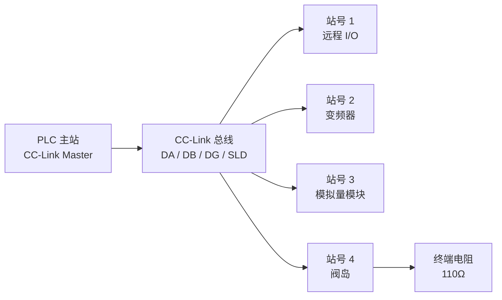
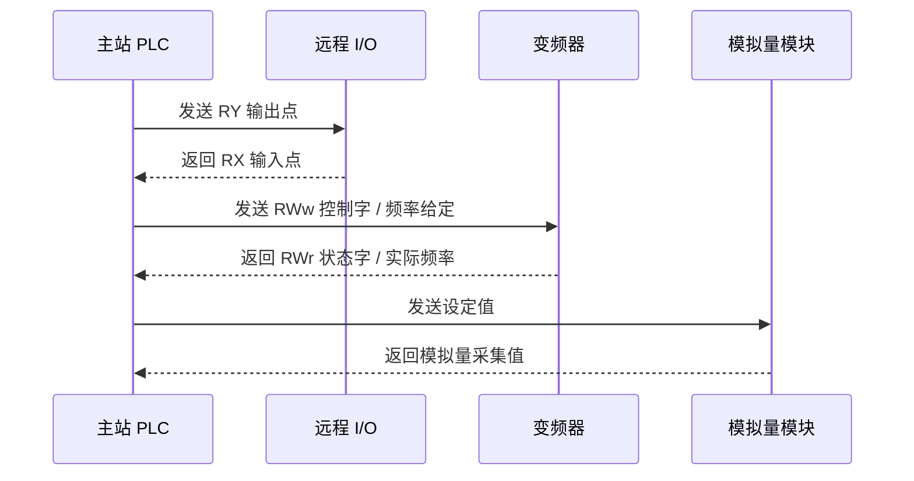
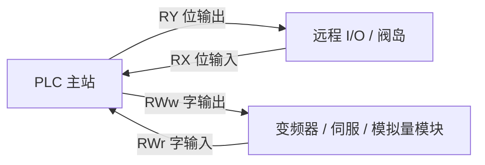
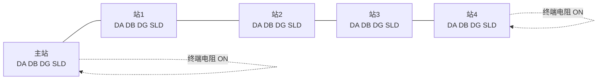
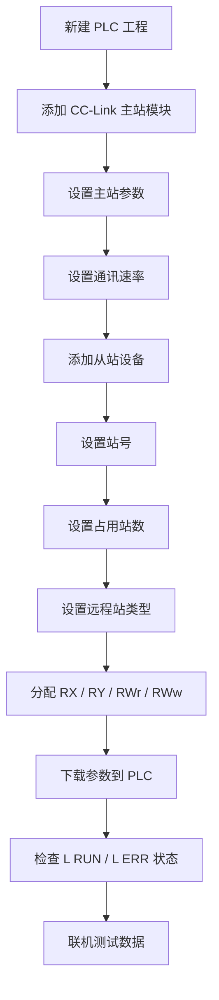
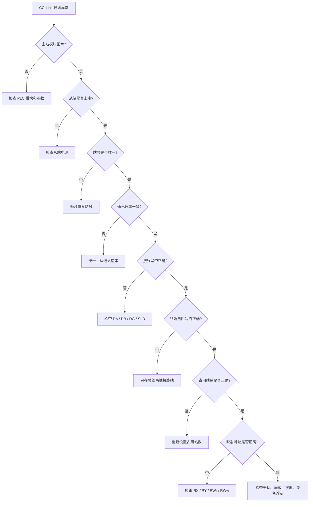
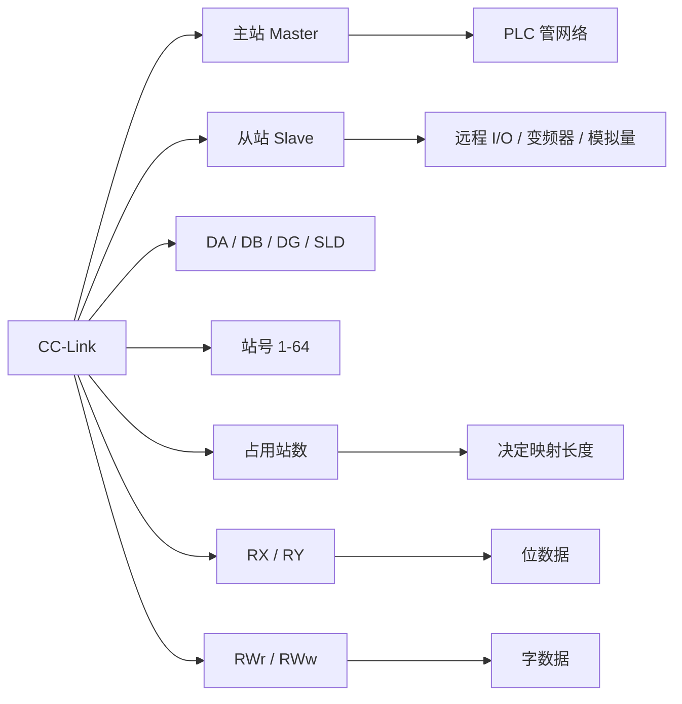

## 01｜核心概念

> [!info] 核心概念
> - **全称**：Control & Communication Link
> - **中文理解**：控制与通信链路
> - **典型厂家**：三菱 Mitsubishi 常用
> - **协议定位**：现场总线
> - **典型物理层**：RS485 专用总线
> - **典型结构**：一主多从
> - **通讯方式**：主站管理网络，从站周期性交换数据
> - **典型设备**：远程 I/O、变频器、伺服、阀岛、模拟量模块、条码枪、称重仪表
> - **核心特点**：速度快、数据映射清晰、适合 PLC 分布式控制

---

## 02｜CC-Link 系统结构图



> [!tip] 结构记忆
> **主站管网络，从站交数据；站号不能重，终端两头接。**

---

## 03｜CC-Link 通讯逻辑

CC-Link 对用户来说通常不需要手写报文，而是通过 PLC 参数配置，把从站数据映射到固定的软元件区域。

```text
PLC 输出数据  →  CC-Link  →  从站输出
PLC 输入数据  ←  CC-Link  ←  从站输入
```



> [!info] 通讯规则
> CC-Link 是主站管理型网络，从站一般不会脱离主站主动上报数据。

---

## 04｜关键参数速查表

| 参数 | 常见值 | 说明 | 易错点 |
|---|---|---|---|
| 通讯介质 | CC-Link 专用电缆 | 3 芯 + 屏蔽 | 不建议用普通线替代 |
| 信号线 | DA / DB / DG / SLD | 数据线、信号地、屏蔽 | DA / DB 接反会异常 |
| 通讯速率 | 156kbps–10Mbps | 速率越高，距离越短 | 主从速率必须一致 |
| 站号 | 1–64 | 每个从站唯一 | 地址重复会网络异常 |
| 主站 | Station 0 | 网络管理者 | 参数配置错误会全网异常 |
| 终端电阻 | 常见 110Ω | 接在总线两端 DA-DB 间 | 中间站不要接 |
| 拓扑结构 | 总线型 | 手拉手连接 | 不推荐星型接线 |
| 占用站数 | 1–4 站常见 | 决定数据映射长度 | 设错会数据错位 |
| 通讯数据 | RX / RY / RWr / RWw | 位数据和字数据 | 方向容易混淆 |

---

## 05｜CC-Link 网络组成

| 角色 | 英文 | 作用 | 典型设备 |
|---|---|---|---|
| 主站 | Master Station | 管理整个 CC-Link 网络 | PLC 主站模块 |
| 本地站 | Local Station | 具有控制器能力的站点 | 另一台 PLC |
| 远程 I/O 站 | Remote I/O Station | 只处理开关量 I/O | DI / DO 模块 |
| 远程设备站 | Remote Device Station | 处理位和字数据 | 模拟量模块、变频器 |
| 智能设备站 | Intelligent Device Station | 支持复杂数据与参数 | 伺服、仪表、特殊模块 |

> [!tip] 记忆口诀
> **I/O 站管点位，设备站管字，智能站功能多，本地站像小主站。**

---

## 06｜CC-Link 数据区详解

CC-Link 最核心的是 4 类数据区：

| 数据区 | 方向 | 数据类型 | 作用 |
|---|---|---|---|
| RX | 从站 → 主站 | 位 bit | 远程输入 |
| RY | 主站 → 从站 | 位 bit | 远程输出 |
| RWr | 从站 → 主站 | 字 word | 远程寄存器读入 |
| RWw | 主站 → 从站 | 字 word | 远程寄存器写出 |

> [!info] 方向理解
> - **RX**：PLC 读取从站状态  
> - **RY**：PLC 控制从站输出  
> - **RWr**：从站返回给 PLC 的字数据  
> - **RWw**：PLC 写给从站的字数据  

---

## 07｜数据流向图



> [!tip] 快速记忆
> **R 后面带 X，多数理解为输入；R 后面带 Y，多数理解为输出。**
>
> **RWr 是读回来的字，RWw 是写出去的字。**

---

## 08｜RX / RY / RWr / RWw 速查表

| 数据区 | 中文含义 | 数据方向 | 常见用途 |
|---|---|---|---|
| RX | 远程输入 | 从站 → 主站 | 按钮、传感器状态、设备运行状态 |
| RY | 远程输出 | 主站 → 从站 | 电磁阀、继电器、启动停止命令 |
| RWr | 远程寄存器读 | 从站 → 主站 | 实际频率、状态字、模拟量输入 |
| RWw | 远程寄存器写 | 主站 → 从站 | 频率给定、控制字、参数设定 |

---

## 09｜占用站数概念

CC-Link 中很多设备会设置 **占用站数**，常见为 `1站 / 2站 / 3站 / 4站`。

| 占用站数 | 含义 | 典型设备 |
|---|---|---|
| 1 站 | 占用最小数据区 | 远程 I/O、小型模块 |
| 2 站 | 占用更多位和字数据 | 变频器、模拟量模块 |
| 3 站 | 中等数据量设备 | 多通道模块 |
| 4 站 | 大数据量设备 | 复杂智能设备、伺服 |

> [!warning] 易错点
> 占用站数设置错误，会导致后续站点数据整体错位。

---

## 10｜CC-Link 通讯速率与距离

| 通讯速率 | 单段最大距离参考 |
|---|---|
| 156 kbps | 约 1200 m |
| 625 kbps | 约 600 m |
| 2.5 Mbps | 约 200 m |
| 5 Mbps | 约 150 m |
| 10 Mbps | 约 100 m |

> [!tip] 选择建议
> 距离长、干扰大时，优先降低通讯速率。  
> 不要一上来就用 `10Mbps`。

---

## 11｜CC-Link 接线规范

CC-Link 常见信号线如下：

| 端子 | 说明 |
|---|---|
| DA | 数据线 A |
| DB | 数据线 B |
| DG | 信号地 |
| SLD | 屏蔽线 |
| FG | 机壳地 / 框架地 |



> [!check] 接线注意事项
> - [ ] 使用 CC-Link 专用电缆
> - [ ] DA 接 DA，DB 接 DB，DG 接 DG
> - [ ] SLD 屏蔽层连续连接
> - [ ] FG 按现场接地规范处理
> - [ ] 总线两端加终端电阻
> - [ ] 中间站不要加终端电阻
> - [ ] 不建议星型接线
> - [ ] 通讯线远离动力线、伺服线、变频器输出线

---

## 12｜终端电阻

CC-Link 总线两端需要接终端电阻，常见为 `110Ω`，接在 `DA` 和 `DB` 之间。

```text
DA ───[ 110Ω ]─── DB
```

| 位置 | 是否接终端电阻 |
|---|---|
| 总线起点 | 接 |
| 总线中间站 | 不接 |
| 总线终点 | 接 |

> [!warning] 易错点
> 终端电阻不是每个站都接。  
> 只在整条总线的最前端和最后端接。

---

## 13｜CC-Link 参数配置流程



> [!check] 配置检查清单
> - [ ] 主站模块型号是否正确
> - [ ] 通讯速率是否一致
> - [ ] 从站站号是否唯一
> - [ ] 占用站数是否正确
> - [ ] 远程站类型是否正确
> - [ ] RX / RY / RWr / RWw 映射是否正确
> - [ ] 参数是否已下载到 PLC
> - [ ] PLC 是否重新启动或刷新参数

---

## 14｜实战示例：远程 I/O 站

### 场景

PLC 通过 CC-Link 控制一个远程 I/O 模块。

| 数据方向 | 数据区 | 说明 |
|---|---|---|
| 从站 → PLC | RX | 读取输入点 |
| PLC → 从站 | RY | 控制输出点 |

### 示例映射

```text
RX0  = 输入点 1
RX1  = 输入点 2
RX2  = 输入点 3

RY0  = 输出点 1
RY1  = 输出点 2
RY2  = 输出点 3
```

> [!example] 应用场景
> - RX 读取按钮、限位、光电开关
> - RY 控制电磁阀、继电器、指示灯
> - 远程 I/O 模块减少现场接线长度

---

## 15｜实战示例：变频器 CC-Link 通讯

### 常见数据结构

| PLC → 变频器 | 数据区 | 说明 |
|---|---|---|
| 运行命令 | RY | 正转、反转、停止、复位 |
| 控制字 | RWw | 启动、停止、复位、模式控制 |
| 频率给定 | RWw | 目标频率或速度 |

| 变频器 → PLC | 数据区 | 说明 |
|---|---|---|
| 运行状态 | RX | 运行中、故障、到达频率 |
| 状态字 | RWr | 就绪、运行、报警、故障 |
| 实际频率 | RWr | 当前输出频率 |

### 示例数据

```text
PLC 写出：
RY0 = 1        启动命令
RWw0 = 1500    频率给定 15.00Hz

PLC 读入：
RX0 = 1        运行中
RWr0 = 1498    实际频率 14.98Hz
```

> [!warning] 易错点
> 不同品牌、不同型号变频器的 RY、RX、RWw、RWr 定义不同，必须查看对应设备手册。

---

## 16｜实战示例：模拟量模块

### 场景

CC-Link 模拟量输入模块采集压力传感器信号。

| 数据 | 数据区 | 示例 |
|---|---|---|
| 通道 1 原始值 | RWr0 | 12000 |
| 通道 2 原始值 | RWr1 | 8000 |
| 通道 3 原始值 | RWr2 | 16000 |
| 通道 4 原始值 | RWr3 | 4000 |

### 换算示例

```text
压力范围：0 - 1.0MPa
模块数字量：0 - 16000

实际压力 = 原始值 ÷ 16000 × 1.0MPa
```

```text
通道 1：
12000 ÷ 16000 × 1.0 = 0.75MPa
```

> [!tip] 工程建议
> 模拟量模块重点检查：量程、通道使能、数据格式、缩放比例。

---

## 17｜CC-Link 常见指示灯

不同模块指示灯略有差异，但常见含义如下：

| 指示灯 | 常见含义 | 状态说明 |
|---|---|---|
| RUN | 模块运行 | 常亮表示模块正常 |
| ERR | 模块错误 | 常亮或闪烁表示模块异常 |
| L RUN | 数据链路运行 | 常亮表示 CC-Link 通讯正常 |
| L ERR | 数据链路错误 | 常亮或闪烁表示通讯异常 |
| SD | 发送数据 | 闪烁表示正在发送 |
| RD | 接收数据 | 闪烁表示正在接收 |

> [!tip] 快速判断
> **L RUN 亮，通讯大概率正常。**  
> **L ERR 亮，优先查站号、速率、线缆、终端电阻。**

---

## 18｜常见故障现象

| 现象 | 可能原因 | 排查方向 |
|---|---|---|
| L RUN 不亮 | 数据链路未建立 | 查速率、站号、接线 |
| L ERR 亮 | 通讯错误 | 查终端电阻、DA/DB、屏蔽 |
| 某个从站不上线 | 站号错误或设备掉电 | 查从站电源、站号 |
| 全部从站异常 | 主站参数或总线首端问题 | 查主站、总线、终端 |
| 数据错位 | 占用站数错误 | 查站号和占用站数 |
| 输入读不到 | RX 映射错误 | 查远程输入地址 |
| 输出不动作 | RY 写错或模块未使能 | 查远程输出地址 |
| 变频器不启动 | 命令源未设为 CC-Link | 查变频器参数 |
| 模拟量数值异常 | 量程或数据格式错误 | 查量程、比例、通道设置 |

---

## 19｜CC-Link 排查流程



---

> [!check] 排查清单
> - [ ] 主站模块是否正常
> - [ ] 从站是否上电
> - [ ] 站号是否重复
> - [ ] 通讯速率是否一致
> - [ ] DA / DB 是否接反
> - [ ] DG 是否连接正确
> - [ ] SLD 屏蔽是否连续
> - [ ] FG 接地是否可靠
> - [ ] 总线两端是否接终端电阻
> - [ ] 中间站是否误接终端电阻
> - [ ] 占用站数是否设置正确
> - [ ] 从站类型是否选择正确
> - [ ] RX / RY / RWr / RWw 地址是否正确
> - [ ] 参数是否已下载
> - [ ] PLC 是否需要重启生效
> - [ ] 通讯线是否靠近强电干扰源

---

## 20｜CC-Link 与 Modbus RTU 对比

| 对比项 | CC-Link | Modbus RTU |
|---|---|---|
| 协议定位 | 现场总线 | 通用串口协议 |
| 常见厂家 | 三菱系统常见 | 多厂家通用 |
| 物理层 | RS485 专用总线 | RS485 / RS232 |
| 数据方式 | RX / RY / RWr / RWw 映射 | 功能码 + 寄存器 |
| 是否手写报文 | 通常不需要 | 常需要理解报文 |
| 实时性 | 较好 | 一般 |
| 组态要求 | 较高 | 较低 |
| 诊断能力 | 较强 | 较弱 |
| 典型设备 | 远程 I/O、变频器、伺服 | 仪表、传感器、变频器 |
| 学习重点 | 站号、占用站数、映射区 | 地址、功能码、CRC |

> [!tip] 选择建议
> - 三菱 PLC 系统、远程 I/O、多设备高速控制：优先 CC-Link  
> - 简单仪表、低成本、多品牌通用通信：优先 Modbus RTU  

---

## 21｜CC-Link 与 PROFIBUS DP 对比

| 对比项 | CC-Link | PROFIBUS DP |
|---|---|---|
| 常见生态 | 三菱自动化系统 | 西门子、欧系自动化系统 |
| 物理层 | RS485 | RS485 |
| 配置文件 | 设备参数 / 配置文件 | GSD 文件 |
| 数据映射 | RX / RY / RWr / RWw | I/O 输入输出区 |
| 典型设备 | 三菱远程 I/O、变频器、伺服 | ET200、阀岛、变频器 |
| 诊断方式 | 主站诊断 + 模块灯 | 主站诊断 + BF/SF |
| 工程重点 | 站号、占用站数、远程软元件 | GSD、模块顺序、站地址 |

> [!info] 工程理解
> CC-Link 和 PROFIBUS DP 都是现场总线，区别主要在生态、组态方式和数据映射习惯。

---

## 22｜CC-Link 家族简单区分

| 名称 | 介质 | 特点 | 说明 |
|---|---|---|---|
| CC-Link | RS485 | 经典现场总线 | 本笔记主要讲这个 |
| CC-Link/LT | 专用线缆 | 简化版传感器网络 | 低成本 I/O |
| CC-Link IE Field | 以太网 | 高速工业以太网 | 千兆级现场网络 |
| CC-Link IE TSN | 以太网 TSN | 时间敏感网络 | 高速同步控制 |

> [!warning] 易错点
> **CC-Link** 和 **CC-Link IE Field** 不是同一种物理网络。  
> 前者偏 RS485 现场总线，后者是工业以太网。

---

## 23｜工程应用建议

> [!tip] 初次调试建议
> - 先只接一个从站测试
> - 通讯速率先不要设太高
> - 站号从 1 开始顺序规划
> - 每个从站记录占用站数
> - 先确认 L RUN 正常，再看程序数据
> - 先测试 RX / RY，再测试 RWr / RWw
> - 变频器先确认命令源和频率源是否设为 CC-Link
> - 模拟量模块先确认量程和数据格式

---

> [!warning] 现场注意事项
> - CC-Link 必须使用专用电缆更可靠
> - 不建议星型接线
> - 总线两端必须接终端电阻
> - DA / DB / DG 不要接错
> - SLD 屏蔽层要连续
> - 强干扰现场要注意屏蔽和接地
> - 站号重复是常见故障
> - 占用站数错误会导致数据整体错位
> - 修改网络参数后，PLC 可能需要重新下载或重启

---

## 24｜CC-Link 快速记忆图



---

## 25｜记忆口诀

> [!tip] CC-Link 口诀
> **DA DB 走数据，DG SLD 要接好。**
>
> **站号不能重，速率要相同。**
>
> **RX 是读入，RY 是写出。**
>
> **RWr 读字，RWw 写字。**
>
> **占用站数设错，后面数据全错。**
>
> **L RUN 看链路，L ERR 查总线。**

---

## 26｜最终速记卡

- CC-Link 是三菱系统常见的高速现场总线。
- 经典 CC-Link 多使用 RS485 专用总线，不是普通以太网。
- 网络通常是一主多从，主站管理整个网络。
- 从站地址常用 `1–64`，同一网络不能重复。
- 接线核心端子：`DA / DB / DG / SLD / FG`。
- 总线两端需要接终端电阻，常见为 `110Ω`。
- 通讯数据核心是 `RX / RY / RWr / RWw`。
- `RX` 是从站给主站的位输入，`RY` 是主站给从站的位输出。
- `RWr` 是从站返回主站的字数据，`RWw` 是主站写给从站的字数据。
- 排查顺序：电源 → 站号 → 速率 → 接线 → 终端 → 占用站数 → 数据映射 → 干扰接地。