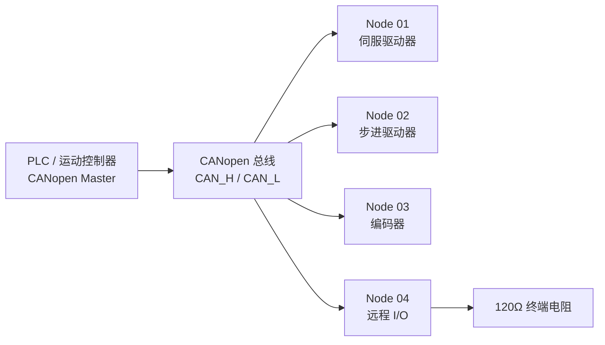
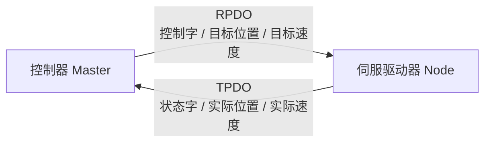
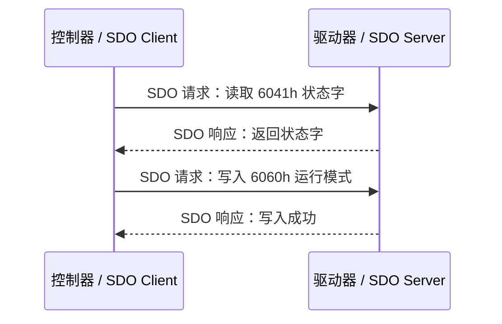
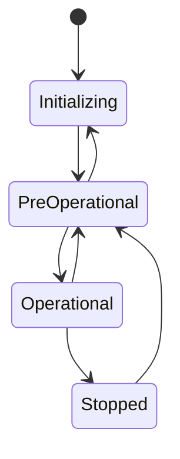
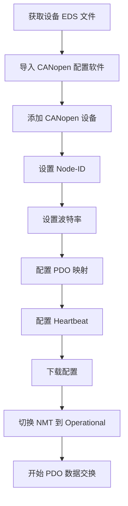
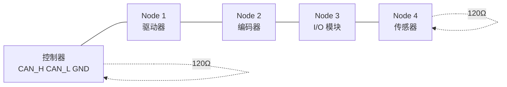
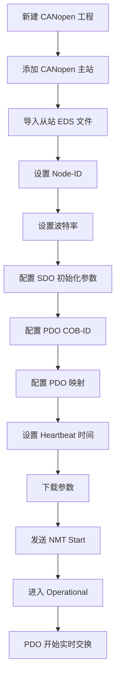
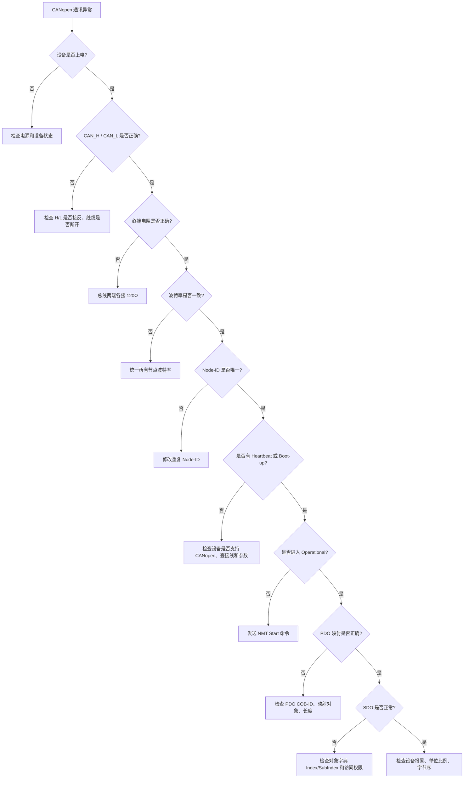
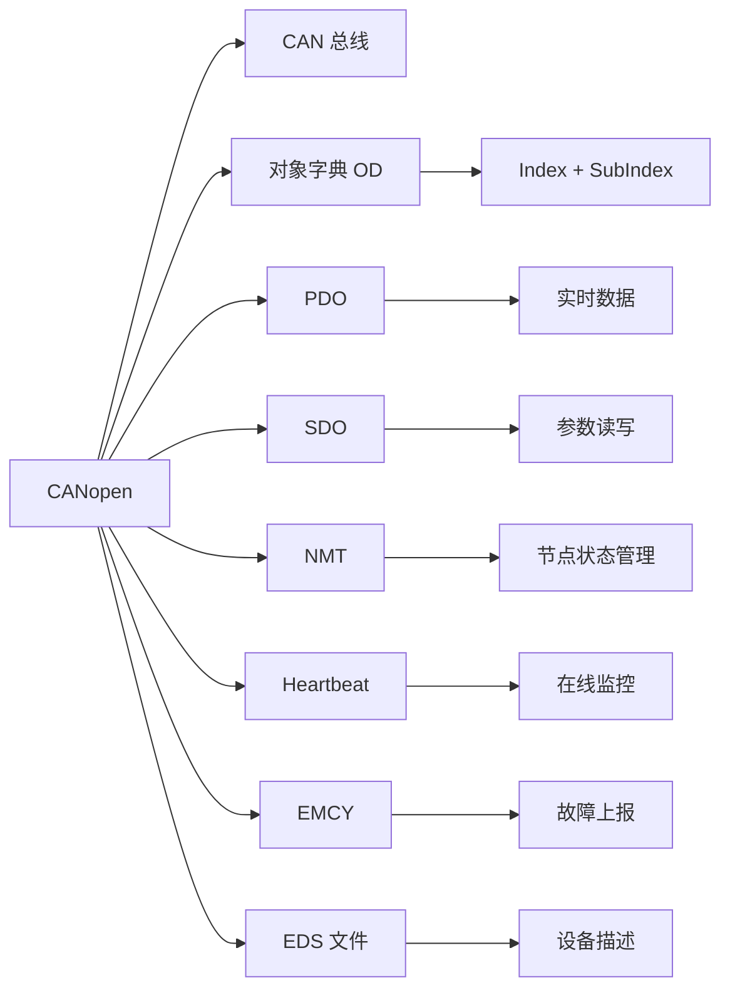

## 01｜核心概念

> [!info] 核心概念
> - **协议基础**：基于 CAN 总线
> - **协议定位**：CAN 的高层应用协议
> - **典型标准**：CiA 301、CiA 402
> - **通讯结构**：多主式总线 + 节点管理
> - **节点数量**：常见 Node-ID 为 `1–127`
> - **典型物理层**：CAN_H / CAN_L 差分总线
> - **核心机制**：对象字典、PDO、SDO、NMT、Heartbeat
> - **典型设备**：伺服驱动器、步进驱动器、编码器、远程 I/O、传感器、控制器

---

## 02｜CANopen 系统结构图



> [!tip] 结构记忆
> **CAN 是底层高速公路，CANopen 是这条路上的交通规则。**

---

## 03｜CANopen 与 CAN 的关系

| 项目 | CAN | CANopen |
|---|---|---|
| 定位 | 底层总线协议 | 高层应用协议 |
| 规定内容 | 报文帧、仲裁、差分信号 | 对象字典、PDO、SDO、NMT |
| 数据含义 | 只规定如何传输 | 规定数据怎么解释 |
| 设备互操作 | 弱 | 强 |
| 工程配置 | 手动定义报文 | 使用 EDS / 对象字典 |
| 典型应用 | 汽车、工业设备内部通讯 | 工业控制、运动控制、传感器网络 |

> [!info] 工程理解
> CAN 只解决“怎么发”，CANopen 解决“发什么、怎么解释、怎么管理设备”。

---

## 04｜关键参数速查表

| 参数 | 常见值 | 说明 | 易错点 |
|---|---|---|---|
| Node-ID | 1–127 | 每个设备唯一节点号 | 节点号重复会冲突 |
| 波特率 | 125k / 250k / 500k / 1M | 总线通讯速度 | 所有节点必须一致 |
| 物理线 | CAN_H / CAN_L | 差分通讯线 | H/L 接反无法通讯 |
| 终端电阻 | 120Ω × 2 | 总线两端各一个 | 中间节点不要加 |
| 帧格式 | 标准帧 11-bit ID | CANopen 常用标准帧 | 不同于扩展帧 29-bit |
| 数据长度 | 0–8 Byte | 经典 CAN 单帧数据长度 | PDO 单帧最多 8 字节 |
| 配置文件 | EDS / DCF | 设备描述文件 | EDS 不匹配会配置失败 |
| 核心通信 | PDO / SDO | 实时数据 / 参数访问 | 方向容易混淆 |
| 状态管理 | NMT | 节点启动、停止、复位 | 设备未 Operational 时 PDO 不工作 |

---

## 05｜CANopen 核心组成

| 模块 | 全称 | 作用 | 类比 |
|---|---|---|---|
| OD | Object Dictionary | 对象字典，保存所有参数和变量 | 设备参数表 |
| PDO | Process Data Object | 过程数据对象，实时数据交换 | 快速通道 |
| SDO | Service Data Object | 服务数据对象，读写对象字典 | 参数读写 |
| NMT | Network Management | 网络管理，控制节点状态 | 开关机管理 |
| EMCY | Emergency Object | 紧急报文，故障上报 | 报警信号 |
| SYNC | Synchronization Object | 同步报文 | 同步节拍 |
| Heartbeat | 心跳 | 节点在线状态监控 | 设备心跳包 |
| EDS | Electronic Data Sheet | 设备描述文件 | 设备说明书 |

> [!tip] 记忆口诀
> **OD 存参数，SDO 改参数，PDO 跑数据，NMT 管状态，心跳看在线。**

---

## 06｜CANopen 对象字典 OD

对象字典是 CANopen 的核心。设备的参数、状态、控制命令、实时数据，通常都放在对象字典中。

```text
对象地址 = Index + SubIndex

Index    = 16 位索引
SubIndex = 8 位子索引
```

### 示例

```text
6040h:00h = 控制字 Controlword
6041h:00h = 状态字 Statusword
6060h:00h = 运行模式 Modes of Operation
6064h:00h = 实际位置 Position Actual Value
607Ah:00h = 目标位置 Target Position
```

> [!info] 工程理解
> 对象字典就像设备内部的“寄存器地图”。  
> 读写 CANopen 参数，本质上就是读写对象字典。

---

## 07｜对象字典常见区域

| 索引范围 | 作用 | 说明 |
|---|---|---|
| `0000h–0FFFh` | 数据类型区 | 定义基础数据类型 |
| `1000h–1FFFh` | 通讯参数区 | 设备类型、心跳、PDO、SDO |
| `2000h–5FFFh` | 厂家自定义区 | 厂家参数、扩展功能 |
| `6000h–9FFFh` | 标准设备协议区 | I/O、驱动器、编码器等标准对象 |
| `A000h–FFFFh` | 保留或扩展 | 特殊应用 |

> [!warning] 易错点
> `2000h–5FFFh` 多数是厂家自定义参数，不同品牌含义可能完全不同。

---

## 08｜PDO 与 SDO 核心区别

| 对比项 | PDO | SDO |
|---|---|---|
| 全称 | Process Data Object | Service Data Object |
| 作用 | 实时过程数据交换 | 参数读写、配置设备 |
| 通讯方式 | 无确认，快速 | 有请求和响应，可靠 |
| 数据长度 | 单帧最多 8 Byte | 可传输较大数据 |
| 使用场景 | 控制字、状态字、位置、速度 | 修改参数、读取配置 |
| 是否访问对象字典 | 映射后直接传输 | 直接访问对象字典 |
| 实时性 | 高 | 低 |
| 典型阶段 | 运行中周期使用 | 调试、初始化、参数配置 |

> [!tip] 记忆口诀
> **PDO 快，跑实时；SDO 稳，改参数。**

---

## 09｜PDO 数据流向

CANopen 中 PDO 分为 TPDO 和 RPDO。

| 类型 | 全称 | 方向 | 工程含义 |
|---|---|---|---|
| TPDO | Transmit PDO | 从设备发出 | 设备发送给控制器 |
| RPDO | Receive PDO | 设备接收 | 控制器发送给设备 |



> [!warning] 易错点
> TPDO / RPDO 是站在“从站设备”的角度命名的。  
> **TPDO 是设备发出的，RPDO 是设备接收的。**

---

## 10｜PDO 典型应用

### 伺服控制场景

| 方向 | PDO 类型 | 数据内容 | 说明 |
|---|---|---|---|
| 控制器 → 驱动器 | RPDO | 控制字 | 启动、使能、复位 |
| 控制器 → 驱动器 | RPDO | 目标位置 | 位置模式给定 |
| 控制器 → 驱动器 | RPDO | 目标速度 | 速度模式给定 |
| 驱动器 → 控制器 | TPDO | 状态字 | 驱动器状态反馈 |
| 驱动器 → 控制器 | TPDO | 实际位置 | 编码器位置 |
| 驱动器 → 控制器 | TPDO | 实际速度 | 当前速度 |

```text
RPDO 示例：
6040h 控制字
607Ah 目标位置

TPDO 示例：
6041h 状态字
6064h 实际位置
```

---

## 11｜PDO 映射概念

PDO 映射决定了一个 PDO 报文里装哪些对象。

```text
PDO = 对象 A + 对象 B + 对象 C
```

### 示例：RPDO1 映射

```text
RPDO1 数据区：
Byte 0-1：6040h 控制字，16 bit
Byte 2-5：607Ah 目标位置，32 bit
Byte 6-7：空余或其他对象
```

| 字节 | 对象 | 含义 |
|---|---|---|
| Byte 0–1 | `6040h:00h` | 控制字 |
| Byte 2–5 | `607Ah:00h` | 目标位置 |
| Byte 6–7 | 备用 | 未使用 |

> [!warning] 易错点
> PDO 单帧最多 8 字节，映射对象总长度不能超过 64 bit。

---

## 12｜SDO 读写对象字典

SDO 用于读写对象字典，常用于参数配置和调试。



> [!info] 通讯规则
> SDO 通讯是典型的“请求 - 响应”模式。  
> 控制器发请求，设备返回结果。

---

## 13｜SDO 常用命令速查

| 操作 | 常见命令字节 | 含义 |
|---|---|---|
| 读请求 | `40` | 读取对象 |
| 读响应 1 Byte | `4F` | 返回 1 字节数据 |
| 读响应 2 Byte | `4B` | 返回 2 字节数据 |
| 读响应 4 Byte | `43` | 返回 4 字节数据 |
| 写 1 Byte | `2F` | 写入 1 字节 |
| 写 2 Byte | `2B` | 写入 2 字节 |
| 写 4 Byte | `23` | 写入 4 字节 |
| 写成功 | `60` | 写入确认 |
| SDO 中止 | `80` | 访问失败 |

> [!tip] 重点记忆
> **读用 40，写成功回 60，失败回 80。**

---

## 14｜SDO 实战示例：读取对象

### 示例目标

读取节点 `01` 的 `6041h:00h` 状态字。

### 请求报文

```text
COB-ID：601h
数据：  40 41 60 00 00 00 00 00
```

### 字段解释

| 字节 | 含义 |
|---|---|
| `40` | SDO 读请求 |
| `41 60` | Index = `6041h`，低字节在前 |
| `00` | SubIndex = `00h` |
| `00 00 00 00` | 空数据 |

### 响应示例

```text
COB-ID：581h
数据：  4B 41 60 00 37 12 00 00
```

| 字节 | 含义 |
|---|---|
| `4B` | SDO 读响应，返回 2 字节 |
| `41 60` | Index = `6041h` |
| `00` | SubIndex |
| `37 12` | 返回数据 = `1237h`，低字节在前 |
| `00 00` | 填充 |

> [!warning] 易错点
> SDO 报文中的 Index 使用 **低字节在前**。  
> `6041h` 在报文里写成 `41 60`。

---

## 15｜SDO 实战示例：写入对象

### 示例目标

向节点 `01` 的 `6060h:00h` 写入运行模式 `01h`。

### 请求报文

```text
COB-ID：601h
数据：  2F 60 60 00 01 00 00 00
```

### 字段解释

| 字节 | 含义 |
|---|---|
| `2F` | SDO 写 1 字节 |
| `60 60` | Index = `6060h` |
| `00` | SubIndex = `00h` |
| `01` | 写入值 |
| `00 00 00` | 填充 |

### 写入成功响应

```text
COB-ID：581h
数据：  60 60 60 00 00 00 00 00
```

> [!check] 判断写入成功
> SDO 写入成功时，响应命令字节通常为 `60`。

---

## 16｜COB-ID 速查表

CANopen 报文通过 COB-ID 进行区分。常见 COB-ID 与 Node-ID 有固定关系。

| 对象 | 默认 COB-ID | 说明 |
|---|---|---|
| NMT | `000h` | 网络管理 |
| SYNC | `080h` | 同步报文 |
| EMCY | `080h + Node-ID` | 紧急报文 |
| TPDO1 | `180h + Node-ID` | 从站发送 PDO1 |
| RPDO1 | `200h + Node-ID` | 从站接收 PDO1 |
| TPDO2 | `280h + Node-ID` | 从站发送 PDO2 |
| RPDO2 | `300h + Node-ID` | 从站接收 PDO2 |
| TPDO3 | `380h + Node-ID` | 从站发送 PDO3 |
| RPDO3 | `400h + Node-ID` | 从站接收 PDO3 |
| TPDO4 | `480h + Node-ID` | 从站发送 PDO4 |
| RPDO4 | `500h + Node-ID` | 从站接收 PDO4 |
| SDO 响应 | `580h + Node-ID` | 从站 → 控制器 |
| SDO 请求 | `600h + Node-ID` | 控制器 → 从站 |
| Heartbeat | `700h + Node-ID` | 节点状态监控 |

### Node-ID = 1 示例

| 对象 | COB-ID |
|---|---|
| TPDO1 | `181h` |
| RPDO1 | `201h` |
| SDO 响应 | `581h` |
| SDO 请求 | `601h` |
| Heartbeat | `701h` |

> [!tip] 快速记忆
> **180 发 PDO，200 收 PDO；580 回 SDO，600 发 SDO；700 看心跳。**

---

## 17｜NMT 网络管理

NMT 用于控制 CANopen 节点状态。

### NMT 状态

| 状态 | 含义 | 说明 |
|---|---|---|
| Initializing | 初始化 | 上电后自动进入 |
| Pre-operational | 预操作 | 可用 SDO 配置参数 |
| Operational | 操作运行 | PDO 正常工作 |
| Stopped | 停止 | 大部分通讯停止，仅保留少量管理功能 |



> [!warning] 易错点
> 很多设备只有进入 `Operational` 后，PDO 才会正常收发。

---

## 18｜NMT 命令速查

NMT 报文 COB-ID 固定为 `000h`。

```text
NMT 数据格式：
命令字节 + Node-ID
```

| 命令 | 数据 | 作用 |
|---|---|---|
| Start Remote Node | `01 Node-ID` | 进入 Operational |
| Stop Remote Node | `02 Node-ID` | 进入 Stopped |
| Enter Pre-operational | `80 Node-ID` | 进入 Pre-operational |
| Reset Node | `81 Node-ID` | 复位整个节点 |
| Reset Communication | `82 Node-ID` | 复位通讯部分 |

### 示例：让节点 1 进入 Operational

```text
COB-ID：000h
数据：  01 01
```

### 示例：让所有节点进入 Operational

```text
COB-ID：000h
数据：  01 00
```

> [!tip] 记忆口诀
> **01 启动，02 停止，80 预操作，81 整机复位，82 通讯复位。**

---

## 19｜Heartbeat 心跳机制

Heartbeat 用于监控节点是否在线、处于什么状态。

### Heartbeat 报文

```text
COB-ID：700h + Node-ID
数据：  节点状态
```

### 常见状态值

| 数据值 | 状态 |
|---|---|
| `00h` | Boot-up |
| `04h` | Stopped |
| `05h` | Operational |
| `7Fh` | Pre-operational |

### 示例：节点 1 处于 Operational

```text
COB-ID：701h
数据：  05
```

> [!check] 判断在线
> 周期性收到 `700h + Node-ID` 的心跳报文，说明该节点在线。

---

## 20｜EMCY 紧急报文

EMCY 用于设备发生故障时快速上报错误。

```text
EMCY COB-ID = 080h + Node-ID
```

### 示例：节点 1 发送紧急报文

```text
COB-ID：081h
数据：  00 10 01 00 00 00 00 00
```

| 字段 | 含义 |
|---|---|
| Byte 0–1 | 错误码 |
| Byte 2 | 错误寄存器 |
| Byte 3–7 | 厂家自定义错误信息 |

> [!warning] 易错点
> EMCY 只能说明设备报错了，具体含义通常要查设备手册的错误码表。

---

## 21｜EDS 文件详解

EDS 文件是 CANopen 设备描述文件。

> [!info] EDS 文件作用
> - 描述设备支持的对象字典
> - 描述 PDO 映射能力
> - 描述通讯参数
> - 描述设备型号、厂家、版本
> - 供主站或配置软件识别设备
> - 用于工程组态和参数下载

---

### EDS 使用流程



> [!warning] 易错点
> EDS 文件不等于参数已经写入设备。  
> 很多设备仍需要单独下载参数或保存参数。

---

## 22｜CiA 402 驱动器控制核心对象

CANopen 运动控制中，最常见的是 CiA 402 设备协议。

| 对象 | 名称 | 作用 |
|---|---|---|
| `6040h` | Controlword | 控制字 |
| `6041h` | Statusword | 状态字 |
| `6060h` | Modes of Operation | 运行模式设定 |
| `6061h` | Modes of Operation Display | 当前运行模式 |
| `6064h` | Position Actual Value | 实际位置 |
| `606Ch` | Velocity Actual Value | 实际速度 |
| `607Ah` | Target Position | 目标位置 |
| `60FFh` | Target Velocity | 目标速度 |
| `6077h` | Torque Actual Value | 实际转矩 |
| `6071h` | Target Torque | 目标转矩 |

> [!tip] 重点记忆
> **6040 控制，6041 状态；6060 模式，6064 位置；607A 目标位置。**

---

## 23｜CiA 402 常见运行模式

| 模式值 | 模式名称 | 说明 |
|---|---|---|
| `01h` | Profile Position Mode | 轮廓位置模式 |
| `03h` | Profile Velocity Mode | 轮廓速度模式 |
| `04h` | Profile Torque Mode | 轮廓转矩模式 |
| `06h` | Homing Mode | 回零模式 |
| `08h` | Cyclic Synchronous Position | 周期同步位置模式 |
| `09h` | Cyclic Synchronous Velocity | 周期同步速度模式 |
| `0Ah` | Cyclic Synchronous Torque | 周期同步转矩模式 |

> [!info] 工程理解
> 普通点位控制常用 `01h`，回零常用 `06h`，高速同步运动控制常用 `08h / 09h / 0Ah`。

---

## 24｜CANopen 接线规范



> [!check] 接线注意事项
> - [ ] 使用双绞屏蔽线
> - [ ] CAN_H 接 CAN_H
> - [ ] CAN_L 接 CAN_L
> - [ ] 总线两端各接一个 `120Ω` 终端电阻
> - [ ] 中间节点不要加终端电阻
> - [ ] 不建议星型接线
> - [ ] 支线尽量短
> - [ ] 屏蔽层按现场规范接地
> - [ ] 通讯线远离动力线、伺服线、变频器输出线

---

## 25｜波特率与距离

| 波特率 | 单段最大距离参考 |
|---|---|
| 1 Mbps | 约 25 m |
| 800 kbps | 约 50 m |
| 500 kbps | 约 100 m |
| 250 kbps | 约 250 m |
| 125 kbps | 约 500 m |
| 50 kbps | 约 1000 m |
| 20 kbps | 约 2500 m |

> [!tip] 选择建议
> 距离越长，波特率越低。  
> 现场干扰大时，不要盲目使用 `1 Mbps`。

---

## 26｜CANopen 配置流程



> [!check] 配置检查清单
> - [ ] EDS 文件是否正确
> - [ ] Node-ID 是否唯一
> - [ ] 波特率是否一致
> - [ ] 终端电阻是否正确
> - [ ] PDO 映射是否超过 8 字节
> - [ ] PDO 方向是否正确
> - [ ] SDO 初始化参数是否写入
> - [ ] 设备是否进入 Operational
> - [ ] Heartbeat 是否正常
> - [ ] 设备参数是否保存

---

## 27｜实战示例：伺服驱动器位置控制

### 目标

控制 Node 1 伺服驱动器进入位置模式，并发送目标位置。

### 初始化步骤

```text
1. 设置 Node-ID = 1
2. 设置波特率 = 500 kbps
3. 写入 6060h = 01h，选择位置模式
4. 配置 RPDO：6040h 控制字 + 607Ah 目标位置
5. 配置 TPDO：6041h 状态字 + 6064h 实际位置
6. 发送 NMT Start
7. 周期发送 RPDO 控制运动
8. 读取 TPDO 反馈状态
```

### 典型 PDO 数据

```text
控制器 → 驱动器 RPDO：
6040h 控制字
607Ah 目标位置

驱动器 → 控制器 TPDO：
6041h 状态字
6064h 实际位置
```

> [!warning] 易错点
> 伺服是否能运动，不只取决于 PDO。  
> 还要满足使能状态、运行模式、报警复位、限位状态、急停状态等条件。

---

## 28｜实战示例：读取编码器位置

### 场景

CANopen 绝对值编码器通过 TPDO 周期发送当前位置。

| 项目 | 示例 |
|---|---|
| Node-ID | `03` |
| TPDO1 COB-ID | `183h` |
| 映射对象 | `6004h:00h` |
| 数据长度 | 32 bit |
| 数据内容 | 绝对位置值 |

### 报文示例

```text
COB-ID：183h
数据：  78 56 34 12
```

### 数据解释

```text
低字节在前：
78 56 34 12 = 0x12345678
```

> [!tip] 工程建议
> 编码器重点检查：分辨率、方向、零点偏移、PDO 发送周期、数据字节序。

---

## 29｜常见故障现象

| 现象 | 可能原因 | 排查方向 |
|---|---|---|
| 完全无报文 | 电源、接线、波特率错误 | 查供电、CAN_H/L、波特率 |
| 只有 Boot-up，无 PDO | 未发送 NMT Start | 让节点进入 Operational |
| SDO 无响应 | Node-ID 错误或 SDO COB-ID 错误 | 查 Node-ID、COB-ID |
| PDO 不更新 | PDO 未使能或映射错误 | 查 PDO 参数和 NMT 状态 |
| Heartbeat 超时 | 节点掉线或总线异常 | 查电源、接线、干扰 |
| EMCY 报文出现 | 设备报警 | 查设备故障码 |
| 数据方向反了 | TPDO / RPDO 理解错误 | 站在从站角度判断 |
| 位置数据异常 | 字节序、单位、比例错误 | 查对象类型和厂家手册 |
| 多节点冲突 | Node-ID 重复 | 修改重复节点号 |
| 通讯不稳定 | 终端电阻、支线过长、干扰 | 查终端、线缆、屏蔽接地 |

---

## 30｜CANopen 排查流程



---

> [!check] 排查清单
> - [ ] 设备是否上电
> - [ ] CAN_H / CAN_L 是否接反
> - [ ] 是否使用双绞屏蔽线
> - [ ] 总线两端是否有 `120Ω` 终端电阻
> - [ ] 中间节点是否误加终端
> - [ ] 波特率是否一致
> - [ ] Node-ID 是否重复
> - [ ] 是否收到 Boot-up 报文
> - [ ] 是否收到 Heartbeat 报文
> - [ ] 是否发送 NMT Start
> - [ ] 节点是否进入 Operational
> - [ ] SDO COB-ID 是否正确
> - [ ] PDO COB-ID 是否正确
> - [ ] PDO 映射长度是否超过 8 字节
> - [ ] TPDO / RPDO 方向是否理解正确
> - [ ] 对象字典 Index / SubIndex 是否正确
> - [ ] 参数是否保存到设备
> - [ ] 是否有 EMCY 故障报文

---

## 31｜CANopen 与 Modbus RTU 对比

| 对比项 | CANopen | Modbus RTU |
|---|---|---|
| 底层总线 | CAN | RS485 / RS232 |
| 通讯模式 | 多主仲裁 + 对象通信 | 主从请求响应 |
| 实时数据 | PDO | 功能码读写寄存器 |
| 参数访问 | SDO | 读写寄存器 |
| 设备模型 | 对象字典 | 寄存器表 |
| 实时性 | 较强 | 一般 |
| 报文长度 | CAN 单帧 8 字节 | RTU 报文可变 |
| 错误处理 | CAN 错误机制 + EMCY | CRC + 异常码 |
| 常见场景 | 伺服、编码器、运动控制 | 仪表、变频器、传感器 |
| 学习重点 | OD、PDO、SDO、NMT | 地址、功能码、CRC |

> [!tip] 选择建议
> - 运动控制、伺服、编码器、多节点实时通讯：优先 CANopen  
> - 简单仪表、低成本、通用串口采集：优先 Modbus RTU  

---

## 32｜CANopen 与 PROFIBUS DP 对比

| 对比项 | CANopen | PROFIBUS DP |
|---|---|---|
| 底层物理 | CAN 总线 | RS485 |
| 网络结构 | 多主仲裁机制 | 主站轮询 |
| 配置文件 | EDS / DCF | GSD |
| 实时数据 | PDO | 周期性 I/O |
| 参数访问 | SDO | DP-V1 非周期参数 |
| 典型场景 | 伺服、驱动、编码器 | 远程 I/O、变频器、阀岛 |
| 诊断方式 | Heartbeat、EMCY | BF/SF、从站诊断 |
| 工程重点 | 对象字典和 PDO 映射 | GSD 和模块组态 |

> [!info] 工程理解
> CANopen 更像“对象字典驱动的设备网络”，PROFIBUS DP 更像“PLC 统一管理的现场 I/O 网络”。

---

## 33｜工程应用建议

> [!tip] 初次调试建议
> - 先只接一个节点
> - 波特率先用 `500 kbps` 或设备默认值
> - Node-ID 从 `1` 开始设置
> - 先确认 Boot-up 和 Heartbeat
> - 再测试 SDO 读对象字典
> - 然后发送 NMT Start
> - 最后调试 PDO 映射和实时数据
> - 伺服驱动先看 CiA 402 状态机

---

> [!warning] 现场注意事项
> - CAN_H / CAN_L 接反会导致无法通讯
> - 总线两端必须有 120Ω 终端电阻
> - 支线过长会导致波形反射
> - Node-ID 重复会导致报文冲突
> - 波特率必须全网一致
> - PDO 只有在节点进入 Operational 后才通常有效
> - SDO 写参数成功后，不代表参数已经永久保存
> - 不同厂家对象字典扩展区差异很大

---

## 34｜CANopen 快速记忆图



---

## 35｜记忆口诀

> [!tip] CANopen 口诀
> **H L 两根线，两端一百二。**
>
> **节点号别重复，波特率要统一。**
>
> **OD 是地图，SDO 查地图。**
>
> **PDO 跑实时，NMT 管状态。**
>
> **TPDO 是设备发，RPDO 是设备收。**
>
> **700 看心跳，80 报紧急。**
>
> **未进 Operational，PDO 多半不工作。**

---

## 36｜最终速记卡

- CANopen 是基于 CAN 总线的高层工业通讯协议。
- CANopen 核心是：`对象字典 OD + PDO + SDO + NMT + Heartbeat + EMCY`。
- Node-ID 常用范围是 `1–127`，同一总线不能重复。
- CANopen 常用标准 11-bit CAN ID，单帧数据最多 `8 Byte`。
- PDO 用于实时数据交换，SDO 用于参数读写。
- TPDO 是从站发出的数据，RPDO 是从站接收的数据。
- SDO 访问对象字典时，Index 在报文中低字节在前。
- NMT 控制节点状态，节点进入 `Operational` 后 PDO 才通常正常工作。
- Heartbeat 的 COB-ID 是 `700h + Node-ID`。
- 伺服常用对象：`6040h` 控制字，`6041h` 状态字，`6060h` 模式，`607Ah` 目标位置。
- 接线重点：CAN_H / CAN_L 不要接反，总线两端各接 `120Ω`。
- 排查顺序：电源 → H/L → 终端 → 波特率 → Node-ID → Heartbeat → NMT → PDO / SDO。