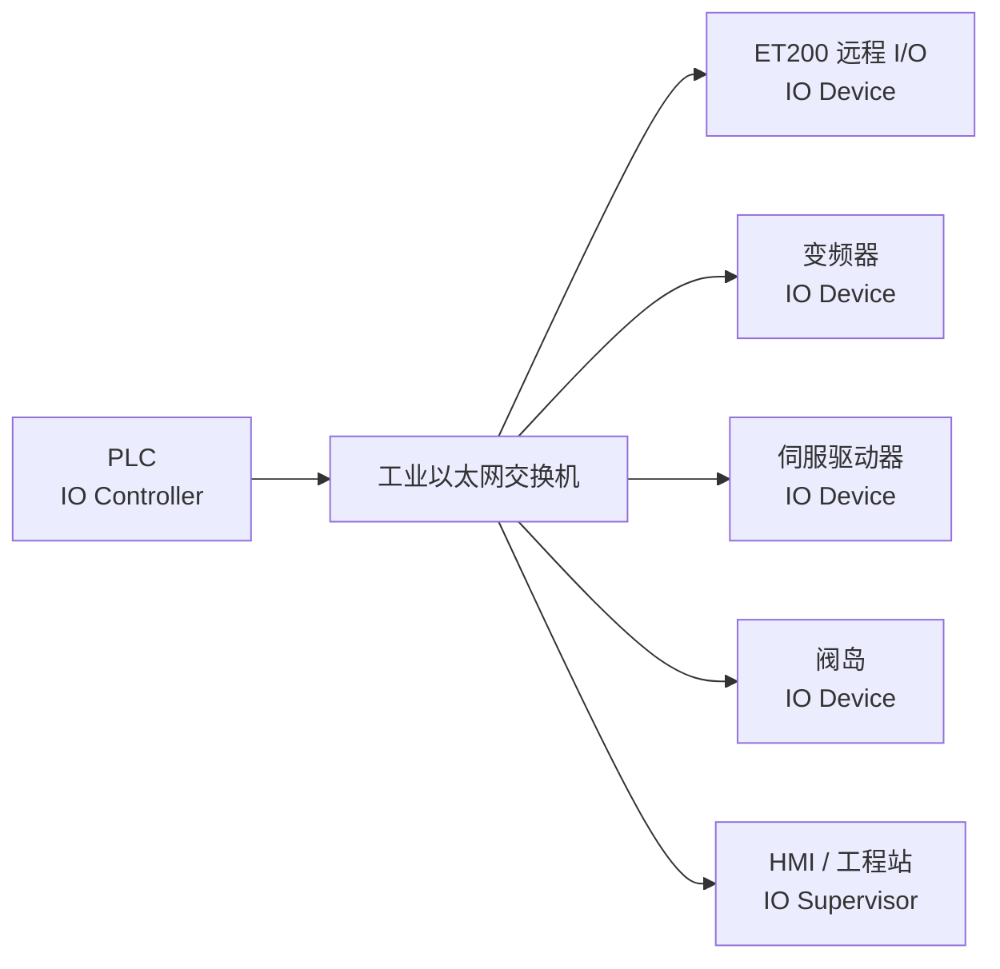
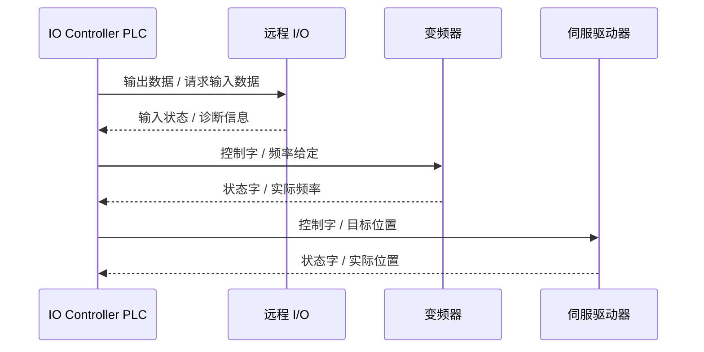
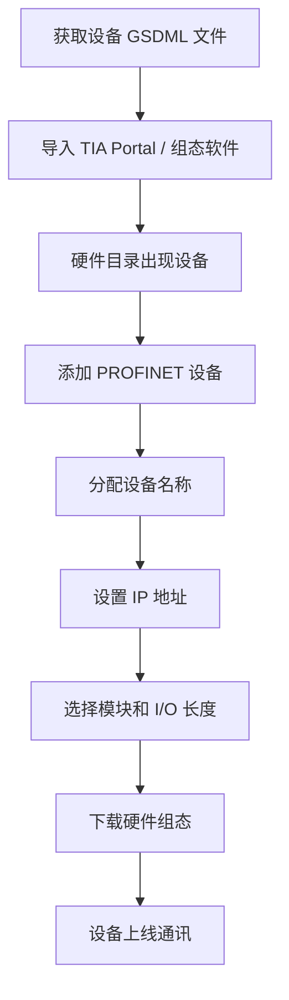
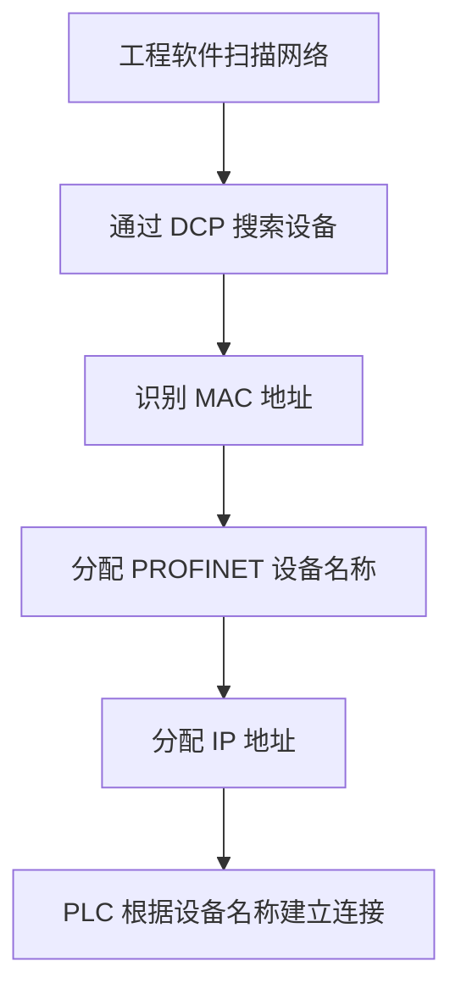
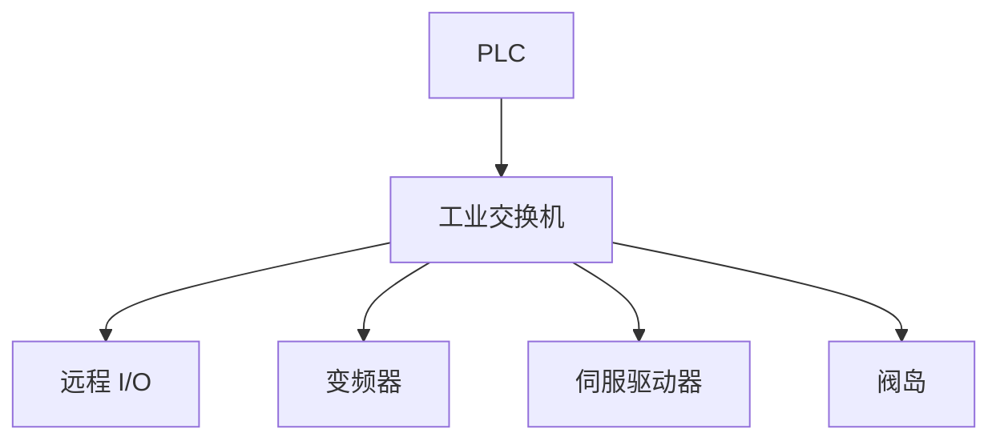
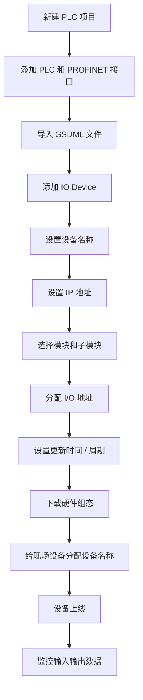
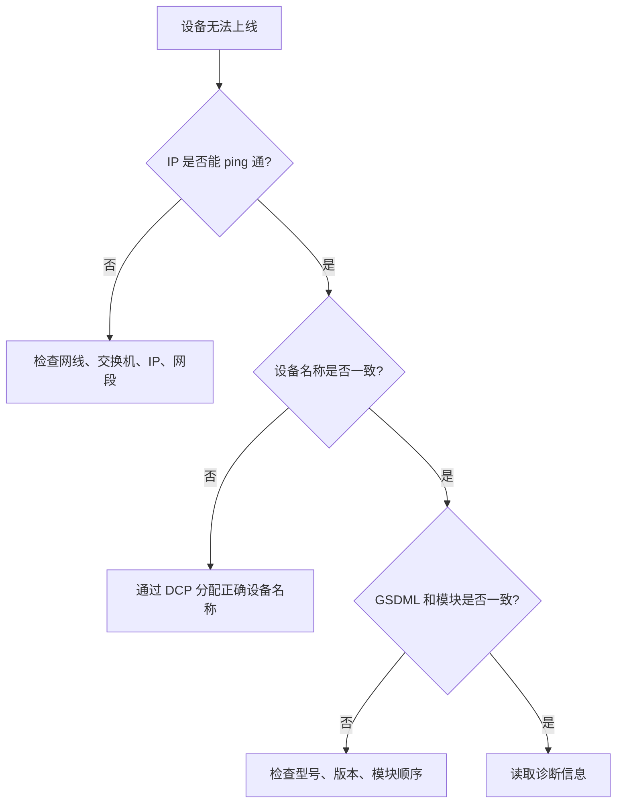
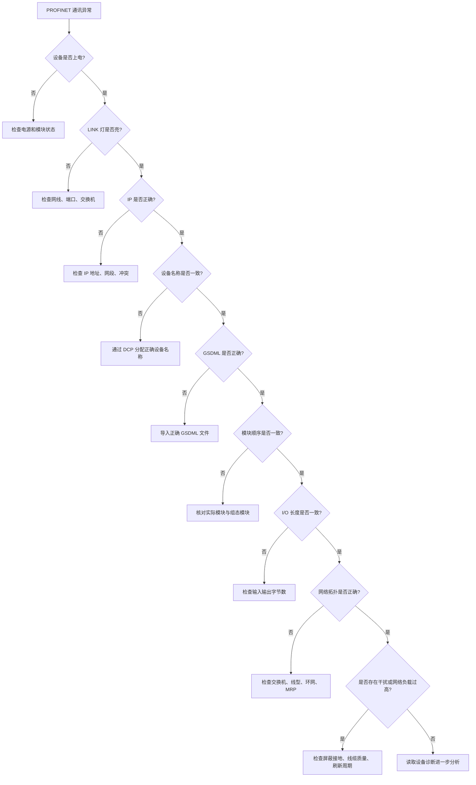
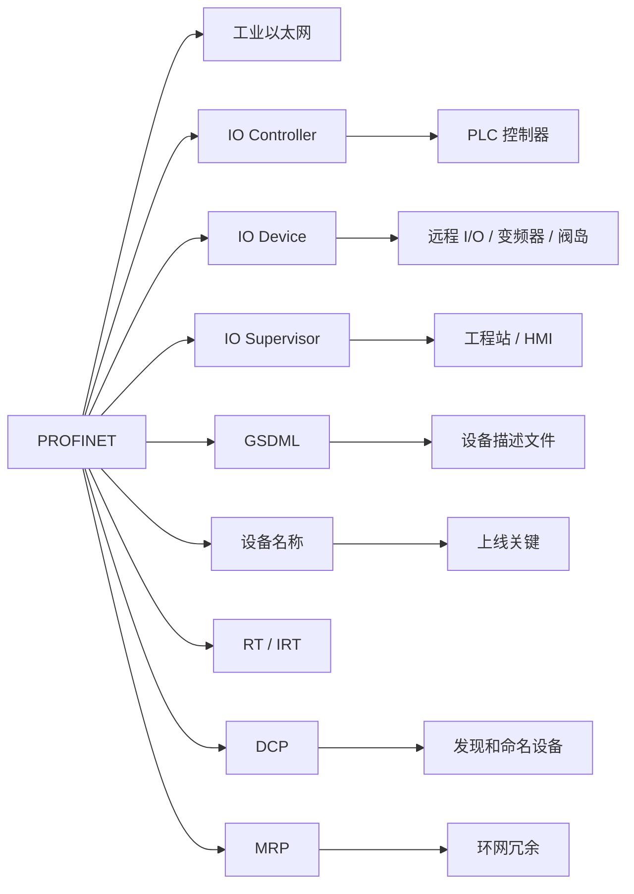

## 01｜核心概念

> [!info] 核心概念
> - **协议类型**：工业以太网通讯协议
> - **典型生态**：西门子 Siemens、欧系自动化系统常见
> - **物理介质**：工业以太网线、光纤
> - **通讯方式**：控制器周期性访问设备
> - **典型结构**：一台 PLC 控制多个 PROFINET 设备
> - **核心对象**：IO Controller、IO Device、IO Supervisor
> - **配置文件**：GSDML 文件
> - **主要特点**：高速、实时、诊断能力强、支持网络拓扑诊断

---

## 02｜PROFINET 系统结构图



> [!tip] 结构记忆
> **PLC 是控制器，现场设备是 Device，工程软件是 Supervisor。**

---

## 03｜PROFINET 与普通以太网的关系

| 对比项 | 普通以太网 | PROFINET |
|---|---|---|
| 用途 | 办公网络、普通数据通信 | 工业自动化实时控制 |
| 通讯对象 | 电脑、服务器、路由器 | PLC、I/O、驱动器、仪表 |
| 实时性 | 一般 | 强 |
| 设备识别 | IP / MAC | 设备名称 + IP + GSDML |
| 诊断能力 | 普通网络诊断 | 工业设备级诊断 |
| 组态方式 | 网络配置 | PLC 硬件组态 |
| 典型线缆 | 普通网线 | 工业以太网线 |
| 典型拓扑 | 星型为主 | 星型、线型、环网 |

> [!info] 工程理解
> PROFINET 不是“普通网口随便通信”，而是基于以太网的工业实时通讯系统。

---

## 04｜关键参数速查表

| 参数 | 常见值 | 说明 | 易错点 |
|---|---|---|---|
| 通讯介质 | 工业以太网 | 铜缆或光纤 | 普通网线抗干扰差 |
| 速率 | 100 Mbps 常见 | PROFINET RT 常见百兆 | 线缆和交换机要支持 |
| IP 地址 | 如 `192.168.0.x` | 网络层地址 | 同网段但不是唯一判断条件 |
| 设备名称 | 如 `et200sp_1` | PROFINET 关键标识 | 名称不一致会连不上 |
| MAC 地址 | 设备硬件地址 | 用于 DCP 搜索和命名 | 换设备后需重新分配名称 |
| GSDML | XML 设备描述文件 | 供工程软件识别设备 | 版本不匹配会组态失败 |
| 周期时间 | 1 ms / 2 ms / 4 ms 等 | I/O 刷新周期 | 设太小会增加网络负载 |
| 设备角色 | Controller / Device / Supervisor | 网络角色 | 不同角色功能不同 |
| 拓扑 | 星型 / 线型 / 环网 | 现场网络结构 | 接线与组态拓扑不一致会报警 |

---

## 05｜PROFINET 三类角色

| 角色 | 中文理解 | 作用 | 典型设备 |
|---|---|---|---|
| IO Controller | 控制器 | 控制现场设备，周期性交换 I/O 数据 | PLC、运动控制器 |
| IO Device | 现场设备 | 接收控制器命令，返回输入数据和诊断 | 远程 I/O、变频器、阀岛 |
| IO Supervisor | 监控 / 工程站 | 组态、调试、诊断设备 | TIA Portal、工程电脑、HMI |

> [!tip] 记忆口诀
> **Controller 管控制，Device 干活，Supervisor 做调试。**

---

## 06｜PROFINET 通讯逻辑

PROFINET 通常通过 PLC 硬件组态，把现场设备数据映射到 PLC 的输入区和输出区。

```text
PLC 输出区  →  PROFINET  →  现场设备输出 / 控制命令
PLC 输入区  ←  PROFINET  ←  现场设备输入 / 状态反馈
```



> [!info] 通讯规则
> PROFINET IO 设备通常不会脱离控制器随意上报控制数据，而是按照组态周期与控制器交换数据。

---

## 07｜PROFINET 数据类型

| 数据类型 | 说明 | 典型用途 |
|---|---|---|
| 周期性 I/O 数据 | 固定周期刷新 | 输入点、输出点、控制字、状态字 |
| 非周期性数据 | 按需读取或写入 | 参数、诊断、设备信息 |
| 报警数据 | 设备状态变化触发 | 模块拔出、短路、断线、故障 |
| 诊断数据 | 设备健康状态 | 端口状态、拓扑、模块错误 |

> [!tip] 快速理解
> **周期数据跑控制，非周期数据改参数，报警诊断查故障。**

---

## 08｜PROFINET RT / IRT / TCP/IP 区别

| 类型 | 全称 | 特点 | 典型用途 |
|---|---|---|---|
| TCP/IP | 普通以太网通讯 | 非实时 | 参数、诊断、网页访问 |
| RT | Real-Time | 实时通讯，常见 PROFINET IO | 远程 I/O、变频器、阀岛 |
| IRT | Isochronous Real-Time | 等时同步实时 | 高性能运动控制、同步伺服 |

> [!info] 工程理解
> - **RT**：最常见，适合普通自动化控制  
> - **IRT**：要求更高，适合运动控制和高同步场景  
> - **TCP/IP**：用于普通数据访问，不负责高速实时 I/O  

---

## 09｜PROFINET 与 PROFIBUS DP 对比

| 对比项 | PROFINET | PROFIBUS DP |
|---|---|---|
| 物理层 | 工业以太网 | RS485 现场总线 |
| 线缆 | 网线 / 光纤 | 紫色 PROFIBUS 电缆 |
| 速率 | 常见 100 Mbps | 最高 12 Mbps |
| 地址识别 | 设备名称 + IP | 站地址 |
| 配置文件 | GSDML | GSD |
| 拓扑 | 星型、线型、环网 | 总线型 |
| 实时性 | RT / IRT | 周期性 DP 通讯 |
| 诊断能力 | 强，支持拓扑诊断 | 强，但拓扑信息较弱 |
| 扩展性 | 更强 | 较传统 |
| 典型应用 | 新型工业以太网系统 | 传统现场总线系统 |

> [!tip] 记忆口诀
> **PROFIBUS 看站号，PROFINET 看设备名。**

---

## 10｜GSDML 文件详解

GSDML 是 PROFINET 设备描述文件，通常是 XML 格式。

> [!info] GSDML 文件作用
> - 描述设备厂家、型号、版本
> - 描述设备支持的模块
> - 描述输入输出字节长度
> - 描述诊断信息
> - 描述参数配置项
> - 让 PLC 组态软件识别设备
> - 用于硬件组态和数据映射

---

### GSDML 使用流程



> [!warning] 易错点
> GSDML 文件版本、设备固件版本、实际模块型号不匹配，都会导致设备无法正常上线。

---

## 11｜设备名称与 IP 地址

PROFINET 最容易出错的地方之一是 **设备名称**。

| 项目 | 作用 | 说明 |
|---|---|---|
| 设备名称 | PROFINET 识别设备的关键 | 必须与 PLC 组态一致 |
| IP 地址 | 网络通信地址 | 通常由 PLC 或工程软件分配 |
| MAC 地址 | 物理网卡地址 | 用于搜索、识别、分配名称 |
| 子网掩码 | 网络范围 | 主站和设备需在合理网段 |
| 网关 | 跨网段通信 | 普通本地 PROFINET 常不需要 |

> [!warning] 易错点
> PROFINET 设备 **IP 正确但设备名称错误**，仍然可能无法通讯。

---

### 命名规则建议

```text
推荐格式：
设备类型_区域_编号

示例：
et200sp_a01
vfd_line1_01
valve_station_02
servo_x_axis
camera_check_01
```

> [!tip] 工程建议
> 设备名称建议全部使用小写字母、数字和下划线，避免空格和特殊字符。

---

## 12｜DCP 设备发现与命名

DCP 是 PROFINET 中用于发现和配置设备名称、IP 地址的协议。



> [!info] 工程理解
> PROFINET 现场调试时，常见操作就是：  
> **扫描设备 → 找到 MAC → 分配设备名称 → 下载组态 → 建立通讯。**

---

## 13｜PROFINET 拓扑结构

### 星型拓扑



> [!tip] 优点
> 星型拓扑结构清晰，便于维护，单个支路故障不一定影响全网。

---

### 线型拓扑


> [!warning] 注意
> 线型拓扑节省交换机，但中间设备或网口故障可能影响后面的设备。

---

### 环网拓扑


> [!info] 工程理解
> 环网通常配合 MRP 使用，提高网络冗余能力。

---

## 14｜MRP 环网冗余

MRP 是 PROFINET 常用的介质冗余协议，用于环网故障恢复。

| 项目 | 说明 |
|---|---|
| 全称 | Media Redundancy Protocol |
| 作用 | 网络断线时自动切换路径 |
| 常见角色 | MRP Manager / MRP Client |
| 典型场景 | 重要产线、设备较多、不能轻易停机 |
| 注意事项 | 所有环网设备需支持 MRP |

> [!tip] 记忆口诀
> **MRP 做环网，断一处还能通。**

---

## 15｜PROFINET 常见数据映射

### 远程 I/O 示例

| 数据方向 | PLC 地址 | 说明 |
|---|---|---|
| Device → PLC | 输入区 I | 数字量输入、模拟量输入 |
| PLC → Device | 输出区 Q | 数字量输出、模拟量输出 |

```text
I100.0 = 输入点 1
I100.1 = 输入点 2
Q100.0 = 输出点 1
Q100.1 = 输出点 2
```

---

### 变频器示例

| 方向 | 数据 | 含义 |
|---|---|---|
| PLC → 变频器 | 控制字 | 启动、停止、复位 |
| PLC → 变频器 | 频率给定 | 目标频率 |
| 变频器 → PLC | 状态字 | 就绪、运行、故障 |
| 变频器 → PLC | 实际频率 | 当前输出频率 |

```text
PLC 输出：
控制字 = 047F
频率给定 = 1500

PLC 输入：
状态字 = 1237
实际频率 = 1498
```

> [!warning] 易错点
> 不同品牌驱动器的控制字、状态字、频率倍率可能不同，必须查看设备手册。

---

## 16｜PROFINET 设备组态流程



> [!check] 配置检查清单
> - [ ] GSDML 文件是否正确
> - [ ] 设备型号是否一致
> - [ ] 固件版本是否兼容
> - [ ] 设备名称是否完全一致
> - [ ] IP 地址是否在正确网段
> - [ ] 模块顺序是否与实际一致
> - [ ] 输入输出字节长度是否正确
> - [ ] 更新时间设置是否合理
> - [ ] 组态是否已下载到 PLC
> - [ ] 现场设备是否已分配名称

---

## 17｜实战示例：ET200 远程 I/O

### 场景

PLC 通过 PROFINET 连接一个 ET200 远程 I/O 站。

| 模块 | 数据方向 | 数据长度 | 说明 |
|---|---|---|---|
| DI 16x24VDC | Device → PLC | 2 Byte | 16 点数字量输入 |
| DO 16x24VDC | PLC → Device | 2 Byte | 16 点数字量输出 |
| AI 4xU/I | Device → PLC | 8 Byte | 4 路模拟量输入 |
| AO 2xU/I | PLC → Device | 4 Byte | 2 路模拟量输出 |

### PLC 地址示例

```text
数字量输入：
I100.0 - I101.7

数字量输出：
Q100.0 - Q101.7

模拟量输入：
IW102 / IW104 / IW106 / IW108

模拟量输出：
QW102 / QW104
```

> [!example] 应用场景
> - 读取现场按钮、限位、传感器
> - 控制电磁阀、继电器、指示灯
> - 采集温度、压力、流量
> - 输出模拟量控制阀门或变频器

---

## 18｜实战示例：变频器 PROFINET 通讯

### 常见控制结构

| PLC → 变频器 | 说明 |
|---|---|
| 控制字 | 启动、停止、使能、故障复位 |
| 速度 / 频率给定 | 目标速度或频率 |
| 参数控制 | 可选，取决于报文类型 |

| 变频器 → PLC | 说明 |
|---|---|
| 状态字 | 就绪、运行、故障、报警 |
| 实际速度 / 频率 | 当前运行反馈 |
| 故障代码 | 设备异常信息 |

### 示例数据

```text
PLC → VFD：
控制字：047F
频率给定：1500

VFD → PLC：
状态字：1237
实际频率：1498
```

> [!warning] 易错点
> 变频器要确认：
> - 命令源是否设置为 PROFINET
> - 频率源是否设置为 PROFINET
> - 报文类型是否与 PLC 组态一致
> - 控制字使能流程是否正确

---

## 19｜实战示例：工业相机 / 机器人

### 工业相机常见数据

| PLC → 相机 | 相机 → PLC |
|---|---|
| 触发拍照 | 拍照完成 |
| 任务编号 | OK / NG 结果 |
| 复位命令 | 错误状态 |
| 参数切换 | 检测数据 |

### 机器人常见数据

| PLC → 机器人 | 机器人 → PLC |
|---|---|
| 启动程序 | 程序运行中 |
| 程序号 | 到位信号 |
| 复位 / 停止 | 报警状态 |
| 握手信号 | 允许进入 / 离开 |

> [!tip] 工程建议
> 复杂设备通讯重点看 **握手信号时序**，不要只看单个 bit 是否有变化。

---

## 20｜设备名称错误排查

设备名称错误是 PROFINET 最常见故障之一。



> [!warning] 易错点
> 有时可以 ping 通设备，但 PLC 仍然报错。  
> 这种情况优先检查 **PROFINET 设备名称**。

---

## 21｜PROFINET 常见指示灯

| 指示灯 | 常见含义 | 状态说明 |
|---|---|---|
| RUN | 设备运行状态 | 常亮表示设备运行 |
| ERROR / SF | 系统错误 | 设备或模块故障 |
| BF | 总线故障 | PROFINET 通讯异常 |
| LINK | 网口物理连接 | 亮表示网线连接 |
| ACT | 数据活动 | 闪烁表示有数据收发 |
| PN | PROFINET 状态 | 不同厂家定义不同 |

> [!tip] 快速判断
> **LINK 不亮先查网线。BF 亮先查名称、IP、组态。SF 亮查模块和设备诊断。**

---

## 22｜常见故障现象

| 现象 | 可能原因 | 排查方向 |
|---|---|---|
| LINK 不亮 | 网线断、端口坏、交换机未上电 | 查网线、端口、交换机 |
| 能 ping 但 PLC 连不上 | 设备名称错误 | 查 PROFINET Name |
| BF 灯亮 | 总线通讯异常 | 查名称、IP、组态、网络 |
| SF 灯亮 | 系统或模块故障 | 查模块、诊断、参数 |
| 设备不上线 | GSDML 错、设备名错、IP 冲突 | 查 GSDML、名称、地址 |
| 数据错位 | 模块顺序或 I/O 长度错误 | 查硬件组态 |
| 通讯偶发中断 | 干扰、线缆质量、交换机问题 | 查屏蔽、接地、网络负载 |
| 环网报警 | MRP 角色或接线错误 | 查 MRP Manager / Client |
| 驱动器不响应 | 报文类型或控制字错误 | 查控制字和报文配置 |
| 相机无结果 | 握手时序错误 | 查触发、完成、复位信号 |

---

## 23｜PROFINET 排查流程



---

> [!check] 排查清单
> - [ ] 设备是否上电
> - [ ] 网口 LINK 灯是否亮
> - [ ] 网线是否为工业以太网线
> - [ ] 交换机是否正常
> - [ ] IP 地址是否正确
> - [ ] 是否存在 IP 冲突
> - [ ] 设备名称是否与组态完全一致
> - [ ] 是否已通过 DCP 分配名称
> - [ ] GSDML 文件是否正确
> - [ ] 设备固件版本是否匹配
> - [ ] 模块顺序是否与实际一致
> - [ ] I/O 字节长度是否正确
> - [ ] 更新时间是否设置过小
> - [ ] MRP 环网角色是否正确
> - [ ] 是否存在网络环路
> - [ ] 线缆屏蔽和接地是否可靠
> - [ ] 变频器命令源是否设为 PROFINET
> - [ ] 驱动器报文类型是否与 PLC 一致

---

## 24｜PROFINET 与 Modbus TCP 对比

| 对比项 | PROFINET | Modbus TCP |
|---|---|---|
| 协议定位 | 工业以太网实时控制 | 通用以太网读写协议 |
| 典型生态 | 西门子、欧系自动化 | 多品牌通用 |
| 实时性 | 强，支持 RT / IRT | 一般 |
| 组态方式 | GSDML + 硬件组态 | IP + 功能码 + 寄存器 |
| 数据模型 | I/O 映射、模块化设备 | 寄存器、线圈 |
| 设备识别 | 设备名称 + IP | IP 地址 |
| 诊断能力 | 强 | 较弱 |
| 典型应用 | PLC 控制远程 I/O、驱动器 | 上位机、仪表、简单设备通信 |
| 学习重点 | 设备名称、GSDML、拓扑、诊断 | 功能码、寄存器、端口 502 |

> [!tip] 选择建议
> - PLC 与 I/O、驱动器做高速实时控制：优先 PROFINET  
> - 简单读写寄存器、多品牌低成本通信：优先 Modbus TCP  

---

## 25｜PROFINET 与 EtherNet/IP 对比

| 对比项 | PROFINET | EtherNet/IP |
|---|---|---|
| 常见生态 | 西门子、欧系 | 罗克韦尔、北美系 |
| 底层网络 | 工业以太网 | 工业以太网 |
| 实时机制 | RT / IRT | CIP + Implicit I/O |
| 配置文件 | GSDML | EDS |
| 设备识别 | Device Name + IP | IP + 设备对象 |
| 典型工具 | TIA Portal | Studio 5000 |
| 典型设备 | ET200、G120、S120、阀岛 | Point I/O、PowerFlex、ArmorBlock |
| 工程重点 | 名称、GSDML、拓扑 | Assembly、EDS、RPI |

> [!info] 工程理解
> 两者都是工业以太网，区别主要在协议生态、组态方式和设备模型。

---

## 26｜工程应用建议

> [!tip] 初次调试建议
> - 先只接一个 IO Device
> - 使用正确 GSDML 文件
> - 设备名称使用简单英文小写
> - 先通过 DCP 扫描设备
> - 分配设备名称后再下载组态
> - 先确认 LINK 灯，再看 BF / SF
> - 先测试远程 I/O，再测试驱动器控制字
> - 更新周期先用默认值，不要一开始设太小

---

> [!warning] 现场注意事项
> - PROFINET 设备名称比 IP 更关键
> - 换新设备后通常要重新分配设备名称
> - 工业现场不要随便使用普通办公交换机
> - 避免形成未知网络环路
> - 环网需要正确配置 MRP
> - 线缆应远离变频器输出线、伺服动力线
> - 高实时场景不要让大量普通 TCP 流量占用网络
> - 模块顺序和实际硬件必须一致
> - 复杂设备通讯重点看报文类型和握手时序

---

## 27｜PROFINET 快速记忆图



---

## 28｜记忆口诀

> [!tip] PROFINET 口诀
> **以太网做底层，PLC 做控制。**
>
> **Device 要上线，名称最关键。**
>
> **GSDML 描设备，模块顺序要对应。**
>
> **LINK 查网线，BF 查总线，SF 查模块。**
>
> **RT 跑控制，IRT 跑同步，DCP 管命名，MRP 管环网。**
>
> **能 ping 不代表能通讯，名称不对照样掉线。**

---

## 29｜最终速记卡

- PROFINET 是基于工业以太网的实时通讯协议。
- 典型角色：`IO Controller`、`IO Device`、`IO Supervisor`。
- PLC 通常是 IO Controller，远程 I/O、变频器、阀岛通常是 IO Device。
- PROFINET 设备上线关键是 **设备名称 + IP + GSDML + 组态一致**。
- GSDML 是 PROFINET 设备描述文件，用于工程软件识别设备。
- DCP 用于搜索设备、分配设备名称和 IP。
- RT 用于普通实时控制，IRT 用于高同步运动控制。
- MRP 用于环网冗余，断一处网络仍可恢复通信。
- PROFINET 支持星型、线型、环网拓扑。
- 常见故障：设备名错误、IP 冲突、GSDML 不匹配、模块顺序错误、网线或交换机异常。
- 排查顺序：电源 → LINK → IP → 设备名称 → GSDML → 模块顺序 → I/O 长度 → 拓扑 → 干扰。