## 01｜核心概念

> [!info] 核心概念
> - **全称**：Ethernet for Control Automation Technology
> - **协议类型**：实时工业以太网
> - **典型用途**：高速 I/O、伺服控制、多轴同步、运动控制
> - **核心特点**：高速、低延迟、高同步精度
> - **通讯方式**：主站发送以太网帧，从站边收边处理
> - **典型结构**：一主多从
> - **配置文件**：ESI 文件，通常为 XML 格式
> - **典型设备**：伺服驱动器、步进驱动器、远程 I/O、编码器、视觉模块、机器人控制单元

---

## 02｜EtherCAT 系统结构图

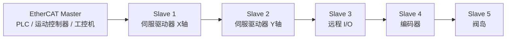

> [!tip] 结构记忆
> **主站发一帧，数据穿全网；从站边走边读写。**

---

## 03｜EtherCAT 与普通以太网的关系

| 对比项 | 普通以太网 | EtherCAT |
|---|---|---|
| 协议定位 | 通用网络通信 | 实时工业控制 |
| 数据传输 | 点对点收发数据包 | 一帧经过多个从站 |
| 实时性 | 一般 | 很强 |
| 典型拓扑 | 星型为主 | 线型、树型、环型 |
| 数据处理 | 设备收到完整帧后处理 | 从站边接收边处理 |
| 交换机依赖 | 常用交换机 | 多数场景不需要交换机 |
| 同步能力 | 弱 | 支持分布式时钟 DC |
| 典型应用 | 办公网络、普通 TCP/IP | 伺服同步、运动控制、高速 I/O |

> [!info] 工程理解
> EtherCAT 使用以太网物理层，但不是普通 TCP/IP 通讯。  
> 它的重点是 **实时控制和从站同步**。

---

## 04｜关键参数速查表

| 参数 | 常见值 | 说明 | 易错点 |
|---|---|---|---|
| 物理介质 | 双绞线以太网 | 常用 RJ45 工业网线 | 线缆质量影响稳定性 |
| 速率 | 100 Mbps 全双工 | EtherCAT 常见速率 | 不等于普通百兆网络通信 |
| 主站 | EtherCAT Master | 控制整个网络 | 主站实时性能很关键 |
| 从站 | EtherCAT Slave | 执行输入输出或驱动控制 | 从站顺序影响地址映射 |
| 配置文件 | ESI XML | 从站设备描述文件 | 版本不匹配会识别异常 |
| 同步机制 | DC 分布式时钟 | 多轴同步核心 | DC 配置错误会抖动 |
| 数据对象 | PDO / SDO | 过程数据 / 参数访问 | 与 CANopen 概念相似 |
| 状态机 | INIT / PREOP / SAFEOP / OP | 从站运行状态 | 未进入 OP 无法正常控制 |
| 拓扑 | 线型 / 树型 / 环型 | 灵活连接 | 环网需支持冗余配置 |
| 周期时间 | 250 μs / 500 μs / 1 ms 等 | 控制刷新周期 | 周期设太短会丢帧 |

---

## 05｜EtherCAT 网络组成

| 角色 | 英文 | 作用 | 典型设备 |
|---|---|---|---|
| 主站 | Master | 发起周期通信，管理所有从站 | PLC、运动控制器、工控机 |
| 从站 | Slave | 处理数据帧中的指定数据 | 伺服、I/O、编码器、阀岛 |
| ESI 文件 | EtherCAT Slave Information | 描述从站功能和对象 | XML 文件 |
| PDO | Process Data Object | 实时过程数据 | 控制字、状态字、位置、I/O |
| SDO | Service Data Object | 非周期参数读写 | 参数设置、对象字典访问 |
| DC | Distributed Clocks | 分布式时钟同步 | 多轴同步、运动控制 |
| ESC | EtherCAT Slave Controller | 从站控制芯片 | 从站硬件核心 |

> [!tip] 记忆口诀
> **Master 管全网，Slave 做执行；PDO 跑实时，SDO 改参数，DC 做同步。**

---

## 06｜EtherCAT 工作原理

EtherCAT 的核心特点是 **On-the-fly Processing**，即从站在数据帧经过时直接读取和写入数据。


> [!info] 工程理解
> 传统以太网像“寄快递给每个设备”。  
> EtherCAT 像“一辆数据列车经过所有设备，每个设备只取放自己的货物”。

---

## 07｜EtherCAT 数据流向

```text
主站输出数据  →  EtherCAT 帧  →  从站输出 / 驱动控制
主站输入数据  ←  EtherCAT 帧  ←  从站输入 / 状态反馈
```

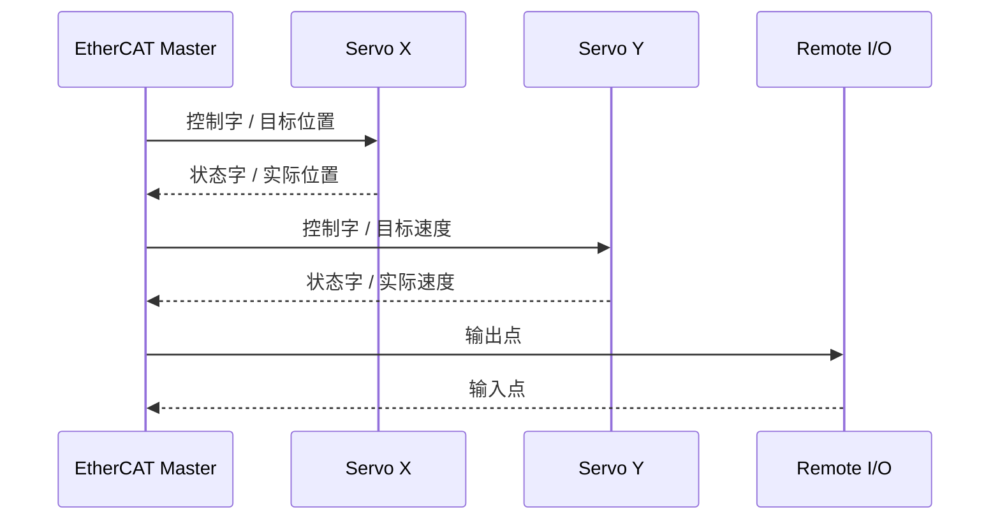

> [!tip] 快速理解
> EtherCAT 的周期通信主要就是：  
> **主站写输出，从站回输入。**

---

## 08｜EtherCAT 状态机

EtherCAT 从站必须经过状态切换，最终进入 `OP` 后才能正常进行周期数据交换。

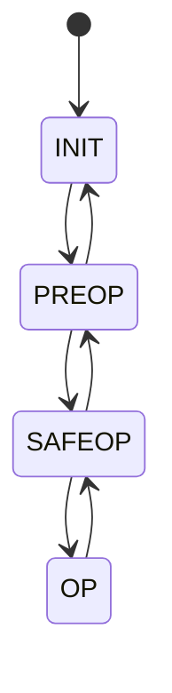

| 状态 | 名称 | 说明 |
|---|---|---|
| INIT | 初始化 | 从站上电后的初始状态 |
| PREOP | 预操作 | 可进行邮箱通信和参数配置 |
| SAFEOP | 安全操作 | 输入数据有效，输出保持安全 |
| OP | 操作运行 | 输入输出周期数据正常交换 |

> [!warning] 易错点
> 从站没有进入 `OP` 状态时，伺服和 I/O 通常不能正常执行周期控制。

---

## 09｜PDO 与 SDO 核心区别

| 对比项 | PDO | SDO |
|---|---|---|
| 全称 | Process Data Object | Service Data Object |
| 中文理解 | 过程数据对象 | 服务数据对象 |
| 通讯类型 | 周期性实时数据 | 非周期参数访问 |
| 典型用途 | 控制字、状态字、目标位置、实际位置 | 读写参数、配置对象字典 |
| 实时性 | 高 | 低 |
| 数据方式 | 周期刷新 | 请求响应 |
| 工程阶段 | 运行时频繁使用 | 调试、初始化、参数设置 |
| 类比 | 高速通道 | 参数设置通道 |

> [!tip] 记忆口诀
> **PDO 负责跑，SDO 负责调。**

---

## 10｜EtherCAT 对象字典

EtherCAT 很多设备使用类似 CANopen 的对象字典结构。

```text
对象地址 = Index + SubIndex

Index    = 16 位索引
SubIndex = 8 位子索引
```

### 伺服常见对象

| 对象 | 名称 | 作用 |
|---|---|---|
| `6040h:00h` | Controlword | 控制字 |
| `6041h:00h` | Statusword | 状态字 |
| `6060h:00h` | Modes of Operation | 运行模式设置 |
| `6061h:00h` | Modes of Operation Display | 当前运行模式 |
| `6064h:00h` | Position Actual Value | 实际位置 |
| `607Ah:00h` | Target Position | 目标位置 |
| `60FFh:00h` | Target Velocity | 目标速度 |
| `6077h:00h` | Torque Actual Value | 实际转矩 |

> [!info] 工程理解
> EtherCAT 驱动器参数常常通过对象字典访问。  
> 调试时重点看：`6040h`、`6041h`、`6060h`、`6064h`、`607Ah`。

---

## 11｜PDO 映射示例

PDO 映射决定周期数据里包含哪些对象。

### 伺服 RPDO 示例

主站发送给伺服的数据：

```text
6040h 控制字
607Ah 目标位置
60FFh 目标速度
```

| 字节 | 对象 | 含义 |
|---|---|---|
| Byte 0–1 | `6040h` | 控制字 |
| Byte 2–5 | `607Ah` | 目标位置 |
| Byte 6–9 | `60FFh` | 目标速度 |

---

### 伺服 TPDO 示例

伺服返回给主站的数据：

```text
6041h 状态字
6064h 实际位置
606Ch 实际速度
```

| 字节 | 对象 | 含义 |
|---|---|---|
| Byte 0–1 | `6041h` | 状态字 |
| Byte 2–5 | `6064h` | 实际位置 |
| Byte 6–9 | `606Ch` | 实际速度 |

> [!warning] 易错点
> PDO 映射长度、对象顺序、数据类型必须与主站组态一致，否则会出现数据错位。

---

## 12｜EtherCAT 常见通讯模式

| 模式 | 说明 | 典型用途 |
|---|---|---|
| Free Run | 从站按自身节奏运行 | 普通 I/O、低要求场景 |
| SM Sync | 基于同步管理器同步 | 一般周期控制 |
| DC Sync0 | 分布式时钟同步 0 | 伺服运动控制常用 |
| DC Sync1 | 分布式时钟同步 1 | 更复杂同步场景 |

> [!tip] 工程建议
> 伺服多轴同步控制时，优先关注 **DC Sync0** 是否正确配置。

---

## 13｜DC 分布式时钟

DC 是 EtherCAT 实现高精度同步的关键机制。

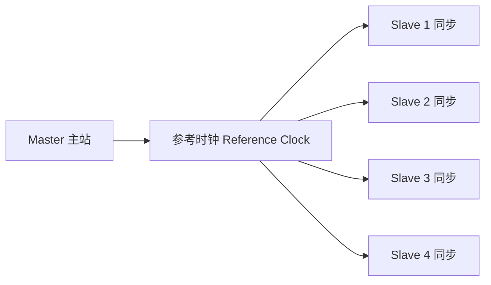

| 项目 | 说明 |
|---|---|
| DC 全称 | Distributed Clocks |
| 作用 | 让多个从站使用统一时间基准 |
| 典型用途 | 多轴伺服同步、插补运动 |
| 关键参数 | Sync0 周期、偏移时间、参考时钟 |
| 常见故障 | 同步失败、周期抖动、从站进不了 OP |

> [!tip] 记忆口诀
> **多轴要同步，DC 是核心。**

---

## 14｜ESI 文件详解

ESI 文件是 EtherCAT 从站设备描述文件，通常是 XML 格式。

> [!info] ESI 文件作用
> - 描述设备厂家、型号、版本
> - 描述从站支持的对象字典
> - 描述 PDO 映射
> - 描述同步模式
> - 描述邮箱通信能力
> - 描述设备状态和诊断信息
> - 供主站软件识别和组态设备

---

### ESI 使用流程

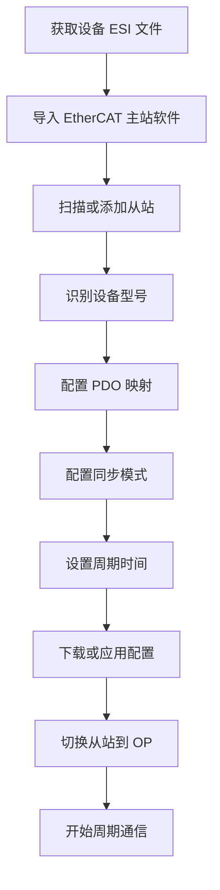

> [!warning] 易错点
> ESI 文件版本不匹配、设备固件版本不同、PDO 配置不一致，都会导致从站无法正常进入 OP。

---

## 15｜EtherCAT 拓扑结构

### 线型拓扑


> [!tip] 优点
> 线型拓扑简单，接线清晰，最常见。

---

### 树型拓扑

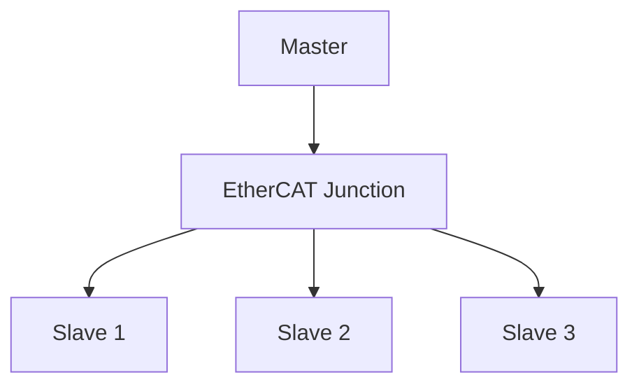

> [!info] 工程理解
> 使用 EtherCAT 分支模块可以构成树型网络。

---

### 环型拓扑


> [!warning] 注意
> 环型拓扑通常用于冗余，需要主站和从站支持相关功能。

---

## 16｜EtherCAT 接线规范

| 项目 | 要求 |
|---|---|
| 线缆 | 工业以太网线 |
| 接头 | RJ45 或 M12 |
| 连接方式 | OUT 接下一个从站 IN |
| 推荐拓扑 | 线型、树型、环型 |
| 单段距离 | 双绞线常见最大约 100 m |
| 屏蔽 | 建议使用屏蔽线并可靠接地 |
| 交换机 | 普通以太网交换机通常不能插在 EtherCAT 主链路中 |


> [!check] 接线注意事项
> - [ ] Master 接第一个从站 IN
> - [ ] 从站 OUT 接下一个从站 IN
> - [ ] 注意设备 IN / OUT 端口方向
> - [ ] 使用工业以太网屏蔽线
> - [ ] 线缆远离变频器输出线、伺服动力线
> - [ ] 普通交换机不要随意接入 EtherCAT 主链路
> - [ ] 更换设备后重新扫描从站顺序
> - [ ] 多轴系统注意接地和屏蔽连续性

---

## 17｜EtherCAT 配置流程

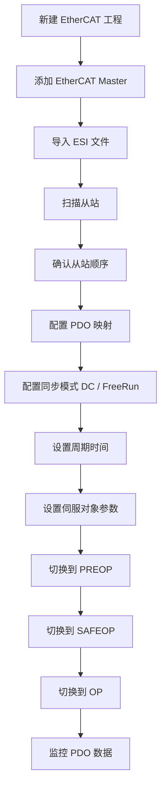

> [!check] 配置检查清单
> - [ ] ESI 文件是否正确
> - [ ] 从站顺序是否与实际一致
> - [ ] 从站型号是否一致
> - [ ] 固件版本是否兼容
> - [ ] PDO 映射是否正确
> - [ ] 同步模式是否正确
> - [ ] 周期时间是否合理
> - [ ] DC 参考时钟是否正确
> - [ ] 从站是否进入 OP
> - [ ] 伺服使能流程是否正确
> - [ ] 参数是否已保存到设备

---

## 18｜实战示例：远程 I/O 通讯

### 场景

EtherCAT 主站连接一个远程 I/O 模块。

| 数据方向 | 数据 | 说明 |
|---|---|---|
| 从站 → 主站 | 输入字节 | 按钮、限位、传感器状态 |
| 主站 → 从站 | 输出字节 | 电磁阀、继电器、指示灯 |

### PLC 地址示例

```text
输入：
Input Byte 0
Bit 0 = DI1
Bit 1 = DI2
Bit 2 = DI3

输出：
Output Byte 0
Bit 0 = DO1
Bit 1 = DO2
Bit 2 = DO3
```

> [!example] 应用场景
> - 读取数字量输入
> - 控制数字量输出
> - 采集模拟量
> - 输出模拟量控制阀门或驱动器

---

## 19｜实战示例：伺服 EtherCAT 通讯

### 常见数据结构

| 主站 → 伺服 | 对象 | 说明 |
|---|---|---|
| 控制字 | `6040h` | 启动、停止、复位、使能 |
| 运行模式 | `6060h` | 位置、速度、转矩、同步模式 |
| 目标位置 | `607Ah` | 位置给定 |
| 目标速度 | `60FFh` | 速度给定 |
| 目标转矩 | `6071h` | 转矩给定 |

| 伺服 → 主站 | 对象 | 说明 |
|---|---|---|
| 状态字 | `6041h` | 就绪、运行、故障状态 |
| 当前模式 | `6061h` | 实际运行模式 |
| 实际位置 | `6064h` | 编码器反馈位置 |
| 实际速度 | `606Ch` | 当前速度 |
| 实际转矩 | `6077h` | 当前转矩 |

---

### 典型控制流程

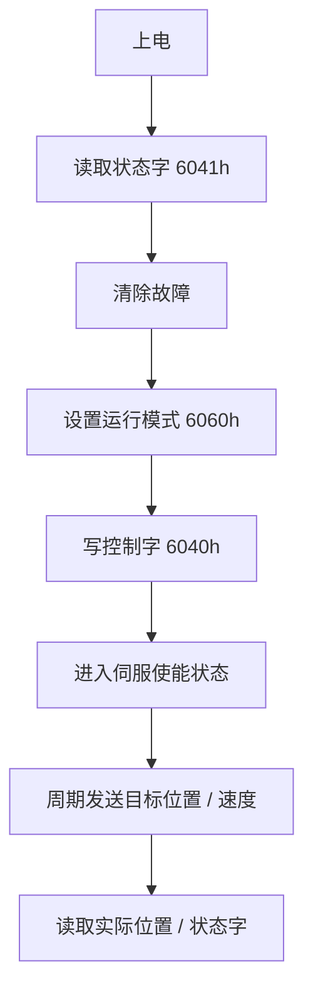

> [!warning] 易错点
> 伺服能不能运动，不只看 EtherCAT 是否 OP。  
> 还要看控制字、状态机、报警、急停、限位、使能信号、模式设置。

---

## 20｜CiA 402 伺服状态机简化理解

很多 EtherCAT 伺服驱动器遵循 CiA 402 驱动器状态机。

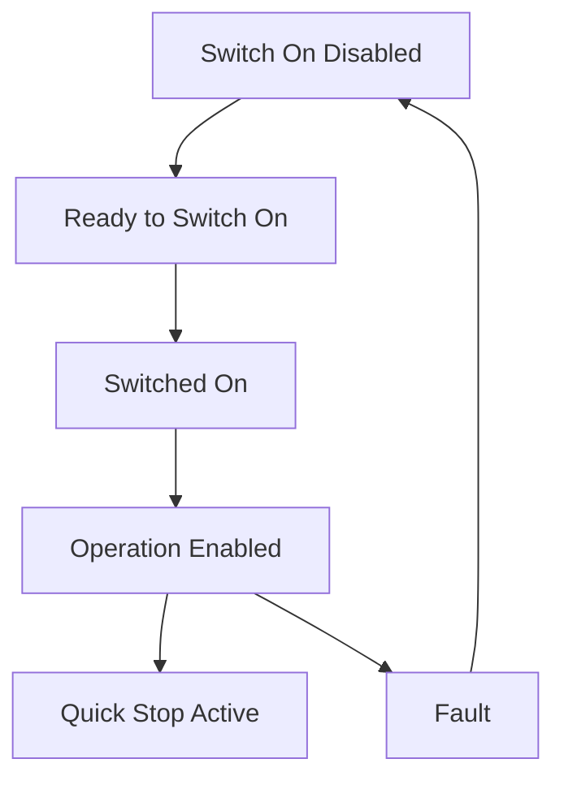

| 状态 | 工程含义 |
|---|---|
| Switch On Disabled | 驱动未准备好 |
| Ready to Switch On | 可上电准备 |
| Switched On | 已上电但未使能运行 |
| Operation Enabled | 允许运动 |
| Fault | 故障状态 |
| Quick Stop Active | 快停状态 |

> [!tip] 重点记忆
> 伺服真正能运动的关键状态是：  
> **Operation Enabled**。

---

## 21｜常见运行模式

| 模式值 | 模式名称 | 说明 |
|---|---|---|
| `01h` | Profile Position Mode | 轮廓位置模式 |
| `03h` | Profile Velocity Mode | 轮廓速度模式 |
| `04h` | Profile Torque Mode | 轮廓转矩模式 |
| `06h` | Homing Mode | 回零模式 |
| `08h` | Cyclic Synchronous Position | 周期同步位置模式 |
| `09h` | Cyclic Synchronous Velocity | 周期同步速度模式 |
| `0Ah` | Cyclic Synchronous Torque | 周期同步转矩模式 |

> [!info] 工程理解
> EtherCAT 多轴运动控制最常见的是 `CSP / CSV / CST`。  
> 即周期同步位置、周期同步速度、周期同步转矩。

---

## 22｜实战示例：CSP 周期同步位置模式

### 目标

主站通过 EtherCAT 周期性发送目标位置，伺服按同步周期执行运动。

### 常见对象

| 对象 | 名称 | 方向 |
|---|---|---|
| `6040h` | 控制字 | 主站 → 伺服 |
| `607Ah` | 目标位置 | 主站 → 伺服 |
| `6041h` | 状态字 | 伺服 → 主站 |
| `6064h` | 实际位置 | 伺服 → 主站 |
| `6060h` | 运行模式 | 主站 → 伺服 |
| `6061h` | 当前模式 | 伺服 → 主站 |

### 初始化步骤

```text
1. 设置 EtherCAT 从站进入 OP
2. 设置 6060h = 08h，选择 CSP 模式
3. 配置 PDO：
   主站发送 6040h + 607Ah
   伺服反馈 6041h + 6064h
4. 启用 DC Sync0
5. 设置合理周期，例如 1 ms
6. 使能伺服到 Operation Enabled
7. 周期发送目标位置
```

> [!warning] 易错点
> CSP 模式下，目标位置通常需要每个周期连续刷新。  
> 目标位置跳变过大可能导致跟随误差或驱动报警。

---

## 23｜Working Counter 工作计数器

EtherCAT 中 WKC 用于判断数据帧是否被预期数量的从站正确处理。

| 项目 | 说明 |
|---|---|
| 全称 | Working Counter |
| 中文理解 | 工作计数器 |
| 作用 | 检查从站是否正确读写数据 |
| 正常情况 | 实际 WKC 等于期望 WKC |
| 异常情况 | WKC 不匹配，说明通信处理异常 |

> [!warning] 易错点
> WKC 错误常见原因：从站掉线、顺序不对、PDO 不匹配、状态没进 OP、线缆异常。

---

## 24｜EtherCAT 常见诊断状态

| 状态 / 报警 | 含义 | 常见原因 |
|---|---|---|
| INIT 停留 | 初始化未完成 | ESI 不匹配、设备异常 |
| PREOP 停留 | 预操作失败 | 参数下载失败、邮箱通信异常 |
| SAFEOP 停留 | 安全操作失败 | PDO 映射错误、输入输出不匹配 |
| OP 失败 | 无法进入运行 | DC 同步失败、PDO 配置错误 |
| WKC 错误 | 工作计数器异常 | 从站掉线、线缆、拓扑变化 |
| Lost Link | 链路断开 | 网线、端口、供电问题 |
| Sync Error | 同步错误 | DC 配置、周期抖动 |
| AL Status Code | 应用层状态码 | 从站具体错误原因 |

---

## 25｜常见故障现象

| 现象 | 可能原因 | 排查方向 |
|---|---|---|
| 扫描不到从站 | 网线、端口、供电、主站网卡问题 | 查电源、LINK、网卡 |
| 从站顺序不对 | 接线顺序与组态不一致 | 重新扫描或调整组态 |
| 无法进入 OP | PDO、ESI、DC、参数错误 | 查日志和 AL 状态码 |
| WKC 报错 | 从站未处理帧或掉线 | 查拓扑、线缆、状态 |
| 伺服不使能 | 状态机未到位、报警、急停 | 查 6041h 和报警码 |
| 伺服抖动 | DC 同步异常、周期不稳定 | 查 Sync0、主站实时性 |
| 位置跟随误差 | 加速度过大、目标突变 | 查运动规划和驱动参数 |
| 输入输出错位 | PDO 映射不一致 | 查映射对象和长度 |
| 通讯偶发中断 | 干扰、线缆质量、接地不好 | 查屏蔽、接地、布线 |
| 换设备后异常 | 型号或 ESI 版本不一致 | 查设备识别码和 ESI |

---

## 26｜EtherCAT 排查流程

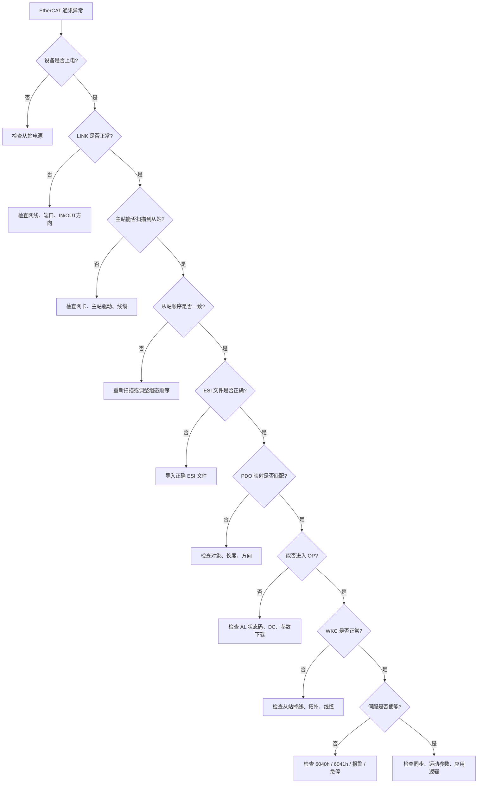

---

> [!check] 排查清单
> - [ ] 从站是否上电
> - [ ] 网口 LINK 灯是否亮
> - [ ] IN / OUT 端口方向是否正确
> - [ ] 主站网卡是否选择正确
> - [ ] 是否使用正确 ESI 文件
> - [ ] 从站顺序是否与组态一致
> - [ ] 从站型号和固件是否匹配
> - [ ] PDO 映射是否一致
> - [ ] PDO 数据长度是否正确
> - [ ] 是否能进入 OP 状态
> - [ ] DC 同步是否正常
> - [ ] 周期时间是否合理
> - [ ] WKC 是否等于期望值
> - [ ] 伺服状态字是否正常
> - [ ] 是否存在驱动器报警
> - [ ] 急停、限位、使能输入是否满足
> - [ ] 屏蔽接地是否可靠
> - [ ] 通讯线是否远离强干扰源

---

## 27｜EtherCAT 与 PROFINET 对比

| 对比项 | EtherCAT | PROFINET |
|---|---|---|
| 协议定位 | 高性能实时工业以太网 | 工业以太网实时通讯 |
| 典型生态 | 运动控制、倍福、欧系运动平台 | 西门子、通用工业以太网 |
| 数据处理 | 从站边收边处理 | 控制器与设备周期交换 |
| 实时性 | 很强 | RT 强，IRT 更强 |
| 同步能力 | DC 分布式时钟 | IRT 支持高同步 |
| 交换机 | 主链路通常不需要普通交换机 | 常用工业交换机 |
| 设备识别 | 从站顺序 + ESI | 设备名称 + IP + GSDML |
| 配置文件 | ESI XML | GSDML |
| 典型应用 | 多轴伺服、机器人、高速 I/O | 远程 I/O、驱动器、自动化产线 |
| 学习重点 | 状态机、PDO、DC、WKC | 设备名称、GSDML、拓扑、诊断 |

> [!tip] 选择建议
> - 多轴同步、高速运动控制：优先 EtherCAT  
> - 西门子生态、通用产线 I/O 和驱动控制：优先 PROFINET  

---

## 28｜EtherCAT 与 CANopen 对比

| 对比项 | EtherCAT | CANopen |
|---|---|---|
| 底层物理 | 工业以太网 | CAN 总线 |
| 速率 | 常见 100 Mbps | 常见 125k–1M |
| 数据对象 | PDO / SDO / 对象字典 | PDO / SDO / 对象字典 |
| 实时性 | 更强 | 较强 |
| 单帧数据 | 以太网帧承载大量过程数据 | 经典 CAN 单帧最多 8 Byte |
| 同步机制 | DC 分布式时钟 | SYNC / 时间机制 |
| 节点识别 | 拓扑顺序和配置 | Node-ID |
| 典型场景 | 高速多轴、机器控制 | 伺服、编码器、中小型控制 |
| 工程重点 | OP 状态、WKC、DC、PDO 映射 | Node-ID、NMT、PDO、Heartbeat |

> [!info] 工程理解
> EtherCAT 借用了很多 CANopen 对象模型概念，但底层传输能力比 CANopen 高得多。

---

## 29｜EtherCAT 与 Modbus TCP 对比

| 对比项 | EtherCAT | Modbus TCP |
|---|---|---|
| 协议定位 | 实时工业控制 | 通用以太网读写协议 |
| 实时性 | 很强 | 一般 |
| 数据模型 | PDO / SDO / 对象字典 | 寄存器 / 线圈 |
| 周期控制 | 高速周期通信 | 轮询读写 |
| 同步能力 | DC 高精度同步 | 基本无同步能力 |
| 配置复杂度 | 较高 | 较低 |
| 典型设备 | 伺服、I/O、编码器、机器人 | 仪表、网关、简单设备 |
| 学习重点 | 状态机、PDO、DC、WKC | 功能码、寄存器、端口 502 |

> [!tip] 选择建议
> - 高速同步控制、伺服运动：选 EtherCAT  
> - 简单读写数据、上位机采集：选 Modbus TCP  

---

## 30｜工程应用建议

> [!tip] 初次调试建议
> - 先只接一个从站
> - 导入厂家提供的正确 ESI 文件
> - 使用主站软件扫描实际拓扑
> - 确认从站型号和顺序
> - 周期时间先用 `1 ms`
> - 普通 I/O 先用 Free Run 或默认同步
> - 伺服多轴控制再配置 DC Sync0
> - 先确认进入 OP，再调试应用程序
> - 伺服先看 `6041h` 状态字，再写 `6040h` 控制字

---

> [!warning] 现场注意事项
> - EtherCAT 主链路不要随便接普通交换机
> - 从站 IN / OUT 端口不要接反
> - 更换从站后要确认设备型号和顺序
> - 运动控制场景对主站实时性要求高
> - 周期时间不是越小越好，要看主站和从站能力
> - 多轴同步必须重点检查 DC 配置
> - WKC 错误不要忽略，它通常表示通信链路或组态有问题
> - 线缆屏蔽和接地不好会导致偶发掉线或同步错误

---

## 31｜EtherCAT 快速记忆图

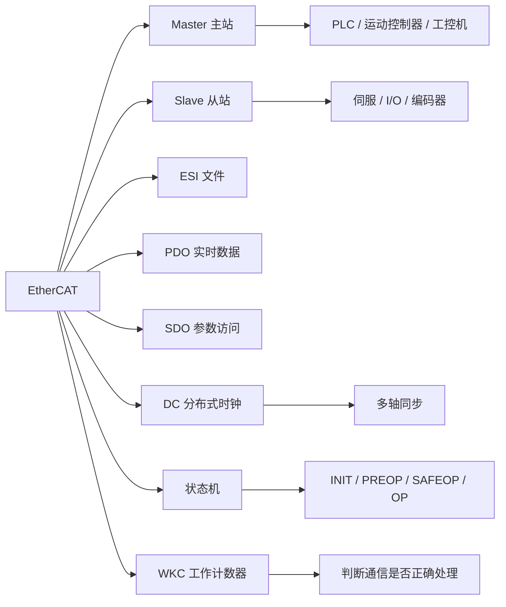

---

## 32｜记忆口诀

> [!tip] EtherCAT 口诀
> **主站发一帧，从站边走边处理。**
>
> **ESI 描设备，PDO 跑实时，SDO 改参数。**
>
> **INIT 到 PREOP，SAFEOP 再到 OP。**
>
> **进不了 OP，看 ESI、PDO、DC、AL 状态码。**
>
> **多轴要同步，DC 是核心。**
>
> **WKC 不匹配，先查拓扑和掉线。**
>
> **伺服不转，先看 6041，再写 6040。**

---

## 33｜最终速记卡

- EtherCAT 是高性能实时工业以太网协议，常用于多轴伺服和高速 I/O。
- EtherCAT 的核心机制是从站对以太网帧进行 **边接收边处理**。
- 常见角色：`Master` 主站、`Slave` 从站。
- 配置文件是 `ESI XML`，用于描述从站设备能力和对象。
- 周期实时数据用 `PDO`，参数访问用 `SDO`。
- 从站状态机：`INIT → PREOP → SAFEOP → OP`。
- 设备必须进入 `OP` 状态后，周期控制才算真正正常。
- 多轴同步重点看 `DC 分布式时钟`。
- EtherCAT 常见故障重点看：ESI、从站顺序、PDO 映射、DC、WKC、AL 状态码。
- 伺服常用对象：`6040h` 控制字，`6041h` 状态字，`6060h` 模式，`607Ah` 目标位置，`6064h` 实际位置。
- 排查顺序：电源 → LINK → IN/OUT → 扫描从站 → ESI → PDO → OP → WKC → DC → 伺服状态机。