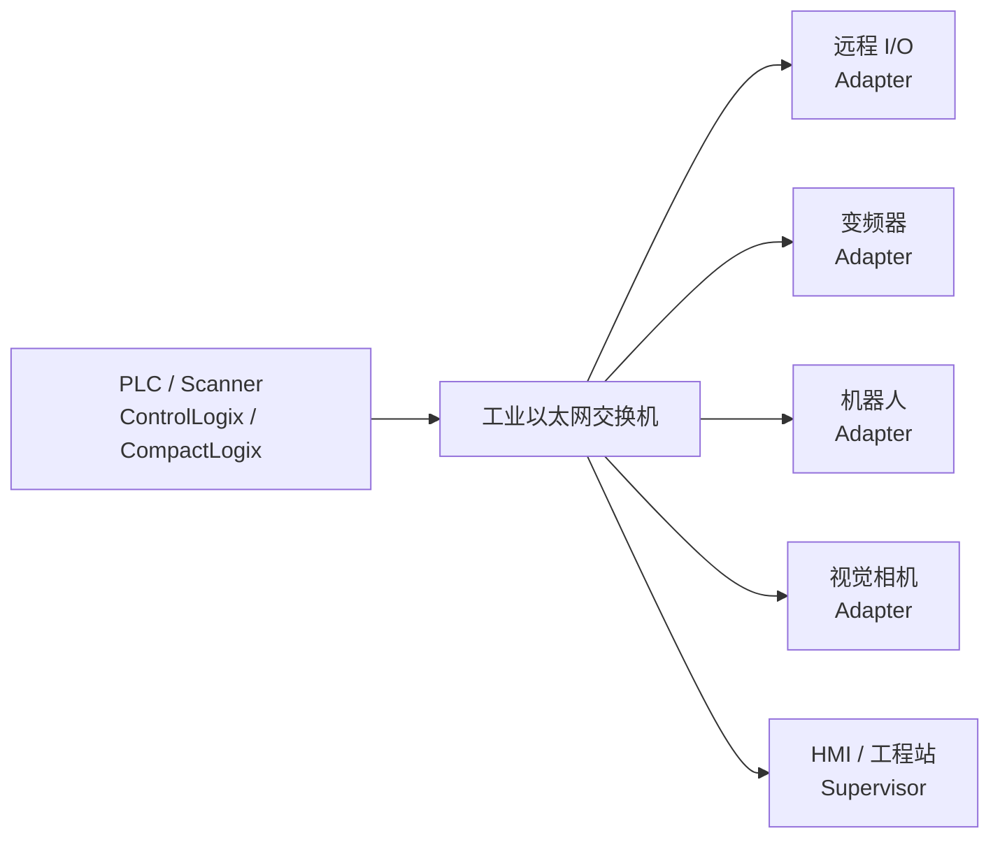
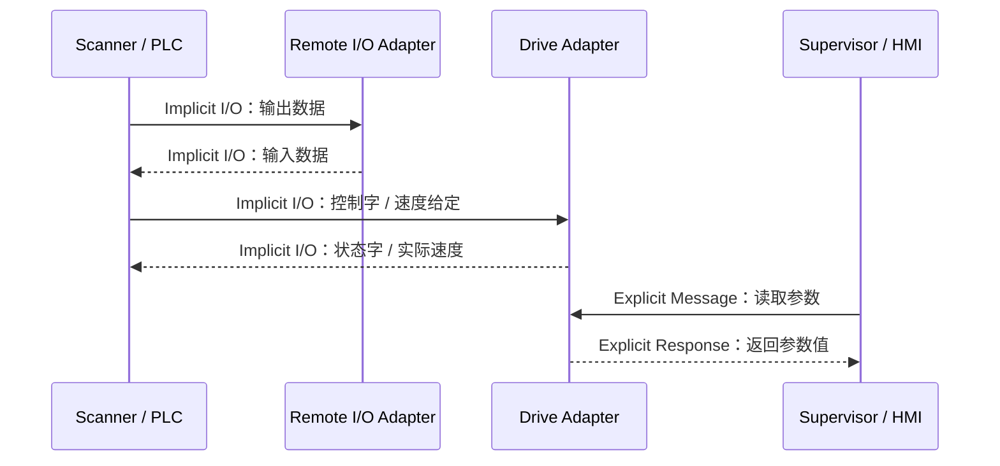
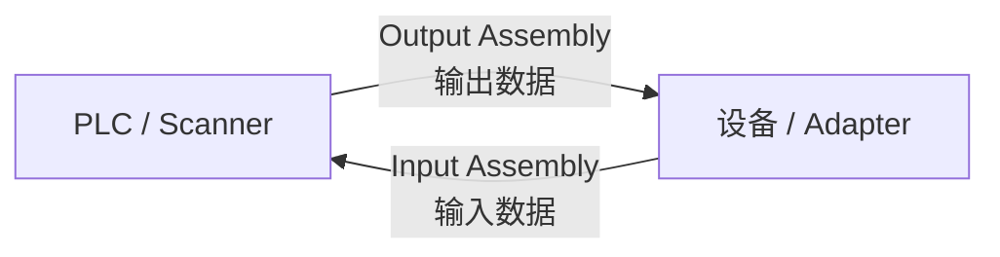
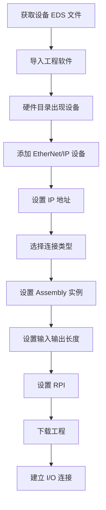
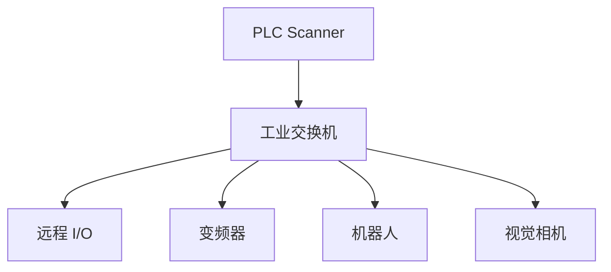
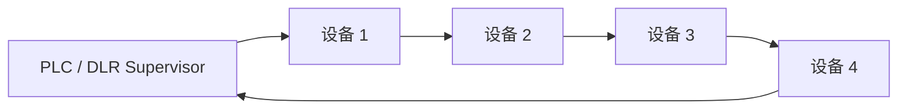
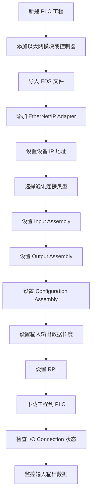
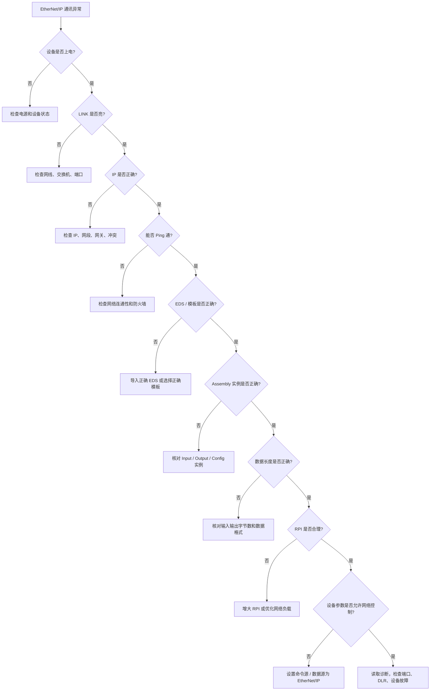
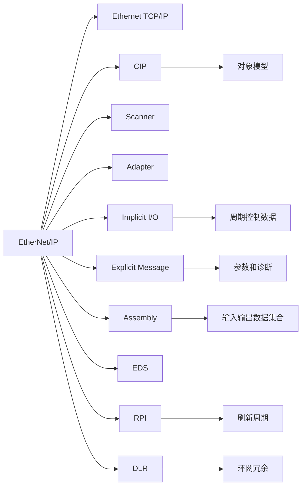

## 01｜核心概念

> [!info] 核心概念
> - **全称**：EtherNet Industrial Protocol
> - **常见生态**：Rockwell / Allen-Bradley、欧姆龙、基恩士、施耐德等
> - **协议基础**：标准 Ethernet + TCP/IP + UDP/IP + CIP
> - **应用层协议**：CIP，Common Industrial Protocol
> - **典型角色**：Scanner、Adapter、Supervisor
> - **核心通信方式**：Implicit Messaging、Explicit Messaging
> - **常见设备**：PLC、远程 I/O、变频器、伺服、机器人、阀岛、视觉相机、扫码枪、传感器
> - **典型用途**：周期性 I/O 控制、参数读写、设备诊断、设备互联

---

## 02｜EtherNet/IP 系统结构图



> [!tip] 结构记忆
> **PLC 做 Scanner，现场设备做 Adapter；Scanner 扫数据，Adapter 交数据。**

---

## 03｜EtherNet/IP 与普通以太网的关系

| 对比项 | 普通以太网 | EtherNet/IP |
|---|---|---|
| 网络基础 | Ethernet / TCP/IP | Ethernet / TCP/IP / UDP/IP |
| 主要用途 | 办公网、普通数据通信 | 工业自动化控制 |
| 应用协议 | HTTP、FTP、MQTT 等 | CIP |
| 实时数据 | 一般 | 通过 Implicit I/O 周期交换 |
| 参数访问 | 普通应用协议 | Explicit Message 读写对象 |
| 设备模型 | 无统一工业对象模型 | CIP 对象模型 |
| 配置文件 | 无统一格式 | EDS 文件 |
| 典型设备 | 电脑、服务器、摄像头 | PLC、I/O、驱动器、机器人 |

> [!info] 工程理解
> EtherNet/IP 使用普通以太网作为底层，但它不是简单的“网口通信”，核心是 **CIP 工业对象模型 + 周期性 I/O 通讯**。

---

## 04｜关键参数速查表

| 参数 | 常见值 | 说明 | 易错点 |
|---|---|---|---|
| IP 地址 | 如 `192.168.1.10` | 设备网络地址 | IP 冲突会导致通信异常 |
| 子网掩码 | 如 `255.255.255.0` | 判断是否同网段 | 网段不一致会连不上 |
| 网关 | 按网络规划 | 跨网段通信使用 | 本地设备常可不设 |
| TCP 端口 | `44818` | Explicit Message 常用 | 防火墙可能拦截 |
| UDP 端口 | `2222` | Implicit I/O 常用 | I/O 通讯异常可检查 |
| RPI | 2ms / 5ms / 10ms / 20ms | 请求包间隔 | 设太小会增加网络负载 |
| EDS 文件 | `.eds` | 设备描述文件 | 不匹配会组态失败 |
| Assembly Instance | 输入 / 输出 / 配置实例 | I/O 数据映射核心 | 实例号错误会连不上 |
| 数据长度 | Byte / Word | 输入输出数据大小 | 长度不一致会连接失败 |
| 网络拓扑 | 星型 / 线型 / DLR | 工业以太网结构 | 普通环路会引发风暴 |

---

## 05｜EtherNet/IP 网络角色

| 角色 | 中文理解 | 作用 | 典型设备 |
|---|---|---|---|
| Scanner | 扫描器 / 控制器 | 主动建立 I/O 连接，周期读取和写入数据 | PLC、运动控制器 |
| Adapter | 适配器 / 现场设备 | 响应 Scanner，提供输入输出数据 | 远程 I/O、变频器、阀岛 |
| Supervisor | 监控 / 工程站 | 组态、诊断、参数配置 | Studio 5000、HMI、上位机 |
| Originator | 连接发起方 | 发起 CIP 连接 | PLC、电脑 |
| Target | 连接目标方 | 接受 CIP 连接 | 设备、模块 |

> [!tip] 记忆口诀
> **Scanner 发起连接，Adapter 提供数据；Supervisor 做调试，Target 等人连。**

---

## 06｜EtherNet/IP 通讯逻辑

EtherNet/IP 常见通信分为两类：

```text
周期性 I/O 数据  →  Implicit Messaging
参数读写 / 诊断  →  Explicit Messaging
```



> [!info] 工程理解
> - **Implicit**：跑实时控制数据  
> - **Explicit**：读写参数和诊断信息  

---

## 07｜Implicit 与 Explicit 对比

| 对比项 | Implicit Messaging | Explicit Messaging |
|---|---|---|
| 中文理解 | 隐式报文 / I/O 通讯 | 显式报文 / 参数通讯 |
| 典型用途 | 周期性输入输出 | 参数读取、参数写入、诊断 |
| 通信方式 | 周期刷新 | 请求 - 响应 |
| 常用端口 | UDP 2222 | TCP 44818 |
| 实时性 | 较强 | 较弱 |
| 数据结构 | Assembly 数据 | CIP 对象、Class / Instance / Attribute |
| 典型场景 | 远程 I/O、驱动器控制 | 读取设备型号、写参数、查故障 |
| 是否长期连接 | 是 | 可按需建立 |

> [!tip] 记忆口诀
> **Implicit 跑 I/O，Explicit 查参数。**

---

## 08｜CIP 对象模型

EtherNet/IP 的核心是 CIP 对象模型。设备中的功能被抽象成对象。

```text
CIP 访问路径：
Class → Instance → Attribute
```

| 层级 | 中文理解 | 示例 |
|---|---|---|
| Class | 类 | 设备类型、对象类型 |
| Instance | 实例 | 第几个对象 |
| Attribute | 属性 | 该对象里的具体参数 |
| Service | 服务 | 读取、写入、复位等操作 |

### 常见 CIP 对象

| 对象 | Class Code | 作用 |
|---|---|---|
| Identity Object | `0x01` | 设备身份信息 |
| Message Router Object | `0x02` | 消息路由 |
| Assembly Object | `0x04` | I/O 数据集合 |
| Connection Manager | `0x06` | 连接管理 |
| TCP/IP Interface Object | `0xF5` | IP 地址相关 |
| Ethernet Link Object | `0xF6` | 网口状态相关 |

> [!info] 工程理解
> Modbus 看“寄存器地址”，CANopen 看“对象字典”，EtherNet/IP 看 **CIP 对象**。

---

## 09｜Assembly 对象详解

Assembly 是 EtherNet/IP I/O 数据映射的核心。

```text
Assembly = 一组输入 / 输出 / 配置数据的集合
```

| Assembly 类型 | 方向 | 作用 |
|---|---|---|
| Input Assembly | Adapter → Scanner | 设备返回给 PLC 的数据 |
| Output Assembly | Scanner → Adapter | PLC 发送给设备的数据 |
| Configuration Assembly | Scanner → Adapter | 连接建立时的配置数据 |

### 典型变频器 Assembly

| 数据方向 | 内容 | 说明 |
|---|---|---|
| PLC → 变频器 | 控制字 | 启动、停止、复位 |
| PLC → 变频器 | 速度给定 | 目标频率或速度 |
| 变频器 → PLC | 状态字 | 就绪、运行、故障 |
| 变频器 → PLC | 实际速度 | 当前运行反馈 |

> [!warning] 易错点
> EtherNet/IP 连接失败时，常见原因是 **Input Assembly / Output Assembly 实例号或数据长度不一致**。

---

## 10｜I/O 数据方向理解



| 名称 | 站在谁的角度 | 数据方向 |
|---|---|---|
| Input | Scanner 的输入 | 设备 → PLC |
| Output | Scanner 的输出 | PLC → 设备 |

> [!tip] 快速记忆
> **Input 是 PLC 读进来的，Output 是 PLC 写出去的。**

---

## 11｜RPI 请求包间隔

RPI 是 EtherNet/IP I/O 通讯中的重要参数。

| 项目 | 说明 |
|---|---|
| 全称 | Requested Packet Interval |
| 中文理解 | 请求包间隔 / 刷新周期 |
| 作用 | 定义周期 I/O 数据交换的时间间隔 |
| 常见值 | 2ms、5ms、10ms、20ms、50ms |
| 数值越小 | 刷新越快，网络负载越大 |
| 数值越大 | 负载越低，响应越慢 |

> [!warning] 易错点
> RPI 不是越小越好。  
> 设备多、交换机一般、网络负载高时，RPI 太小会导致丢包、超时、I/O Fault。

---

## 12｜EDS 文件详解

EDS 是 EtherNet/IP 设备描述文件。

> [!info] EDS 文件作用
> - 描述设备厂家、型号、版本
> - 描述支持的 CIP 对象
> - 描述 Assembly 实例
> - 描述输入输出数据长度
> - 描述参数列表
> - 让工程软件识别设备
> - 用于设备组态和诊断

---

### EDS 使用流程



> [!warning] 易错点
> EDS 文件导入后，不代表通讯一定成功。  
> 还要确认 IP、Assembly 实例、数据长度、RPI、设备固件版本是否匹配。

---

## 13｜常见端口与协议

| 通信内容 | 协议 | 端口 | 说明 |
|---|---|---|---|
| Explicit Message | TCP | 44818 | 参数访问、对象访问 |
| Explicit Message | UDP | 44818 | 发现、部分非连接报文 |
| Implicit I/O | UDP | 2222 | 周期性 I/O 数据 |
| Web 页面 | TCP | 80 / 443 | 设备网页诊断，取决于设备 |
| PING | ICMP | 无端口 | 只验证网络连通性 |

> [!warning] 易错点
> 能 ping 通，只说明 IP 网络可达。  
> 不代表 EtherNet/IP 的 I/O 连接一定正常。

---

## 14｜EtherNet/IP 拓扑结构

### 星型拓扑



> [!tip] 优点
> 星型结构清晰，便于排查，单个支路故障影响较小。

---

### 线型拓扑


> [!warning] 注意
> 线型结构节省交换机，但中间设备断电或端口故障，可能影响后续设备。

---

### DLR 环网拓扑



> [!info] 工程理解
> DLR 是 EtherNet/IP 常用的设备级环网冗余机制。

---

## 15｜DLR 环网冗余

DLR 全称是 **Device Level Ring**。

| 项目 | 说明 |
|---|---|
| 全称 | Device Level Ring |
| 作用 | 设备级环网冗余 |
| 常见角色 | Ring Supervisor、Ring Node |
| 典型用途 | 产线设备不断线冗余 |
| 优点 | 某一处断线时，网络仍可恢复通信 |
| 注意事项 | 设备和交换机需要支持 DLR |

> [!tip] 记忆口诀
> **DLR 做环网，断一处还能跑。**

---

## 16｜EtherNet/IP 配置流程



> [!check] 配置检查清单
> - [ ] EDS 文件是否正确
> - [ ] 设备 IP 地址是否正确
> - [ ] PLC 与设备是否同网段
> - [ ] 是否存在 IP 冲突
> - [ ] Assembly 实例号是否正确
> - [ ] 输入输出数据长度是否正确
> - [ ] Configuration Assembly 是否正确
> - [ ] RPI 是否合理
> - [ ] 设备固件版本是否兼容
> - [ ] 交换机是否支持工业现场通信
> - [ ] 是否有防火墙或安全策略拦截端口

---

## 17｜实战示例：远程 I/O 通讯

### 场景

PLC 通过 EtherNet/IP 连接远程 I/O 模块。

| 数据方向 | 数据 | 说明 |
|---|---|---|
| I/O → PLC | Input Assembly | 数字量输入、模拟量输入 |
| PLC → I/O | Output Assembly | 数字量输出、模拟量输出 |

### PLC 地址示例

```text
输入数据：
Local:1:I.Data[0].0 = DI1
Local:1:I.Data[0].1 = DI2
Local:1:I.Data[0].2 = DI3

输出数据：
Local:1:O.Data[0].0 = DO1
Local:1:O.Data[0].1 = DO2
Local:1:O.Data[0].2 = DO3
```

> [!example] 应用场景
> - 读取按钮、限位、光电开关
> - 控制电磁阀、继电器、指示灯
> - 采集温度、压力、流量
> - 输出模拟量控制阀门或驱动器

---

## 18｜实战示例：变频器 EtherNet/IP 通讯

### 常见数据结构

| PLC → 变频器 | 说明 |
|---|---|
| 控制字 | 启动、停止、复位、使能 |
| 速度 / 频率给定 | 目标速度或频率 |
| 参数控制 | 部分设备支持 |

| 变频器 → PLC | 说明 |
|---|---|
| 状态字 | 就绪、运行、故障、报警 |
| 实际速度 / 频率 | 当前运行反馈 |
| 故障代码 | 设备异常信息 |

### 示例数据

```text
PLC → VFD：
控制字：047F
频率给定：1500

VFD → PLC：
状态字：1237
实际频率：1498
```

> [!warning] 易错点
> 变频器要重点确认：
> - 命令源是否设置为 EtherNet/IP
> - 频率源是否设置为 EtherNet/IP
> - Assembly 实例是否正确
> - 输入输出长度是否与 PLC 一致
> - 控制字使能流程是否符合手册

---

## 19｜实战示例：机器人 / 视觉系统

### 机器人常见数据

| PLC → 机器人 | 机器人 → PLC |
|---|---|
| 启动程序 | 程序运行中 |
| 程序号 | 程序完成 |
| 复位 / 停止 | 报警状态 |
| 夹具控制 | 到位信号 |
| 允许进入 | 请求进入 |

### 视觉系统常见数据

| PLC → 相机 | 相机 → PLC |
|---|---|
| 触发拍照 | 拍照完成 |
| 任务编号 | OK / NG |
| 复位命令 | 错误代码 |
| 参数切换 | 测量结果 |

> [!tip] 工程建议
> 机器人和视觉设备通讯重点看 **握手流程**，不要只看单个位信号。

---

## 20｜Generic Ethernet Module

在 Rockwell 系统中，如果没有专用设备模板，常用 **Generic Ethernet Module** 添加第三方设备。

| 参数 | 说明 |
|---|---|
| Comm Format | 数据格式，如 Data - INT、Data - DINT |
| IP Address | 设备 IP 地址 |
| Input Assembly | 设备返回 PLC 的实例 |
| Output Assembly | PLC 发送给设备的实例 |
| Configuration Assembly | 配置实例 |
| Input Size | 输入数据长度 |
| Output Size | 输出数据长度 |
| Configuration Size | 配置数据长度 |
| RPI | I/O 刷新周期 |

> [!warning] 易错点
> Generic Module 最容易错的是：
> - Assembly 实例号
> - 数据长度单位
> - INT / DINT 数据格式
> - 输入输出方向
> - RPI 太小

---

## 21｜Produced / Consumed Tags

Rockwell 控制器之间常用 Produced / Consumed Tags 交换数据。

| 类型 | 说明 |
|---|---|
| Produced Tag | 本控制器生产并发送的数据 |
| Consumed Tag | 本控制器消费并接收的数据 |
| 用途 | PLC 与 PLC 之间高速数据交换 |
| 特点 | 不需要手写报文，基于标签通信 |
| 注意 | 数据类型、标签名、RPI、控制器路径必须匹配 |


> [!tip] 记忆口诀
> **Produced 是我发的，Consumed 是我收的。**

---

## 22｜常见指示灯

| 指示灯 | 常见含义 | 状态说明 |
|---|---|---|
| LINK | 物理链路 | 亮表示网线连接正常 |
| ACT | 数据活动 | 闪烁表示有数据收发 |
| NS | Network Status | 网络状态 |
| MS | Module Status | 模块状态 |
| I/O | I/O Connection | I/O 连接状态 |
| FAULT | 故障 | 设备或通讯异常 |

> [!tip] 快速判断
> **LINK 不亮先查网线。NS 异常查 IP 和连接。MS 异常查设备本体。I/O Fault 查 Assembly、RPI、数据长度。**

---

## 23｜常见故障现象

| 现象 | 可能原因 | 排查方向 |
|---|---|---|
| LINK 不亮 | 网线断、端口坏、交换机未上电 | 查网线、端口、交换机 |
| 能 ping 但 I/O 不通 | Assembly 或数据长度错误 | 查实例号和长度 |
| I/O Connection Fault | RPI、实例、长度、设备状态异常 | 查连接诊断 |
| Module Fault | 设备本体故障或配置错误 | 查模块状态 |
| IP 冲突 | 两台设备同 IP | 扫描网络、修改 IP |
| 数据错位 | 数据格式或字节长度错误 | 查 INT / DINT / BYTE |
| 变频器不启动 | 命令源未设为网络 | 查驱动参数和控制字 |
| 通讯偶发中断 | 网络负载高、干扰、RPI 太小 | 查交换机、线缆、RPI |
| DLR 报警 | 环网断线或 Supervisor 错误 | 查环网端口和角色 |
| PLC 间标签不通 | Produced / Consumed 配置不匹配 | 查标签名、类型、路径 |

---

## 24｜EtherNet/IP 排查流程



---

> [!check] 排查清单
> - [ ] 设备是否上电
> - [ ] LINK 灯是否亮
> - [ ] 网线和交换机是否正常
> - [ ] IP 地址是否正确
> - [ ] 是否存在 IP 冲突
> - [ ] PLC 与设备是否同网段
> - [ ] 是否能 ping 通
> - [ ] EDS 文件是否正确
> - [ ] 设备固件版本是否匹配
> - [ ] Input Assembly 是否正确
> - [ ] Output Assembly 是否正确
> - [ ] Configuration Assembly 是否正确
> - [ ] 输入输出数据长度是否正确
> - [ ] 数据格式是否正确：BYTE / INT / DINT
> - [ ] RPI 是否过小
> - [ ] UDP 2222 是否被拦截
> - [ ] TCP 44818 是否被拦截
> - [ ] 变频器命令源是否设为网络
> - [ ] 机器人 / 相机握手逻辑是否正确
> - [ ] DLR 环网角色是否正确

---

## 25｜EtherNet/IP 与 PROFINET 对比

| 对比项 | EtherNet/IP | PROFINET |
|---|---|---|
| 常见生态 | Rockwell、北美系 | Siemens、欧系 |
| 应用层 | CIP | PROFINET IO |
| 设备描述文件 | EDS | GSDML |
| 设备识别重点 | IP + Assembly / CIP 对象 | 设备名称 + IP |
| 周期数据 | Implicit I/O | RT / IRT I/O |
| 参数访问 | Explicit Message | Record Data / 非周期数据 |
| 刷新周期 | RPI | Update Time |
| 环网冗余 | DLR | MRP |
| 工程工具 | Studio 5000 | TIA Portal |
| 学习重点 | CIP、Assembly、RPI | Device Name、GSDML、DCP |

> [!tip] 记忆口诀
> **EtherNet/IP 看 Assembly，PROFINET 看设备名。**

---

## 26｜EtherNet/IP 与 Modbus TCP 对比

| 对比项 | EtherNet/IP | Modbus TCP |
|---|---|---|
| 协议模型 | CIP 对象模型 | 寄存器 / 线圈模型 |
| 实时 I/O | 支持 Implicit I/O | 通常轮询读写 |
| 参数访问 | Explicit Message | 功能码读写 |
| 默认端口 | 44818 / 2222 | 502 |
| 组态复杂度 | 较高 | 较低 |
| 诊断能力 | 较强 | 较弱 |
| 数据映射 | Assembly / Tag | 寄存器地址 |
| 典型设备 | I/O、驱动器、机器人 | 仪表、网关、简单设备 |
| 适用场景 | 自动化控制和设备集成 | 简单数据采集和读写 |

> [!tip] 选择建议
> - 需要周期 I/O、驱动器、机器人、Rockwell 生态：优先 EtherNet/IP  
> - 简单读写寄存器、低成本、多品牌仪表：优先 Modbus TCP  

---

## 27｜EtherNet/IP 与 EtherCAT 对比

| 对比项 | EtherNet/IP | EtherCAT |
|---|---|---|
| 协议定位 | 工业以太网控制协议 | 高实时工业以太网 |
| 实时性 | 较强 | 很强 |
| 数据机制 | Scanner 与 Adapter 周期交换 | 从站边收边处理 |
| 同步能力 | 一般，部分应用可扩展 | DC 分布式时钟强同步 |
| 典型应用 | I/O、驱动器、机器人、产线设备 | 多轴伺服、高速运动控制 |
| 配置重点 | Assembly、RPI、EDS | ESI、PDO、DC、WKC |
| 网络结构 | 星型、线型、DLR | 线型、树型、环型 |
| 是否依赖普通交换机 | 常用交换机 | 主链路通常不使用普通交换机 |
| 学习难点 | CIP 对象和 Assembly | 状态机、同步和 PDO 映射 |

> [!info] 工程理解
> EtherNet/IP 更偏通用工业设备互联，EtherCAT 更偏高速同步运动控制。

---

## 28｜工程应用建议

> [!tip] 初次调试建议
> - 先只接一个 Adapter 设备
> - 确认 IP 地址和网段
> - 先 ping，再建 I/O 连接
> - 使用厂家提供的 EDS 文件
> - 按手册核对 Assembly 实例
> - RPI 初期不要设太小，可先用 `20ms` 或设备推荐值
> - 先看输入数据是否变化，再测试输出控制
> - 变频器先确认命令源和频率源
> - 机器人和视觉设备先确认握手时序

---

> [!warning] 现场注意事项
> - 能 ping 通不代表 EtherNet/IP I/O 正常
> - Assembly 实例和数据长度必须完全匹配
> - IP 冲突是现场常见问题
> - 普通办公交换机不适合高负载工业控制网络
> - RPI 太小会导致网络负载过高
> - 大量相机、HMI、上位机流量不要和高实时 I/O 混在一起
> - DLR 环网要确认 Supervisor 配置
> - 变频器、机器人、视觉设备重点看设备侧参数是否允许 EtherNet/IP 控制

---

## 29｜EtherNet/IP 快速记忆图



---

## 30｜记忆口诀

> [!tip] EtherNet/IP 口诀
> **底层以太网，上层跑 CIP。**
>
> **Scanner 发起，Adapter 响应。**
>
> **Implicit 跑 I/O，Explicit 查参数。**
>
> **Input 是读入，Output 是写出。**
>
> **Assembly 要对，长度要配。**
>
> **RPI 别太小，网络才稳定。**
>
> **能 ping 不代表 I/O 通。**

---

## 31｜最终速记卡

- EtherNet/IP 是基于标准以太网和 CIP 的工业通讯协议。
- 常见于 Rockwell / Allen-Bradley 自动化系统，也被很多第三方设备支持。
- 核心角色：`Scanner`、`Adapter`、`Supervisor`。
- Scanner 通常是 PLC，Adapter 通常是远程 I/O、变频器、机器人、阀岛。
- 周期性控制数据使用 `Implicit Messaging`，常用 UDP `2222`。
- 参数读写和诊断使用 `Explicit Messaging`，常用 TCP `44818`。
- I/O 数据映射核心是 `Assembly Object`。
- 配置时重点核对：IP、EDS、Input Assembly、Output Assembly、Config Assembly、数据长度、RPI。
- RPI 是请求包间隔，太小会增加网络负载。
- DLR 是 EtherNet/IP 常见环网冗余机制。
- 能 ping 通只说明网络可达，不代表 I/O 连接正常。
- 排查顺序：电源 → LINK → IP → Ping → EDS → Assembly → 数据长度 → RPI → 设备参数 → 网络负载。