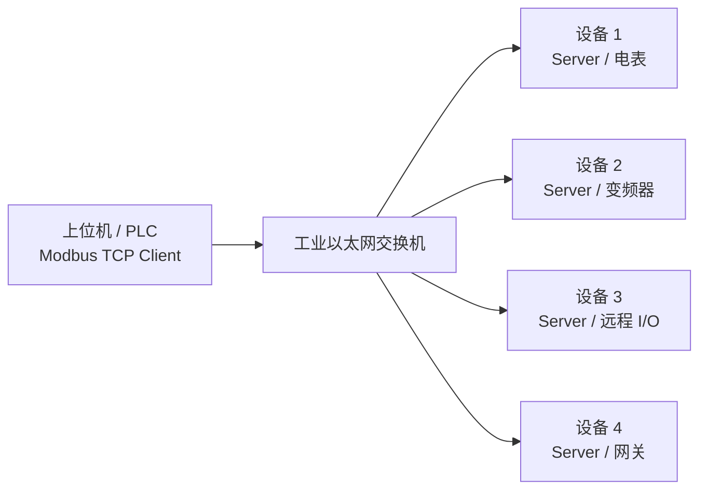
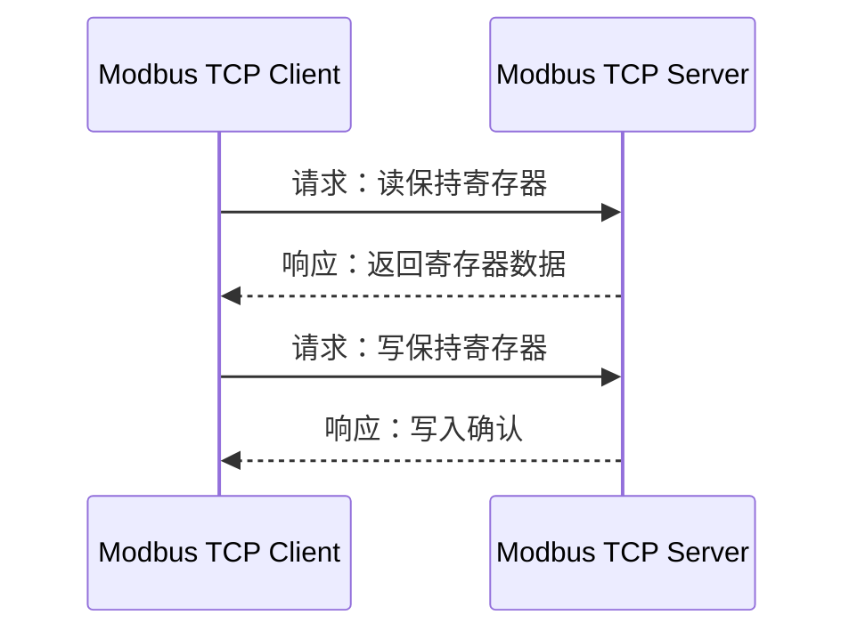
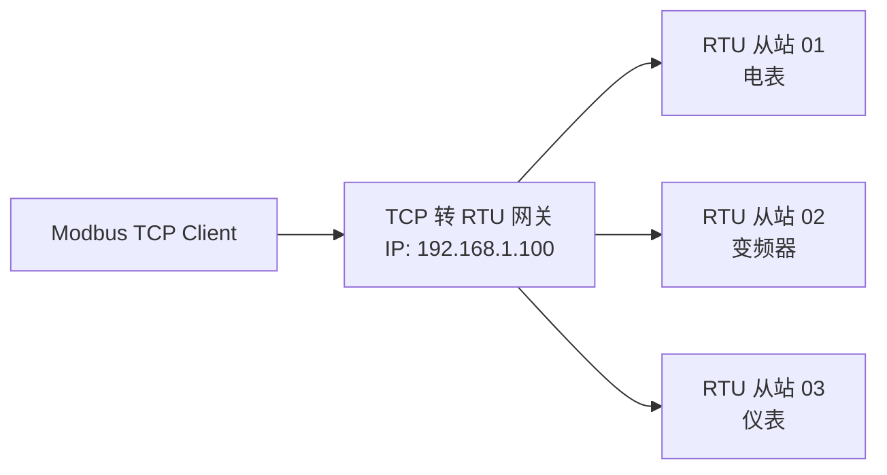
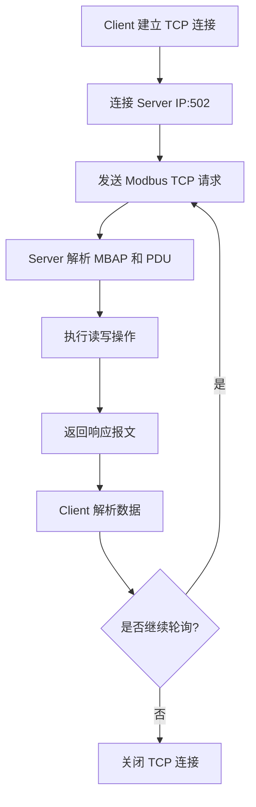
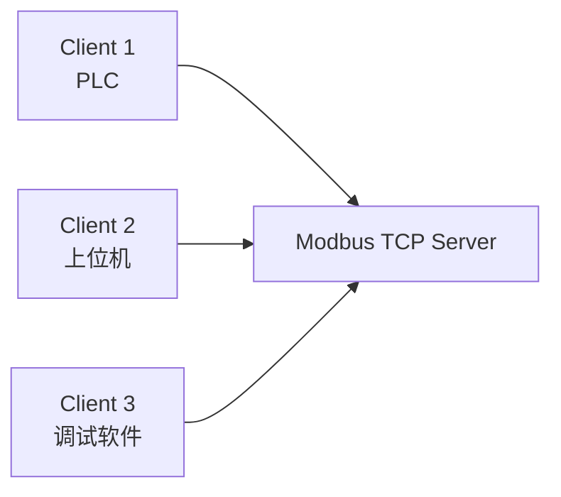
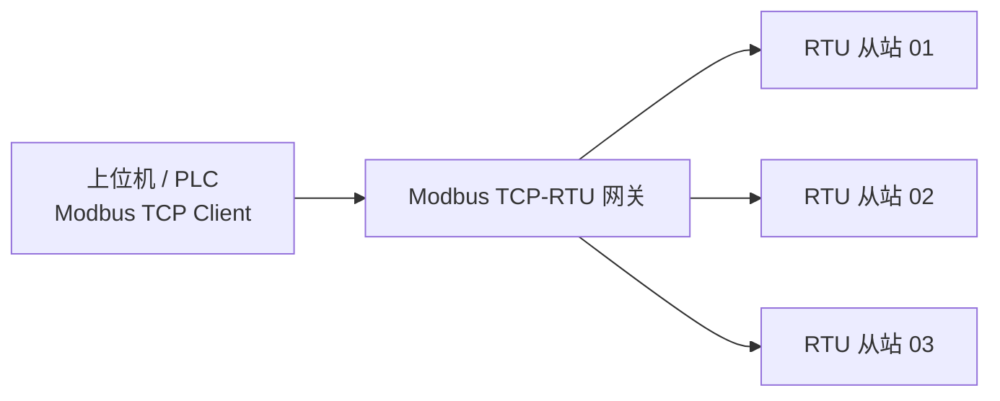
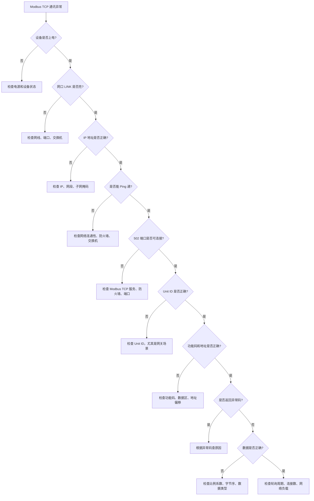
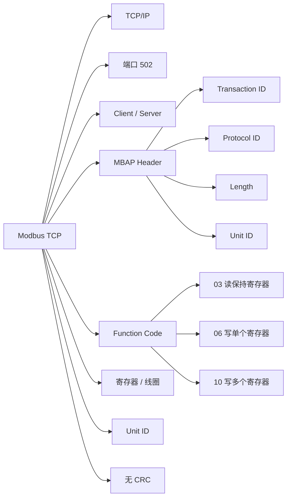

## 01｜核心概念

> [!info] 核心概念
> - **协议类型**：工业以太网通讯协议
> - **协议基础**：Modbus 应用协议 + TCP/IP
> - **默认端口**：`502`
> - **通讯模式**：Client 请求，Server 响应
> - **典型设备**：PLC、上位机、HMI、网关、电表、变频器、传感器、远程 I/O
> - **核心动作**：读线圈、读寄存器、写线圈、写寄存器
> - **校验方式**：TCP/IP 层已有校验，Modbus TCP 不使用 CRC
> - **报文特点**：使用 `MBAP Header + PDU`

---

## 02｜Modbus TCP 系统结构图



> [!tip] 结构记忆
> **Client 发请求，Server 回数据；TCP 走网口，502 是端口。**

---

## 03｜Modbus TCP 与 Modbus RTU 的关系

| 对比项 | Modbus TCP | Modbus RTU |
|---|---|---|
| 通讯介质 | 以太网 | RS485 / RS232 |
| 通讯方式 | TCP/IP | 串口 |
| 默认端口 | `502` | 无端口 |
| 校验方式 | TCP/IP 校验 | CRC16 |
| 报文头 | MBAP Header | 从站地址 |
| 从站标识 | Unit ID | Slave Address |
| 速度 | 较快 | 较慢 |
| 组网方式 | 交换机、IP 网络 | 总线手拉手 |
| 典型应用 | 上位机、PLC、网关、以太网仪表 | 仪表、变频器、传感器 |

> [!tip] 记忆口诀
> **RTU 靠串口和 CRC，TCP 靠网口和 MBAP。**

---

## 04｜Modbus TCP 报文结构

Modbus TCP 报文由 **MBAP Header + PDU** 组成。

```text
┌──────────────────────────────┬──────────────────────┐
│ MBAP Header                  │ PDU                  │
│ 7 Bytes                      │ N Bytes              │
├────────────┬────────────┬────┼──────────┬───────────┤
│ 事务标识符 │ 协议标识符 │ 长度 │ Unit ID  │ 功能码+数据 │
│ 2 Bytes    │ 2 Bytes    │ 2B │ 1 Byte   │ N Bytes     │
└────────────┴────────────┴────┴──────────┴───────────┘
```

> [!info] 报文理解
> - **MBAP Header**：Modbus TCP 专用报文头  
> - **PDU**：功能码 + 数据区  
> - **没有 CRC**：Modbus TCP 不带 RTU 的 CRC 校验  

---

## 05｜MBAP Header 详解

| 字段 | 长度 | 示例 | 说明 |
|---|---:|---|---|
| Transaction ID | 2 Byte | `00 01` | 事务标识符，用于匹配请求和响应 |
| Protocol ID | 2 Byte | `00 00` | 协议标识符，Modbus 固定为 `0000` |
| Length | 2 Byte | `00 06` | 后续字节长度，包含 Unit ID + PDU |
| Unit ID | 1 Byte | `01` | 单元标识符，常用于网关后面的 RTU 从站 |

> [!warning] 易错点
> `Length` 不是整帧长度，而是 **Unit ID + PDU** 的长度。

---

## 06｜关键参数速查表

| 参数 | 常见值 | 说明 | 易错点 |
|---|---|---|---|
| IP 地址 | `192.168.1.x` | 设备网络地址 | IP 冲突会通讯异常 |
| 端口号 | `502` | Modbus TCP 默认端口 | 防火墙可能拦截 |
| Client | PLC / 上位机 | 主动发起请求 | 不能两个 Client 乱写同一设备 |
| Server | 仪表 / 网关 / 设备 | 响应请求 | Server 通常被动等待 |
| Unit ID | `1` / `255` 常见 | 单元标识 | 网关场景尤其重要 |
| Function Code | `03` / `06` / `16` 常用 | 功能码 | 功能码要匹配数据区 |
| 起始地址 | `0000` 起 | 报文地址 | 常见地址偏移 1 |
| 数据长度 | 寄存器数量 | 读取或写入数量 | 超范围会异常 |
| 字节序 | Big-endian / Word Swap | 多寄存器数据顺序 | 32 位数据最容易错 |

---

## 07｜Client / Server 角色

| 角色 | 中文理解 | 作用 | 典型设备 |
|---|---|---|---|
| Client | 客户端 / 主动方 | 发起读写请求 | PLC、上位机、SCADA、HMI |
| Server | 服务器 / 被动方 | 响应请求并返回数据 | 电表、仪表、网关、远程 I/O |
| Gateway | 网关 | Modbus TCP 与 RTU 转换 | TCP-RTU 网关、协议转换器 |



> [!tip] 快速理解
> Modbus TCP 里通常不再说“主站 / 从站”，更常说 **Client / Server**。

---

## 08｜四大数据区

| 数据区 | 英文名称 | 地址前缀 | 读写属性 | 常用功能码 | 典型用途 |
|---|---|---|---|---|---|
| 0区 | Coil | 0xxxx | 读写位 | 01 / 05 / 15 | DO 输出、启停控制 |
| 1区 | Discrete Input | 1xxxx | 只读位 | 02 | DI 输入状态 |
| 3区 | Input Register | 3xxxx | 只读字 | 04 | 传感器测量值 |
| 4区 | Holding Register | 4xxxx | 读写字 | 03 / 06 / 16 | 参数设置、运行数据 |

> [!tip] 记忆口诀
> **0 线圈，1 输入，3 测量，4 参数。**

---

## 09｜常用功能码详解

> [!example] 01｜读线圈状态
> - **功能码**：`01`
> - **作用**：读取 Coil 线圈状态
> - **数据类型**：位
> - **典型场景**：读取输出状态、继电器状态

---

> [!example] 02｜读离散输入
> - **功能码**：`02`
> - **作用**：读取 Discrete Input 状态
> - **数据类型**：位
> - **典型场景**：读取按钮、限位、光电开关

---

> [!example] 03｜读保持寄存器
> - **功能码**：`03`
> - **作用**：读取 Holding Register
> - **数据类型**：16 位寄存器
> - **典型场景**：读取变频器频率、电表参数、设备运行状态

---

> [!example] 04｜读输入寄存器
> - **功能码**：`04`
> - **作用**：读取 Input Register
> - **数据类型**：16 位寄存器
> - **典型场景**：读取温度、压力、流量、电压、电流

---

> [!example] 05｜写单个线圈
> - **功能码**：`05`
> - **写 ON**：`FF 00`
> - **写 OFF**：`00 00`
> - **典型场景**：控制继电器、启动停止设备

---

> [!example] 06｜写单个保持寄存器
> - **功能码**：`06`
> - **作用**：写入单个 Holding Register
> - **典型场景**：设置频率、写入参数、修改设定值

---

> [!example] 15｜写多个线圈
> - **功能码**：`0F`
> - **作用**：批量写入多个 Coil
> - **典型场景**：批量控制多个开关量输出

---

> [!example] 16｜写多个保持寄存器
> - **功能码**：`10`
> - **作用**：批量写入多个 Holding Register
> - **典型场景**：写入多个参数、写入 32 位数据、写入浮点数

---

## 10｜功能码速查表

| 功能码 | 十六进制 | 功能名称 | 数据区 | 读写 |
|---|---|---|---|---|
| 01 | 0x01 | 读线圈 | 0区 Coil | 读 |
| 02 | 0x02 | 读离散输入 | 1区 Discrete Input | 读 |
| 03 | 0x03 | 读保持寄存器 | 4区 Holding Register | 读 |
| 04 | 0x04 | 读输入寄存器 | 3区 Input Register | 读 |
| 05 | 0x05 | 写单个线圈 | 0区 Coil | 写 |
| 06 | 0x06 | 写单个保持寄存器 | 4区 Holding Register | 写 |
| 15 | 0x0F | 写多个线圈 | 0区 Coil | 写 |
| 16 | 0x10 | 写多个保持寄存器 | 4区 Holding Register | 写 |

> [!tip] 重点记忆
> **03 读保持寄存器，06 写单个寄存器，16 写多个寄存器。**

---

## 11｜实战报文示例：读取保持寄存器

### 示例目标

Client 读取 Server 的保持寄存器地址 `0000`，读取数量 `1` 个寄存器。

### 请求报文

```text
00 01 00 00 00 06 01 03 00 00 00 01
```

### 字段解释

| 字节 | 含义 |
|---|---|
| `00 01` | Transaction ID，事务号 |
| `00 00` | Protocol ID，Modbus 固定为 0 |
| `00 06` | Length，后续 6 字节 |
| `01` | Unit ID |
| `03` | 功能码，读保持寄存器 |
| `00 00` | 起始寄存器地址 |
| `00 01` | 读取 1 个寄存器 |

---

### 响应报文

```text
00 01 00 00 00 05 01 03 02 0B B8
```

### 字段解释

| 字节 | 含义 |
|---|---|
| `00 01` | Transaction ID，与请求对应 |
| `00 00` | Protocol ID |
| `00 05` | Length，后续 5 字节 |
| `01` | Unit ID |
| `03` | 功能码 |
| `02` | 返回数据字节数 |
| `0B B8` | 寄存器数据，十进制为 3000 |

> [!info] 数据换算
> 如果设备比例系数为 `0.01`：
>
> ```text
> 实际值 = 3000 × 0.01 = 30.00
> ```

---

## 12｜实战报文示例：写单个保持寄存器

### 示例目标

向保持寄存器地址 `0000` 写入数值 `3000`。

### 请求报文

```text
00 02 00 00 00 06 01 06 00 00 0B B8
```

| 字节 | 含义 |
|---|---|
| `00 02` | Transaction ID |
| `00 00` | Protocol ID |
| `00 06` | Length |
| `01` | Unit ID |
| `06` | 功能码，写单个保持寄存器 |
| `00 00` | 寄存器地址 |
| `0B B8` | 写入值，十进制 3000 |

### 正常响应

```text
00 02 00 00 00 06 01 06 00 00 0B B8
```

> [!check] 判断写入成功
> 功能码 `06` 写入成功后，Server 通常会原样返回请求中的功能码、地址和写入值。

---

## 13｜实战报文示例：写多个保持寄存器

### 示例目标

向保持寄存器地址 `0000` 写入 1 个寄存器，数值为 `3000`。

### 请求报文

```text
00 03 00 00 00 09 01 10 00 00 00 01 02 0B B8
```

| 字节 | 含义 |
|---|---|
| `00 03` | Transaction ID |
| `00 00` | Protocol ID |
| `00 09` | Length，后续 9 字节 |
| `01` | Unit ID |
| `10` | 功能码，写多个保持寄存器 |
| `00 00` | 起始寄存器地址 |
| `00 01` | 写入寄存器数量 |
| `02` | 写入数据字节数 |
| `0B B8` | 写入数据 |

### 正常响应

```text
00 03 00 00 00 06 01 10 00 00 00 01
```

| 字节 | 含义 |
|---|---|
| `10` | 功能码 |
| `00 00` | 起始地址 |
| `00 01` | 成功写入数量 |

---

## 14｜MBAP Length 计算方法

`Length` 字段表示后续字节数量：

```text
Length = Unit ID 长度 + PDU 长度
```

### 示例：读 1 个保持寄存器请求

```text
Unit ID：1 Byte
功能码：1 Byte
起始地址：2 Byte
读取数量：2 Byte

Length = 1 + 1 + 2 + 2 = 6
```

最终 Length 字段：

```text
00 06
```

### 示例：读 1 个寄存器响应

```text
Unit ID：1 Byte
功能码：1 Byte
字节数：1 Byte
数据：2 Byte

Length = 1 + 1 + 1 + 2 = 5
```

最终 Length 字段：

```text
00 05
```

> [!warning] 易错点
> Length 不包含：
> - Transaction ID
> - Protocol ID
> - Length 字段自己

---

## 15｜Unit ID 的作用

Unit ID 在纯 Modbus TCP 设备中有时不重要，但在 **TCP 转 RTU 网关** 中非常关键。



| 场景 | Unit ID 含义 |
|---|---|
| 纯 Modbus TCP 设备 | 常用 `1` 或 `255`，按设备要求 |
| TCP 转 RTU 网关 | 对应 RTU 从站地址 |
| 多设备网关 | Unit ID 决定访问哪个串口从站 |
| 某些 PLC Server | Unit ID 可能被忽略，也可能要求固定值 |

> [!warning] 易错点
> 使用网关时，IP 地址只找到网关，真正访问哪个 RTU 设备要看 **Unit ID**。

---

## 16｜寄存器地址换算

设备手册中的地址和报文中的地址常常不完全一样。

| 手册地址 | 数据区 | 报文地址 |
|---|---|---|
| 40001 | 保持寄存器 | 0000 |
| 40002 | 保持寄存器 | 0001 |
| 40003 | 保持寄存器 | 0002 |
| 30001 | 输入寄存器 | 0000 |
| 30002 | 输入寄存器 | 0001 |
| 00001 | 线圈 | 0000 |
| 10001 | 离散输入 | 0000 |

> [!warning] 易错点
> 很多设备手册写 `40001`，但报文中起始地址要填 `0000`。  
> 这就是 Modbus 常见的 **地址偏移 1** 问题。

---

## 17｜数据类型与字节序

Modbus 一个寄存器是 `16 bit`，也就是 `2 Byte`。

| 数据类型 | 占用寄存器 | 示例用途 |
|---|---|---|
| UINT16 | 1 个寄存器 | 状态值、计数值 |
| INT16 | 1 个寄存器 | 有符号温度、偏差值 |
| UINT32 | 2 个寄存器 | 累计量、计数器 |
| INT32 | 2 个寄存器 | 有符号累计量 |
| FLOAT32 | 2 个寄存器 | 温度、压力、流量 |
| ASCII | 多个寄存器 | 设备名称、编号 |

---

### 16 位数据示例

```text
寄存器数据：
0B B8

十六进制：
0x0BB8

十进制：
3000
```

---

### 32 位数据字节序

两个寄存器组成一个 32 位数据：

```text
12 34 56 78
```

可能存在以下顺序：

| 类型 | 顺序 |
|---|---|
| ABCD | `12 34 56 78` |
| CDAB | `56 78 12 34` |
| BADC | `34 12 78 56` |
| DCBA | `78 56 34 12` |

> [!warning] 易错点
> Modbus 单个寄存器通常是高字节在前，但两个寄存器组合成 32 位数据时，不同厂家可能有不同的字顺序。

---

## 18｜异常响应格式

当 Server 无法执行请求时，会返回异常响应。

```text
异常响应功能码 = 原功能码 + 0x80
```

### 示例

请求功能码：

```text
03
```

异常响应功能码：

```text
83
```

### 异常响应示例

```text
00 01 00 00 00 03 01 83 02
```

| 字节 | 含义 |
|---|---|
| `00 01` | Transaction ID |
| `00 00` | Protocol ID |
| `00 03` | Length，后续 3 字节 |
| `01` | Unit ID |
| `83` | 异常功能码 |
| `02` | 异常码：非法数据地址 |

---

## 19｜常见错误代码

| 异常码 | 名称 | 含义 | 常见原因 | 处理方法 |
|---|---|---|---|---|
| 01 | 非法功能码 | Server 不支持该功能码 | 功能码用错 | 查看设备手册 |
| 02 | 非法数据地址 | 地址不存在或越界 | 寄存器地址错误 | 检查地址偏移 |
| 03 | 非法数据值 | 写入值不合法 | 参数超范围 | 检查数据范围 |
| 04 | 从站设备故障 | 设备内部错误 | 设备异常 | 重启或检查设备 |
| 05 | 确认 | 请求已接受但未完成 | 长时间操作 | 等待后查询 |
| 06 | 设备忙 | Server 正忙 | 请求太快或设备忙 | 延长轮询周期 |
| 08 | 存储奇偶性错误 | 存储校验异常 | 存储故障 | 恢复参数或联系厂家 |
| 0A | 网关路径不可用 | 网关无法连接下级设备 | 网关或串口链路问题 | 查网关配置 |
| 0B | 网关目标无响应 | 下级设备无响应 | RTU 从站掉线 | 查 RTU 设备和 Unit ID |

---

## 20｜Modbus TCP 通讯流程



> [!info] 工程理解
> Modbus TCP 本质上是：  
> **TCP 负责连接，Modbus 负责读写数据。**

---

## 21｜轮询周期与连接管理

| 项目 | 建议 |
|---|---|
| 轮询周期 | 不要过快，常见 100ms–1000ms |
| 单次读取 | 尽量连续地址批量读取 |
| 多设备轮询 | 分散周期，避免同时突发 |
| TCP 连接 | 尽量复用连接，不要频繁连接断开 |
| 超时时间 | 按现场网络和设备响应速度设置 |
| 重试次数 | 通常设置 1–3 次 |
| 写操作 | 避免高频重复写同一参数 |

> [!warning] 易错点
> 轮询太快、连接频繁建立、多个 Client 同时访问同一设备，都会导致 Server 响应变慢或拒绝连接。

---

## 22｜多 Client 访问问题



| 问题 | 说明 |
|---|---|
| 连接数限制 | 一些 Server 只允许少量 TCP 连接 |
| 写入冲突 | 多个 Client 同时写同一寄存器会互相覆盖 |
| 轮询压力 | 多个 Client 高频读取会增加设备负担 |
| 调试软件影响 | 调试时可能抢占连接或造成延迟 |

> [!tip] 工程建议
> 现场调试时，如果 PLC 通讯异常，先确认是否有上位机、调试软件、网关也在同时访问设备。

---

## 23｜Modbus TCP 网关应用

### TCP 转 RTU 网关



| 参数 | 说明 |
|---|---|
| 网关 IP | Client 连接的 IP |
| TCP 端口 | 通常 `502` |
| Unit ID | 对应 RTU 从站地址 |
| 串口参数 | 波特率、校验位、停止位 |
| RTU 地址 | 下级串口设备地址 |

> [!warning] 易错点
> TCP 侧能连上网关，不代表 RTU 侧设备正常。  
> 还要检查网关串口参数、RTU 地址、接线、终端电阻。

---

## 24｜实战示例：电表数据读取

### 场景

上位机读取电表电压、电流、功率数据。

| 数据 | 寄存器 | 数据类型 | 比例系数 |
|---|---|---|---|
| A 相电压 | 40001 | UINT16 | 0.1 V |
| A 相电流 | 40002 | UINT16 | 0.01 A |
| 总功率 | 40003-40004 | INT32 | 1 W |
| 电能累计 | 40005-40006 | UINT32 | 0.01 kWh |

### 读取策略

```text
一次读取 40001-40006 共 6 个寄存器
报文起始地址：0000
读取数量：0006
功能码：03
```

> [!tip] 工程建议
> 连续寄存器尽量一次读取，减少 TCP 请求次数，提高效率。

---

## 25｜实战示例：变频器控制

### 常见数据结构

| PLC → 变频器 | 寄存器 | 说明 |
|---|---|---|
| 控制字 | 40001 | 启动、停止、复位 |
| 频率给定 | 40002 | 目标频率 |
| 参数写入 | 40010+ | 设备参数 |

| 变频器 → PLC | 寄存器 | 说明 |
|---|---|---|
| 状态字 | 40003 | 就绪、运行、故障 |
| 实际频率 | 40004 | 当前输出频率 |
| 故障代码 | 40005 | 异常信息 |

### 示例

```text
写入频率给定：
目标频率 = 30.00 Hz
比例系数 = 0.01 Hz

写入值 = 30.00 ÷ 0.01 = 3000
十六进制 = 0B B8
```

> [!warning] 易错点
> 变频器要确认：
> - 命令源是否设置为 Modbus TCP
> - 频率源是否设置为 Modbus TCP
> - 控制字定义是否正确
> - 写入寄存器是否允许写
> - 比例系数是否正确

---

## 26｜实战示例：远程 I/O

### 数字量输入

| 线圈 / 寄存器 | 含义 |
|---|---|
| Discrete Input 10001 | DI1 |
| Discrete Input 10002 | DI2 |
| Discrete Input 10003 | DI3 |
| Discrete Input 10004 | DI4 |

### 数字量输出

| 线圈 | 含义 |
|---|---|
| Coil 00001 | DO1 |
| Coil 00002 | DO2 |
| Coil 00003 | DO3 |
| Coil 00004 | DO4 |

### 控制示例

```text
读取输入：
功能码 02
起始地址 0000
读取数量 0004

写输出 DO1 = ON：
功能码 05
地址 0000
数据 FF00
```

> [!example] 应用场景
> - 读取按钮、限位、光电开关
> - 控制电磁阀、继电器、指示灯
> - 通过以太网扩展 PLC I/O 点数

---

## 27｜常见网络问题

| 现象 | 可能原因 | 排查方向 |
|---|---|---|
| Ping 不通 | IP 错误、网线断、交换机异常 | 查 IP、网线、交换机 |
| Ping 通但 502 不通 | 端口未开放、防火墙、服务未启动 | 查端口和 Server 设置 |
| 连接经常断开 | 网络不稳定、连接数超限 | 查交换机、线缆、连接数 |
| 响应慢 | 轮询太快、Server 负载高 | 增大轮询周期 |
| 偶发超时 | 干扰、网络拥塞、设备忙 | 查屏蔽、网络负载 |
| 写入失败 | 寄存器只读、值超范围 | 查功能码和权限 |
| 数据不对 | 地址偏移、字节序、比例系数 | 查手册和数据格式 |
| 网关下设备无响应 | Unit序、比例系数 | 查手册和数据格式 |
| 网关下设备 ID 或串口参数错误 | 查网关和 RTU 侧 |

---

## 28｜常用测试方法

| 工具 / 方法 | 作用 |
|---|---|
| Ping | 检查 IP 是否可达 |
| Telnet IP 502 | 检查 502 端口是否开放 |
| Modbus Poll | 模拟 Client 读写 |
| Modbus Slave | 模拟 Server |
| Wireshark | 抓包分析 TCP 和 Modbus 报文 |
| PLC 在线监控 | 查看通讯块状态 |
| 网关诊断页面 | 查看 TCP 和 RTU 侧状态 |

> [!tip] 调试顺序
> **先 Ping，再测 502，再读 03，再写 06。**

---

## 29｜Wireshark 抓包重点

| 字段 | 重点看什么 |
|---|---|
| Source IP | 请求来自哪个 Client |
| Destination IP | 请求发往哪个 Server |
| TCP Port | 是否为 `502` |
| Transaction ID | 请求和响应是否对应 |
| Function Code | 功能码是否正确 |
| Reference Number | 起始地址是否正确 |
| Word Count | 读取数量是否正确 |
| Exception Code | 是否返回异常码 |
| TCP Retransmission | 是否有网络重传 |
| Response Time | Server 响应是否过慢 |

> [!warning] 易错点
> Wireshark 看到 TCP 已连接，不代表 Modbus 数据正确。  
> 要继续看功能码、地址、数量、异常码。

---

## 30｜Modbus TCP 排查流程



---

> [!check] 排查清单
> - [ ] 设备是否上电
> - [ ] 网口 LINK 灯是否亮
> - [ ] 网线是否正常
> - [ ] 交换机是否正常
> - [ ] IP 地址是否正确
> - [ ] 是否存在 IP 冲突
> - [ ] Client 和 Server 是否同网段
> - [ ] 是否能 Ping 通
> - [ ] TCP 502 端口是否开放
> - [ ] Server 是否启用 Modbus TCP
> - [ ] 防火墙是否放行端口
> - [ ] Unit ID 是否正确
> - [ ] 功能码是否支持
> - [ ] 寄存器地址是否偏移
> - [ ] 读取数量是否超范围
> - [ ] 写入值是否超范围
> - [ ] 数据类型是否正确
> - [ ] 字节序是否正确
> - [ ] 比例系数是否正确
> - [ ] 轮询周期是否太快
> - [ ] 多 Client 是否同时访问

---

## 31｜Modbus TCP 与 PROFINET 对比

| 对比项 | Modbus TCP | PROFINET |
|---|---|---|
| 协议定位 | 通用以太网读写协议 | 工业以太网实时控制协议 |
| 典型生态 | 多品牌通用 | 西门子、欧系自动化 |
| 端口 | TCP 502 | 不以单一端口理解 |
| 数据模型 | 寄存器 / 线圈 | I/O 映射、模块化设备 |
| 组态方式 | IP + 功能码 + 地址 | GSDML + 设备名称 + I/O 组态 |
| 实时性 | 一般 | 强 |
| 诊断能力 | 较弱 | 强 |
| 学习重点 | 功能码、地址、字节序 | 设备名称、GSDML、拓扑 |
| 典型应用 | 上位机、仪表、网关 | PLC、远程 I/O、驱动器 |

> [!tip] 选择建议
> - 简单读写寄存器、跨品牌数据采集：选 Modbus TCP  
> - PLC 与 I/O、驱动器做实时控制：选 PROFINET  

---

## 32｜Modbus TCP 与 EtherNet/IP 对比

| 对比项 | Modbus TCP | EtherNet/IP |
|---|---|---|
| 协议模型 | 寄存器 / 线圈 | CIP 对象模型 |
| 周期 I/O | 通常轮询 | 支持 Implicit I/O |
| 参数访问 | 功能码读写 | Explicit Message |
| 默认端口 | TCP 502 | TCP 44818 / UDP 2222 |
| 组态复杂度 | 较低 | 较高 |
| 实时性 | 一般 | 较强 |
| 数据映射 | 地址 + 数量 | Assembly / Tag |
| 典型设备 | 仪表、网关、简单 I/O | I/O、驱动器、机器人 |
| 学习重点 | 功能码和地址 | CIP、Assembly、RPI |

> [!tip] 记忆口诀
> **Modbus TCP 看寄存器，EtherNet/IP 看 Assembly。**

---

## 33｜Modbus TCP 与 EtherCAT 对比

| 对比项 | Modbus TCP | EtherCAT |
|---|---|---|
| 协议定位 | 通用读写协议 | 高实时工业以太网 |
| 通讯方式 | TCP 请求响应 | 主站周期帧，边收边处理 |
| 实时性 | 一般 | 很强 |
| 同步能力 | 基本无 | DC 分布式时钟 |
| 数据模型 | 寄存器 / 线圈 | PDO / SDO / 对象字典 |
| 典型应用 | 数据采集、参数读写 | 多轴伺服、高速 I/O |
| 交换机 | 可通过普通以太网交换机 | 主链路通常不接普通交换机 |
| 学习重点 | 地址、功能码、502 | 状态机、PDO、DC、WKC |

> [!info] 工程理解
> Modbus TCP 更适合简单数据交互，EtherCAT 更适合高速同步控制。

---

## 34｜工程应用建议

> [!tip] 初次调试建议
> - 先确认设备是否启用 Modbus TCP Server
> - 先 Ping 设备 IP
> - 再测试 TCP `502` 端口
> - 先用功能码 `03` 读取保持寄存器
> - 每次先读取少量寄存器
> - 地址从 `0000` 和 `0001` 两种可能都验证
> - 写入前确认寄存器是否可写
> - 多寄存器数据重点检查字节序和比例系数
> - 使用网关时重点检查 Unit ID 和 RTU 侧串口参数

---

> [!warning] 现场注意事项
> - 能 Ping 通不代表 Modbus TCP 一定正常
> - 502 端口不通时，优先查防火墙和 Server 是否启用
> - 多个 Client 同时访问可能导致连接数超限
> - 轮询周期不要过快
> - 写寄存器要谨慎，避免误改设备参数
> - IP 地址冲突会造成非常隐蔽的通讯问题
> - TCP 转 RTU 网关要同时排查 TCP 侧和 RTU 侧
> - 数据异常优先查地址偏移、比例系数、字节序

---

## 35｜Modbus TCP 快速记忆图



---

## 36｜记忆口诀

> [!tip] Modbus TCP 口诀
> **网口通信走 TCP，默认端口五零二。**
>
> **MBAP 放前头，功能码跟后面。**
>
> **03 读参数，06 写单个，10 写多个。**
>
> **TCP 不带 CRC，Length 要算准。**
>
> **网关看 Unit ID，地址常常要减一。**
>
> **Ping 通不代表协议通，502 通了再看功能码。**

---

## 37｜最终速记卡

- Modbus TCP 是基于 TCP/IP 的 Modbus 协议，默认端口是 `502`。
- 通讯角色通常叫 `Client / Server`，Client 主动请求，Server 被动响应。
- Modbus TCP 报文结构是：`MBAP Header + PDU`。
- MBAP Header 包含：`Transaction ID + Protocol ID + Length + Unit ID`。
- Modbus TCP 不使用 RTU 的 CRC 校验。
- 常用功能码：`03` 读保持寄存器，`06` 写单个保持寄存器，`10` 写多个保持寄存器。
- 常见地址陷阱：手册 `40001` 通常对应报文地址 `0000`。
- 使用 TCP-RTU 网关时，`Unit ID` 通常对应下级 RTU 从站地址。
- 能 Ping 通只说明 IP 可达，不代表 Modbus TCP 正常。
- 502 端口不通，优先查防火墙、Server 是否启用、端口是否被占用。
- 数据不对优先查：地址偏移、功能码、数据类型、字节序、比例系数。
- 排查顺序：电源 → LINK → IP → Ping → 502 → Unit ID → 功能码 → 地址 → 数据格式。