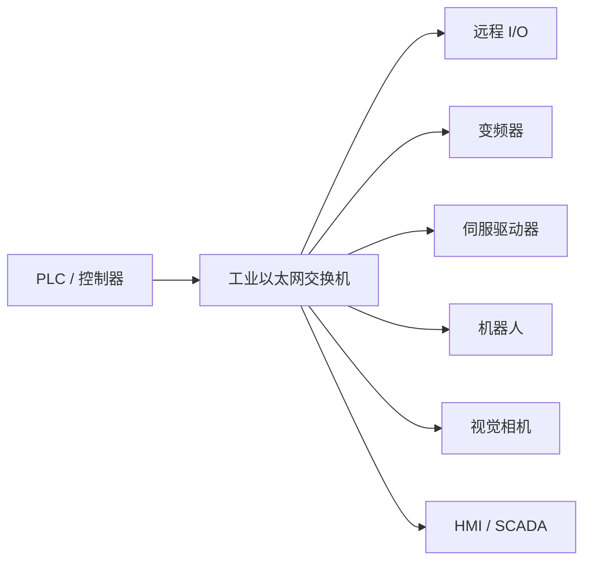
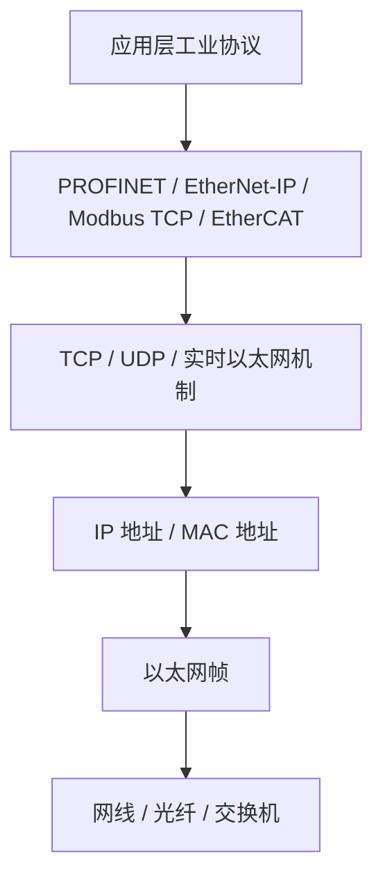
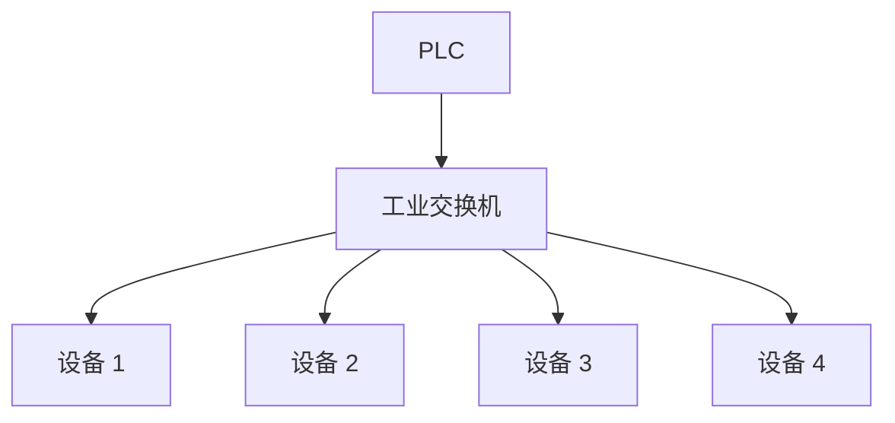
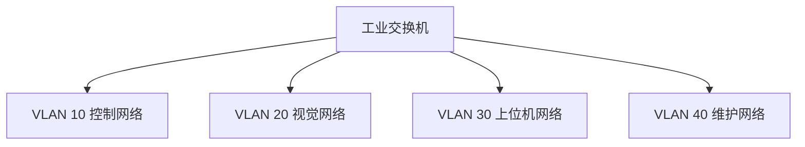
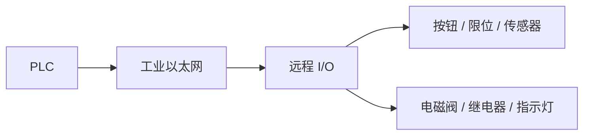
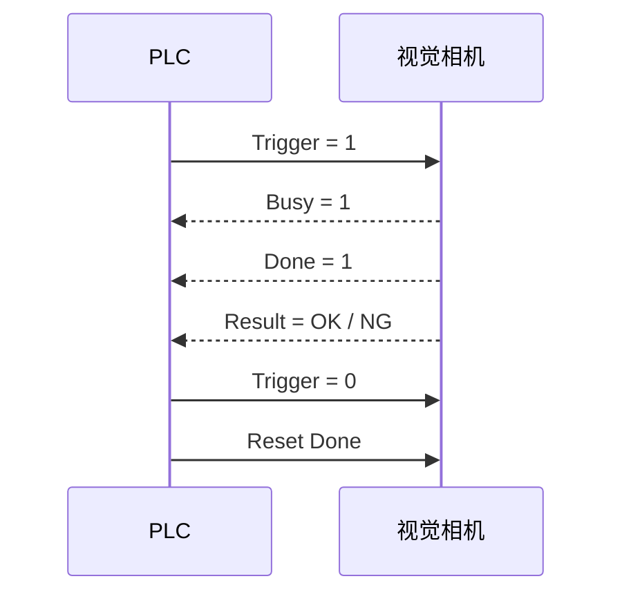
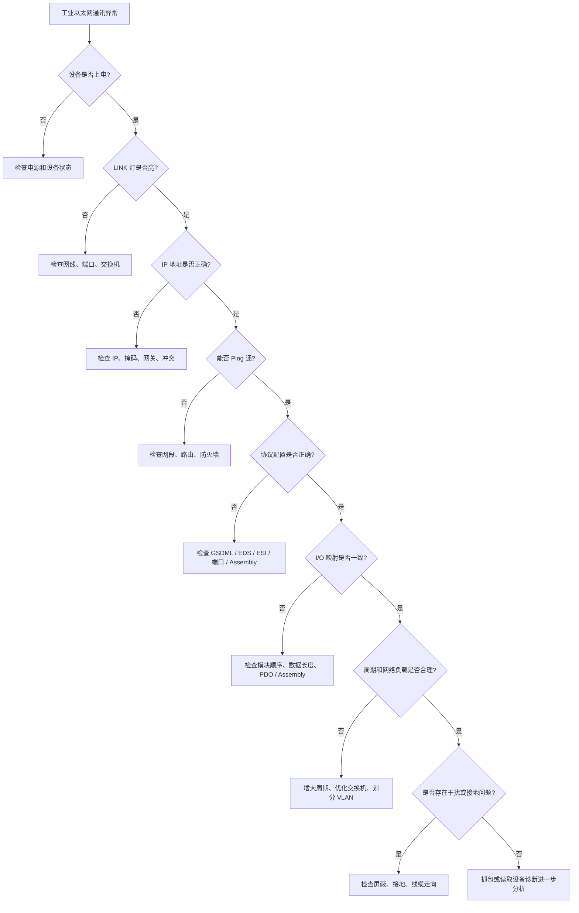
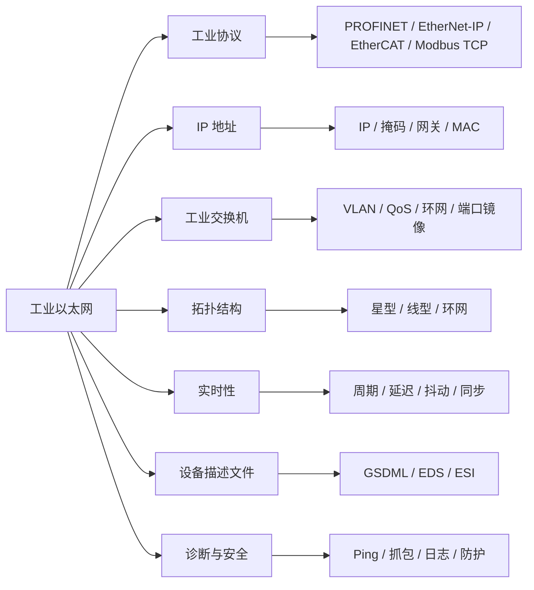

## 01｜核心概念

> [!info] 核心概念
> - **基础技术**：Ethernet + TCP/IP + 工业实时协议
> - **应用场景**：自动化产线、运动控制、远程 I/O、设备互联、数据采集
> - **典型设备**：PLC、HMI、SCADA、远程 I/O、伺服、变频器、机器人、视觉相机、工业交换机
> - **核心特点**：速度快、带宽高、组网灵活、诊断能力强
> - **常见协议**：PROFINET、EtherNet/IP、EtherCAT、Modbus TCP、POWERLINK、CC-Link IE
> - **工程重点**：IP 地址、拓扑结构、实时性、交换机、线缆、接地、诊断、安全

---

## 02｜工业以太网系统结构图



> [!tip] 结构记忆
> **工业以太网 = 以太网做底层，工业协议跑控制。**

---

## 03｜工业以太网与普通以太网的区别

| 对比项 | 普通以太网 | 工业以太网 |
|---|---|---|
| 使用环境 | 办公室、家庭 | 工厂、产线、设备现场 |
| 抗干扰能力 | 一般 | 强 |
| 实时性 | 一般 | 可支持实时 / 高实时 |
| 设备类型 | 电脑、路由器、服务器 | PLC、I/O、驱动器、机器人 |
| 网络设备 | 普通交换机 | 工业交换机 |
| 线缆要求 | 普通网线 | 工业屏蔽网线 |
| 诊断能力 | 基础网络诊断 | 设备级、端口级、拓扑级诊断 |
| 冗余能力 | 一般 | 支持 MRP、DLR、PRP、HSR 等 |
| 工作温度 | 普通环境 | 宽温、抗震、抗电磁干扰 |

> [!warning] 易错点
> 工业以太网不是“随便插网线就能稳定通讯”。  
> 现场干扰、接地、交换机、拓扑、周期时间都会影响通讯质量。

---

## 04｜常见工业以太网协议速查表

| 协议 | 常见生态 | 核心特点 | 典型应用 |
|---|---|---|---|
| PROFINET | 西门子、欧系 | 设备名称 + GSDML + RT / IRT | PLC、远程 I/O、驱动器 |
| EtherNet/IP | 罗克韦尔、北美系 | CIP + Assembly + RPI | I/O、变频器、机器人 |
| EtherCAT | 倍福、运动控制 | 边收边处理 + DC 同步 | 多轴伺服、高速 I/O |
| Modbus TCP | 多品牌通用 | 功能码 + 寄存器 + 端口 502 | 仪表、网关、上位机 |
| CC-Link IE | 三菱生态 | 高速以太网现场网络 | 三菱 PLC、伺服、I/O |
| POWERLINK | B&R 等 | 实时以太网调度机制 | 运动控制、同步设备 |
| SERCOS III | 运动控制 | 高实时同步 | 伺服、数控、机器人 |

> [!tip] 记忆口诀
> **西门子看 PROFINET，罗克韦尔看 EtherNet/IP，倍福运动看 EtherCAT，通用采集看 Modbus TCP。**

---

## 05｜工业以太网核心组成

| 组成 | 作用 | 工程重点 |
|---|---|---|
| PLC / 控制器 | 控制网络核心 | 协议类型、刷新周期、网络接口 |
| 工业交换机 | 连接多个设备 | 管理型、VLAN、QoS、环网 |
| 现场设备 | 执行控制或采集数据 | IP、设备名、协议参数 |
| 工业网线 | 传输信号 | 屏蔽、长度、抗干扰 |
| 设备描述文件 | 让软件识别设备 | GSDML、EDS、ESI |
| 工程软件 | 组态和诊断 | 拓扑、地址、I/O 映射 |
| 上位系统 | 监控和数据采集 | SCADA、MES、OPC UA |

---

## 06｜工业以太网协议分层理解



| 层级 | 典型内容 | 说明 |
|---|---|---|
| 应用层 | PROFINET、EtherNet/IP、Modbus TCP | 决定数据含义 |
| 传输层 | TCP、UDP、实时机制 | 决定传输方式 |
| 网络层 | IP 地址、子网、网关 | 决定网络寻址 |
| 数据链路层 | MAC 地址、以太网帧 | 决定局域网通信 |
| 物理层 | 网线、光纤、接口 | 决定实际传输介质 |

> [!info] 工程理解
> IP 通了，只说明网络层可能正常。  
> 工业协议是否正常，还要看协议配置、设备文件、数据长度、周期、设备状态。

---

## 07｜关键参数速查表

| 参数 | 常见值 | 说明 | 易错点 |
|---|---|---|---|
| IP 地址 | `192.168.1.x` | 设备网络地址 | IP 冲突会通讯异常 |
| 子网掩码 | `255.255.255.0` | 判断同网段 | 掩码错误会跨网失败 |
| 网关 | 路由器地址 | 跨网段使用 | 本地控制网络常不需要 |
| MAC 地址 | 硬件地址 | 设备唯一物理地址 | 换设备后 MAC 变化 |
| 端口速率 | 100M / 1G | 网络带宽 | 低速设备可能拖慢链路 |
| 双工模式 | 全双工 | 同时收发 | 半双工容易冲突 |
| 刷新周期 | 1ms / 4ms / 10ms 等 | I/O 更新周期 | 设太小会增加负载 |
| 交换机类型 | 管理型 / 非管理型 | 网络管理能力 | 复杂网络建议管理型 |
| 拓扑结构 | 星型 / 线型 / 环网 | 网络连接方式 | 环网需配置冗余协议 |
| 协议文件 | GSDML / EDS / ESI | 设备描述文件 | 版本不匹配会失败 |

---

## 08｜常见设备描述文件

| 文件类型 | 对应协议 | 作用 |
|---|---|---|
| GSDML | PROFINET | 描述 PROFINET 设备、模块、I/O 数据 |
| EDS | EtherNet/IP / CANopen | 描述 CIP 或 CANopen 设备能力 |
| ESI | EtherCAT | 描述 EtherCAT 从站、对象、PDO |
| GSD | PROFIBUS DP | 描述 PROFIBUS 从站 |
| CSP+ | CC-Link / CC-Link IE | 描述 CC-Link 系列设备 |

> [!tip] 记忆口诀
> **PROFINET 用 GSDML，EtherNet/IP 用 EDS，EtherCAT 用 ESI。**

---

## 09｜工业以太网通讯类型

| 通讯类型 | 说明 | 典型用途 |
|---|---|---|
| 周期性 I/O 通讯 | 固定周期刷新数据 | 远程 I/O、驱动控制 |
| 非周期参数通讯 | 按需读写参数 | 参数设置、诊断读取 |
| 报警通讯 | 设备异常主动报告 | 模块故障、断线、过载 |
| 诊断通讯 | 读取设备状态 | 端口状态、设备健康 |
| 上位机通讯 | 监控和数据采集 | SCADA、MES、数据库 |
| 时间同步通讯 | 统一设备时间 | 多轴同步、事件记录 |

> [!info] 工程理解
> 控制数据看周期性，参数设置看非周期，故障排查看诊断和报警。

---

## 10｜实时性分类

| 类型 | 特点 | 典型协议 / 场景 |
|---|---|---|
| 非实时 | 普通 TCP/IP 通讯 | 网页、参数读取、文件传输 |
| 软实时 | 延迟可接受，有一定周期要求 | Modbus TCP、普通上位机通讯 |
| 实时 | 周期 I/O 通讯，稳定刷新 | PROFINET RT、EtherNet/IP |
| 高实时 / 等时同步 | 微秒级同步，适合运动控制 | EtherCAT、PROFINET IRT |

> [!warning] 易错点
> 并不是所有“工业以太网”都适合高速运动控制。  
> 运动控制要重点看同步机制、周期抖动、主站实时性能。

---

## 11｜常见拓扑结构

### 星型拓扑



| 优点 | 缺点 |
|---|---|
| 结构清晰，便于排查 | 依赖中心交换机 |
| 单支路故障影响小 | 布线较多 |
| 适合大多数产线 | 交换机要选可靠 |

---

### 线型拓扑


| 优点 | 缺点 |
|---|---|
| 节省交换机和布线 | 中间设备故障可能影响后级 |
| 现场接线简洁 | 排查时要注意前后级链路 |
| 适合设备自带双网口 | 不适合随意断电中间设备 |

---

### 环网拓扑


| 优点 | 缺点 |
|---|---|
| 断一处仍可恢复通信 | 需要配置冗余协议 |
| 可靠性高 | 设备必须支持 |
| 适合关键产线 | 配错可能形成网络风暴 |

---

## 12｜常见冗余协议

| 协议 | 常见生态 | 作用 |
|---|---|---|
| MRP | PROFINET 常见 | 环网冗余 |
| DLR | EtherNet/IP 常见 | 设备级环网冗余 |
| RSTP | 通用以太网 | 快速生成树，防止环路 |
| PRP | 高可靠网络 | 双网并行冗余 |
| HSR | 高可靠网络 | 环网无缝冗余 |

> [!warning] 易错点
> 普通以太网不能随便接成环。  
> 没有冗余协议的环路可能导致广播风暴，严重时全网瘫痪。

---

## 13｜工业交换机选择

| 类型 | 特点 | 适用场景 |
|---|---|---|
| 非管理型交换机 | 即插即用，价格低 | 小型简单网络 |
| 管理型交换机 | 支持 VLAN、QoS、诊断、镜像 | 中大型工业网络 |
| 环网交换机 | 支持 MRP、DLR、RSTP 等 | 高可靠产线 |
| PoE 交换机 | 网线供电 | 相机、无线 AP、部分传感器 |
| 千兆交换机 | 带宽更高 | 视觉、数据采集、上位机 |
| 光纤交换机 | 抗干扰、距离远 | 跨车间、强干扰现场 |

> [!tip] 工程建议
> 控制网络设备多、协议复杂、需要诊断时，优先使用管理型工业交换机。

---

## 14｜管理型交换机常用功能

| 功能 | 作用 | 工程用途 |
|---|---|---|
| VLAN | 划分网络 | 控制网、相机网、办公网隔离 |
| QoS | 流量优先级 | 提高实时控制数据优先级 |
| Port Mirror | 端口镜像 | Wireshark 抓包分析 |
| IGMP Snooping | 管理组播 | EtherNet/IP、视频流优化 |
| SNMP | 网络监控 | 上位系统监控交换机状态 |
| 环网协议 | 冗余恢复 | MRP、DLR、RSTP |
| 端口诊断 | 查看链路状态 | 判断断线、丢包、速率 |
| ACL | 访问控制 | 提高网络安全 |

---

## 15｜VLAN 网络隔离



| VLAN | 用途 |
|---|---|
| VLAN 10 | PLC、I/O、驱动器 |
| VLAN 20 | 相机、视觉控制器 |
| VLAN 30 | SCADA、MES、数据库 |
| VLAN 40 | 工程师维护、远程调试 |

> [!tip] 工程建议
> 大型产线不要把所有设备都放在一个扁平网络里。  
> 相机流量、上位机流量、实时控制流量建议隔离。

---

## 16｜IP 地址规划

### 推荐规划方式

```text
192.168.10.x  = PLC / 控制器
192.168.20.x  = 远程 I/O
192.168.30.x  = 驱动器 / 变频器 / 伺服
192.168.40.x  = 视觉 / 扫码 / 相机
192.168.50.x  = HMI / SCADA
192.168.60.x  = 工程维护
```

### 示例表

| 设备 | IP 地址 | 说明 |
|---|---|---|
| PLC 主站 | `192.168.10.1` | 控制器 |
| HMI | `192.168.50.10` | 人机界面 |
| 远程 I/O 1 | `192.168.20.1` | 输入输出站 |
| 变频器 1 | `192.168.30.1` | 驱动设备 |
| 相机 1 | `192.168.40.1` | 视觉检测 |
| 工程电脑 | `192.168.60.100` | 调试维护 |

> [!warning] 易错点
> IP 地址规划混乱，会导致后期维护非常困难。  
> 设备多时必须建立 IP 地址表。

---

## 17｜工业以太网线缆与接口

| 项目 | 常见类型 | 说明 |
|---|---|---|
| 网线类别 | Cat5e / Cat6 / Cat6A | 工业现场常用 Cat5e 以上 |
| 接头 | RJ45 / M12 | M12 更适合振动和防水环境 |
| 屏蔽 | STP / SFTP | 强干扰现场建议屏蔽线 |
| 光纤 | 单模 / 多模 | 长距离、强干扰、跨区域 |
| 最大距离 | 铜缆常见 100m | 超过需交换机或光纤 |
| 防护等级 | IP20 / IP67 | 柜内 / 现场安装不同 |

> [!check] 接线注意事项
> - [ ] 使用工业以太网线
> - [ ] 强干扰现场使用屏蔽网线
> - [ ] 网线远离变频器输出线、伺服动力线
> - [ ] 长距离优先考虑光纤
> - [ ] 运动设备处注意拖链网线
> - [ ] 柜外设备优先考虑 M12 接头
> - [ ] 屏蔽层按现场接地规范处理

---

## 18｜工业以太网常见协议对比

| 对比项 | PROFINET | EtherNet/IP | EtherCAT | Modbus TCP |
|---|---|---|---|---|
| 常见生态 | 西门子 | 罗克韦尔 | 倍福 / 运动控制 | 多品牌通用 |
| 数据模型 | I/O 模块 | CIP Assembly | PDO / SDO | 寄存器 / 线圈 |
| 配置文件 | GSDML | EDS | ESI | 通常无 |
| 识别重点 | 设备名称 + IP | IP + Assembly | 从站顺序 + ESI | IP + 端口 + Unit ID |
| 实时性 | 强 | 较强 | 很强 | 一般 |
| 同步能力 | RT / IRT | 一般 | DC 强同步 | 基本无 |
| 典型用途 | PLC + I/O + 驱动 | I/O + 驱动 + 机器人 | 多轴伺服 | 仪表和网关 |
| 学习重点 | 设备名、GSDML | Assembly、RPI | OP、PDO、DC、WKC | 功能码、地址 |

---

## 19｜典型应用：PLC 与远程 I/O



| 数据方向 | 数据内容 | 说明 |
|---|---|---|
| 远程 I/O → PLC | 输入点状态 | 按钮、限位、传感器 |
| PLC → 远程 I/O | 输出点状态 | 电磁阀、继电器、灯 |
| 远程 I/O → PLC | 模拟量输入 | 温度、压力、流量 |
| PLC → 远程 I/O | 模拟量输出 | 阀门、调速、给定值 |

> [!example] 应用场景
> 工业以太网可以减少现场长距离 I/O 硬接线，把分散设备集中映射到 PLC 输入输出区。

---

## 20｜典型应用：PLC 与变频器

| PLC → 变频器 | 说明 |
|---|---|
| 控制字 | 启动、停止、复位 |
| 频率给定 | 目标频率 |
| 参数写入 | 加减速时间、运行模式 |

| 变频器 → PLC | 说明 |
|---|---|
| 状态字 | 就绪、运行、故障 |
| 实际频率 | 当前输出频率 |
| 电流 / 电压 | 运行监控 |
| 故障代码 | 故障诊断 |

> [!warning] 易错点
> 变频器不动作时，除了通讯正常，还要检查：
> - 命令源是否设为网络
> - 频率源是否设为网络
> - 控制字顺序是否正确
> - 端子使能、急停、故障复位是否满足

---

## 21｜典型应用：PLC 与伺服

| 主站 → 伺服 | 典型数据 |
|---|---|
| 控制字 | `6040h` |
| 运行模式 | `6060h` |
| 目标位置 | `607Ah` |
| 目标速度 | `60FFh` |
| 目标转矩 | `6071h` |

| 伺服 → 主站 | 典型数据 |
|---|---|
| 状态字 | `6041h` |
| 当前模式 | `6061h` |
| 实际位置 | `6064h` |
| 实际速度 | `606Ch` |
| 实际转矩 | `6077h` |

> [!tip] 工程建议
> 伺服通讯排查先看网络状态，再看状态字，再看控制字和驱动器报警。

---

## 22｜典型应用：视觉系统

| PLC → 相机 | 相机 → PLC |
|---|---|
| 触发拍照 | 拍照完成 |
| 任务编号 | OK / NG |
| 复位命令 | 错误代码 |
| 参数切换 | 测量结果 |
| 允许检测 | 忙碌 / 空闲 |



> [!warning] 易错点
> 视觉通讯重点不是单个信号，而是完整握手时序。

---

## 23｜工业以太网常见故障现象

| 现象 | 可能原因 | 排查方向 |
|---|---|---|
| LINK 灯不亮 | 网线断、端口坏、设备未上电 | 查电源、网线、交换机 |
| Ping 不通 | IP 错误、网段错误、交换机异常 | 查 IP、掩码、网关 |
| Ping 通但协议不通 | 协议参数错误 | 查设备名、端口、Assembly、GSDML |
| 通讯偶发中断 | 干扰、线缆差、网络负载高 | 查屏蔽、交换机、流量 |
| 数据错位 | I/O 长度或映射错误 | 查设备描述文件和组态 |
| 设备不上线 | 名称、IP、配置文件不匹配 | 查工程组态 |
| 环网报警 | 冗余协议配置错误 | 查 MRP / DLR / RSTP |
| 多设备同时掉线 | 交换机、电源、主干链路问题 | 查核心交换机和主干线 |
| 相机导致网络卡顿 | 数据流量大 | 网络隔离、千兆交换机 |
| 驱动器不动作 | 命令源或控制字错误 | 查设备参数和状态字 |

---

## 24｜工业以太网排查流程



---

> [!check] 排查清单
> - [ ] 设备是否上电
> - [ ] 网口 LINK 灯是否亮
> - [ ] 网线是否正常
> - [ ] 交换机是否正常
> - [ ] IP 地址是否正确
> - [ ] 子网掩码是否正确
> - [ ] 是否存在 IP 冲突
> - [ ] 是否能 Ping 通
> - [ ] 协议端口是否开放
> - [ ] 设备描述文件是否正确
> - [ ] 设备名称是否一致
> - [ ] I/O 数据长度是否一致
> - [ ] 模块顺序是否一致
> - [ ] 周期时间是否过小
> - [ ] 网络流量是否过大
> - [ ] 是否有网络环路
> - [ ] 屏蔽和接地是否可靠
> - [ ] 通讯线是否远离强干扰线缆
> - [ ] 交换机日志是否有丢包或端口错误

---

## 25｜常用测试工具

| 工具 | 作用 |
|---|---|
| Ping | 检查 IP 是否可达 |
| arp -a | 查看 IP 与 MAC 对应关系 |
| ipconfig / ifconfig | 查看本机网络参数 |
| Telnet / nc | 测试 TCP 端口是否开放 |
| Wireshark | 抓包分析协议和网络问题 |
| 工程软件诊断 | 查看设备状态、模块诊断 |
| 交换机 Web 页面 | 查看端口、流量、错误包 |
| 端口镜像 | 抓取指定设备通讯数据 |
| 网络扫描工具 | 搜索在线设备和 IP |

> [!tip] 调试顺序
> **先看 LINK，再 Ping，再查协议，再看数据，再抓包。**

---

## 26｜Wireshark 抓包重点

| 关注项 | 说明 |
|---|---|
| Source IP | 数据从哪里来 |
| Destination IP | 数据发往哪里 |
| Protocol | PROFINET、Modbus TCP、CIP、TCP、UDP 等 |
| TCP Retransmission | 是否存在 TCP 重传 |
| ARP | 是否有 IP 冲突或地址解析异常 |
| Broadcast | 广播是否过多 |
| Multicast | 组播是否过多 |
| Response Time | 响应是否慢 |
| Port | 端口是否正确 |
| Error / Expert Info | Wireshark 提示的异常 |

> [!warning] 易错点
> 抓包不是只看有没有数据包。  
> 要看协议、方向、响应时间、异常码、重传、广播风暴。

---

## 27｜网络负载与周期设置

| 项目 | 建议 |
|---|---|
| I/O 周期 | 不要盲目设到最小 |
| 相机数据 | 尽量独立网络或 VLAN |
| 上位机采集 | 避免与高实时控制混杂 |
| 多设备轮询 | 分散周期，避免同时突发 |
| 广播流量 | 过多会影响全网 |
| 组播流量 | 需要交换机支持 IGMP Snooping |
| 交换机端口 | 关注错误包、丢包、利用率 |

> [!tip] 工程建议
> 控制网络追求的是稳定，不是所有参数都越快越好。

---

## 28｜工业以太网安全建议

| 风险 | 建议 |
|---|---|
| 办公网与控制网直连 | 使用防火墙或网闸隔离 |
| 未授权工程电脑接入 | 设置维护 VLAN 或端口控制 |
| 默认密码未修改 | 修改设备默认账号密码 |
| 远程访问无管控 | 使用 VPN、白名单、审计 |
| 设备网页暴露 | 限制访问范围 |
| 不明设备接入 | 使用交换机端口管理 |
| 广播或恶意流量 | 划分 VLAN，配置 ACL |
| 工程文件泄露 | 做权限和备份管理 |

> [!warning] 现场注意
> 工业网络安全不是只靠“内网就安全”。  
> 维护电脑、远程调试、U 盘、无线网络都可能成为风险入口。

---

## 29｜工业以太网设计建议

> [!tip] 网络规划建议
> - 按产线、工段、设备类型规划 IP
> - 控制网、视觉网、上位机网尽量分层
> - 关键网络使用管理型工业交换机
> - 重要产线考虑环网冗余
> - 大流量设备单独规划网络
> - 记录完整 IP 地址表和拓扑图
> - 保留交换机端口余量
> - 统一命名规则和设备标签

---

> [!warning] 现场布线建议
> - 工业网线远离动力线
> - 变频器和伺服附近重点做好屏蔽
> - 机柜内网线和强电线分槽走线
> - 跨区域优先考虑光纤
> - 运动部件使用拖链专用网线
> - 网线长度不超过规范要求
> - 插头压接质量要检查
> - 现场设备贴好 IP 和设备名称标签

---

## 30｜工业以太网快速记忆图



---

## 31｜记忆口诀

> [!tip] 工业以太网口诀
> **网线只是路，协议才是车。**
>
> **IP 通不等于协议通，Ping 通不等于 I/O 通。**
>
> **PROFINET 看名称，EtherNet/IP 看 Assembly，EtherCAT 看从站顺序，Modbus TCP 看寄存器。**
>
> **LINK 查物理，Ping 查网络，组态查协议，抓包查真相。**
>
> **控制网要稳，相机网要分，办公网要隔离。**
>
> **周期不是越小越好，交换机不是越便宜越好。**

---

## 32｜最终速记卡

- 工业以太网是基于以太网技术的工业控制网络。
- 常见协议包括：`PROFINET`、`EtherNet/IP`、`EtherCAT`、`Modbus TCP`、`CC-Link IE`。
- 普通以太网解决“能不能连”，工业以太网还要解决“能不能实时稳定控制”。
- 工业网络核心参数：IP、子网掩码、网关、MAC、刷新周期、设备描述文件、I/O 映射。
- PROFINET 重点看设备名称和 GSDML。
- EtherNet/IP 重点看 Assembly、RPI 和 EDS。
- EtherCAT 重点看 ESI、从站顺序、PDO、OP 状态、WKC、DC。
- Modbus TCP 重点看 IP、502 端口、Unit ID、功能码、寄存器地址。
- 常见拓扑：星型、线型、环网。
- 关键设备：工业交换机、工业网线、PLC、远程 I/O、驱动器。
- 排查顺序：电源 → LINK → IP → Ping → 协议配置 → I/O 映射 → 周期负载 → 抓包分析。
- 工业网络设计要重视：IP 规划、网络隔离、冗余、屏蔽接地、交换机诊断、安全防护。