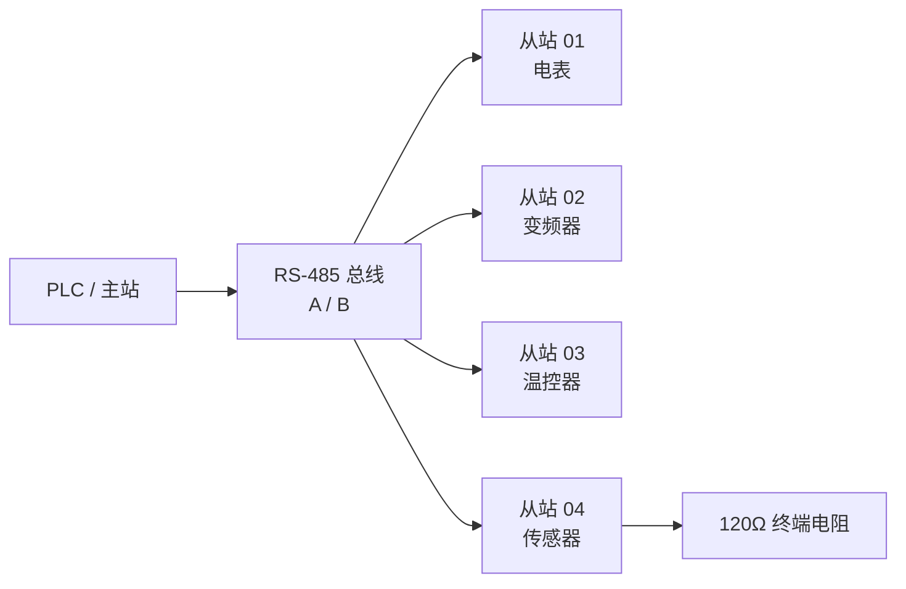
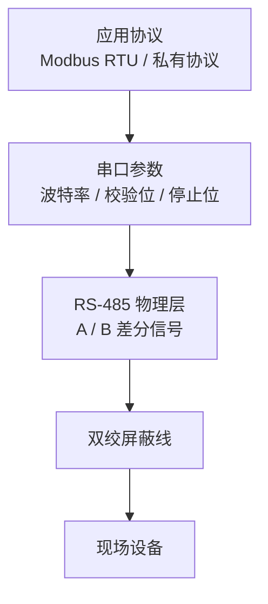
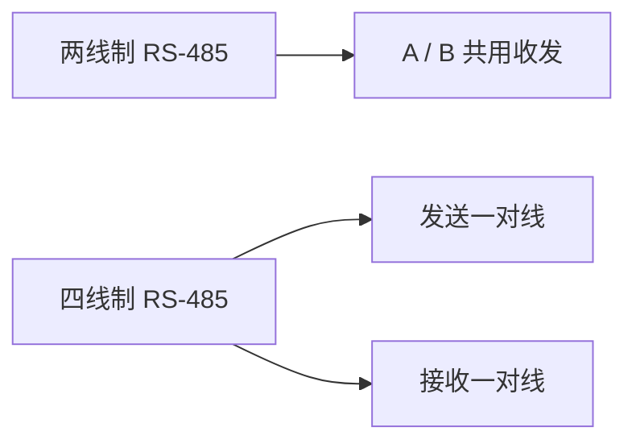
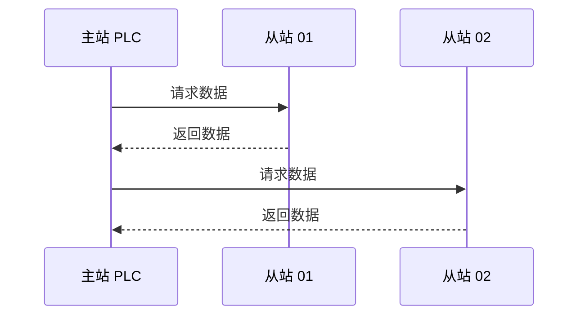
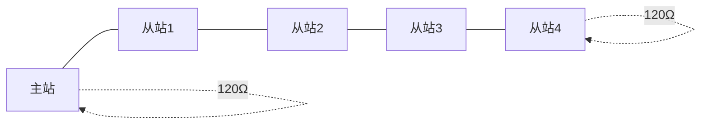
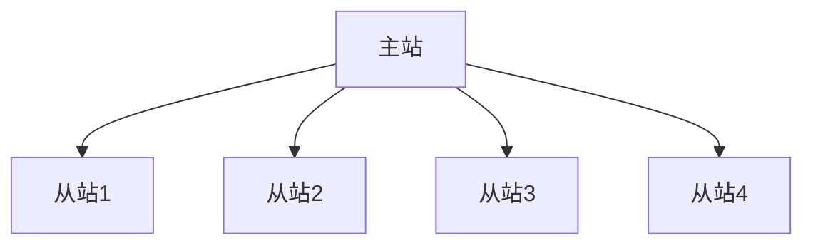
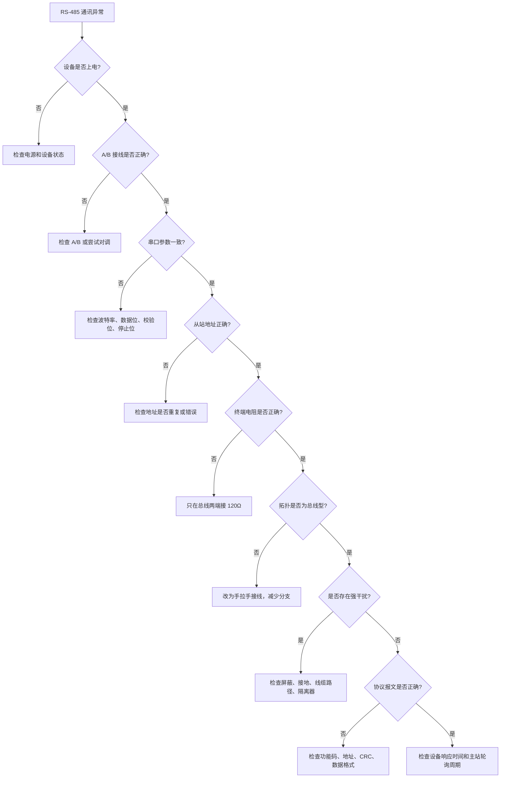
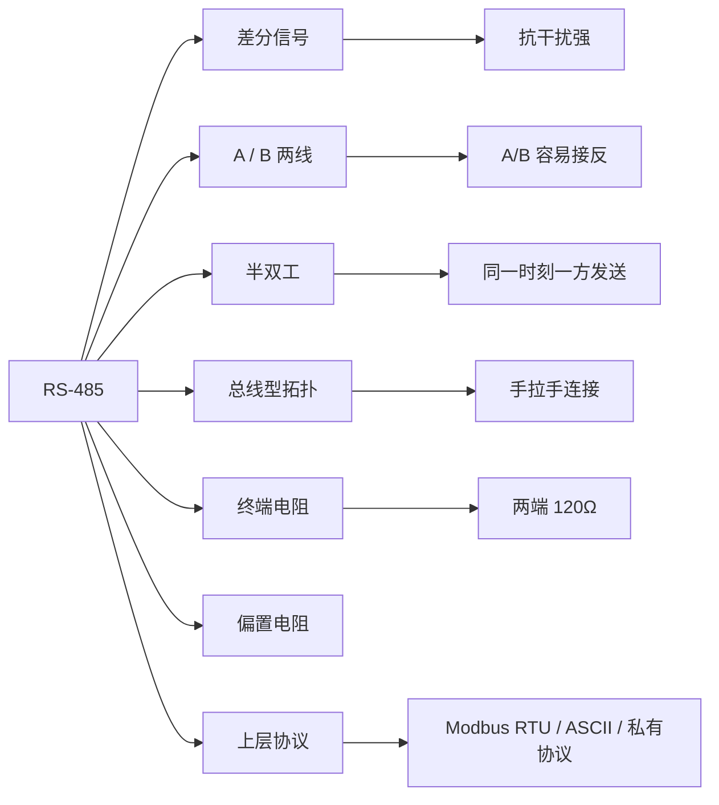

## 01｜核心概念

> [!info] 核心概念
> - **协议定位**：物理层 / 电气层标准
> - **不是协议**：RS-485 本身不规定 Modbus、报文格式、寄存器地址
> - **通信方式**：差分信号通信
> - **常见模式**：两线制半双工
> - **典型协议**：Modbus RTU、Modbus ASCII、自由口协议、厂家私有协议
> - **典型结构**：一主多从、总线型
> - **典型设备**：PLC、变频器、电表、温控器、传感器、称重仪表、远程 I/O

---

## 02｜RS-485 系统结构图



> [!tip] 结构记忆
> **RS-485 是路，Modbus RTU 是车。路只负责传输，车才规定数据怎么跑。**

---

## 03｜RS-485 与通讯协议的关系

| 层级 | 内容 | 说明 |
|---|---|---|
| 物理层 | RS-485 | 规定电气信号、差分传输、接线方式 |
| 数据链路 / 应用层 | Modbus RTU / ASCII / 私有协议 | 规定地址、功能码、数据格式、校验 |
| 设备层 | PLC、仪表、变频器 | 按协议解释数据并执行动作 |



> [!warning] 易错点
> 设备写着“支持 RS-485”，不代表它一定支持 Modbus RTU。  
> 必须继续确认它支持的 **通讯协议**。

---

## 04｜关键参数速查表

| 参数 | 常见值 | 说明 | 易错点 |
|---|---|---|---|
| 接线方式 | A / B 两线 | 差分通信线 | 不同厂家 A/B 标识可能相反 |
| 通讯模式 | 半双工 | 同一时刻只能收或发 | 主站轮询控制节奏 |
| 波特率 | 9600 / 19200 / 38400 / 115200 | 通讯速度 | 主从必须一致 |
| 数据位 | 8 | 常见 8 位 | 与设备手册一致 |
| 校验位 | None / Odd / Even | 无校验 / 奇校验 / 偶校验 | 主从必须一致 |
| 停止位 | 1 / 2 | 串口参数 | 与校验位组合有关 |
| 终端电阻 | 120Ω | 总线两端使用 | 不是每个设备都加 |
| 偏置电阻 | 上拉 / 下拉 | 保持总线空闲稳定 | 没有偏置可能误触发 |
| 拓扑结构 | 总线型 | 手拉手连接 | 不建议星型接线 |
| 通讯距离 | 最远约 1200m | 与速率、线缆、干扰有关 | 速率越高距离越短 |

---

## 05｜RS-485 差分信号原理

RS-485 使用两根线传输一组差分信号，接收端判断的是两根线之间的电压差。

```text
差分电压 = VA - VB
```

| 状态 | 判断方式 | 说明 |
|---|---|---|
| A 高于 B | 一种逻辑状态 | 具体 0 / 1 取决于芯片和设备定义 |
| B 高于 A | 另一种逻辑状态 | 与上面相反 |
| A 与 B 电压接近 | 不稳定区域 | 容易受干扰产生误码 |

> [!info] 工程理解
> RS-485 不是看某一根线对地电压，而是看 **A 与 B 两根线之间的电压差**。

---

## 06｜两线制与四线制

| 类型 | 线缆 | 通讯方式 | 典型应用 |
|---|---|---|---|
| 两线制 RS-485 | A / B | 半双工 | 最常见，Modbus RTU 多用 |
| 四线制 RS-485 | TX+ / TX- / RX+ / RX- | 全双工 | 较少见，特殊设备 |
| RS-422 | 一发多收 | 全双工常见 | 点对多点，不能多发 |



> [!tip] 记忆口诀
> **两线半双工，四线可全双工。现场最常见，两线 A/B 通。**

---

## 07｜半双工通讯逻辑

RS-485 两线制通常是半双工，主站发命令，从站等待被点名后响应。



> [!warning] 易错点
> 半双工通信中，两个设备不能同时发送。  
> 如果多个从站同时发数据，总线会冲突。

---

## 08｜RS-485 接线方式

### 推荐接线：总线型手拉手



> [!check] 接线原则
> - [ ] 使用双绞屏蔽线
> - [ ] A 接 A，B 接 B
> - [ ] 采用手拉手总线连接
> - [ ] 不建议星型接线
> - [ ] 总线两端加终端电阻
> - [ ] 屏蔽层按现场规范接地
> - [ ] 通讯线远离动力线、变频器输出线、伺服动力线

---

### 不推荐接线：星型结构



> [!warning] 易错点
> 星型接线容易产生信号反射，距离长、速率高、设备多时容易通讯不稳定。

---

## 09｜A / B 标识混乱问题

不同厂家对 A/B、D+ / D- 的标识可能不完全一致。

| 常见标识 | 可能含义 |
|---|---|
| A / B | RS-485 差分线 |
| D+ / D- | 数据正 / 数据负 |
| 485+ / 485- | RS-485 正负线 |
| TA / TB | 发送或总线端子 |
| Data+ / Data- | 数据线正负 |

> [!warning] 现场经验
> 如果所有参数都正确但完全无响应，可以尝试对调 A/B。  
> A/B 接反是 RS-485 现场最常见问题之一。

---

## 10｜终端电阻

终端电阻用于减少信号反射，通常接在总线两端的 A/B 之间。

```text
A ───[ 120Ω ]─── B
```

| 位置 | 是否接终端电阻 |
|---|---|
| 总线起点 | 接 |
| 总线中间设备 | 不接 |
| 总线终点 | 接 |

> [!warning] 易错点
> 终端电阻不是越多越好。  
> 通常只在整条总线的最前端和最后端接。

---

## 11｜偏置电阻

偏置电阻用于让总线空闲时保持稳定状态，避免总线悬空导致误码。

```text
VCC
 │
[上拉电阻]
 │
 A
 │
 B
 │
[下拉电阻]
 │
GND
```

| 项目 | 说明 |
|---|---|
| 作用 | 让总线空闲时有确定电平 |
| 常见位置 | 主站侧或总线一处 |
| 典型形式 | A 上拉、B 下拉，或按设备说明配置 |
| 易错点 | 多处偏置可能加重总线负载 |

> [!tip] 工程建议
> 很多 PLC、网关或转换器内部已经带偏置电阻，是否外加要看设备手册。

---

## 12｜屏蔽层与接地

RS-485 现场常用双绞屏蔽线，屏蔽层用于降低外部电磁干扰。

| 项目 | 建议 |
|---|---|
| 屏蔽层 | 使用连续屏蔽 |
| 接地方式 | 按现场规范，常见单端接地 |
| 参考地 | 长距离或干扰大时可连接信号地 |
| 走线 | 远离强电线缆 |
| 变频器附近 | 特别注意屏蔽和接地 |

> [!warning] 易错点
> 只接 A/B 不一定永远稳定。  
> 当设备间地电位差大、干扰强时，可能需要考虑信号地、隔离器或光电隔离。

---

## 13｜通讯距离与波特率

RS-485 通讯距离与波特率、线缆质量、节点数量、干扰环境有关。

| 波特率 | 参考距离 |
|---|---|
| 9600 bps | 可达约 1200m |
| 19200 bps | 可达数百米到 1000m 级 |
| 115200 bps | 距离明显缩短 |
| 1 Mbps | 通常适合较短距离 |
| 10 Mbps | 仅适合很短距离 |

> [!tip] 选择建议
> 距离长、干扰大、设备多时，不要盲目使用高波特率。  
> 现场调试可先用 `9600` 或 `19200` 验证稳定性。

---

## 14｜节点数量

传统 RS-485 常说一条总线最多 32 个节点，但这与设备输入负载有关。

| 类型 | 说明 |
|---|---|
| 1 Unit Load | 传统接收器，常见最多 32 节点 |
| 1/2 Unit Load | 可支持更多节点 |
| 1/4 Unit Load | 可支持更多节点 |
| 1/8 Unit Load | 理论可支持更多设备 |
| 中继器 | 用于扩展节点数和距离 |

> [!info] 工程理解
> “最多 32 台”不是绝对值。  
> 具体能接多少设备，要看设备 RS-485 芯片负载、距离、速率和现场环境。

---

## 15｜RS-485 与 Modbus RTU

RS-485 常被 Modbus RTU 使用，但两者不是同一个概念。

| 对比项 | RS-485 | Modbus RTU |
|---|---|---|
| 类型 | 物理层标准 | 通讯协议 |
| 规定内容 | 电气信号、接线、差分传输 | 地址、功能码、数据区、CRC |
| 是否有寄存器 | 没有 | 有 |
| 是否有功能码 | 没有 | 有 |
| 是否有 CRC | 没有 | 有 |
| 典型作用 | 负责把数据传过去 | 规定数据怎么解释 |

> [!tip] 记忆口诀
> **RS-485 管线，Modbus RTU 管话。线接对只是能说话，协议对才听得懂。**

---

## 16｜典型 Modbus RTU over RS-485 示例

### 请求报文

读取从站 `01` 的保持寄存器 `0000`，读取 1 个寄存器。

```text
01 03 00 00 00 01 84 0A
```

| 字节 | 含义 |
|---|---|
| `01` | 从站地址 |
| `03` | 功能码，读保持寄存器 |
| `00 00` | 起始地址 |
| `00 01` | 读取数量 |
| `84 0A` | CRC 校验 |

> [!info] 工程理解
> RS-485 负责传输这串字节。  
> Modbus RTU 负责定义这串字节的含义。

---

## 17｜RS-485 转换器

常见转换器用于把电脑或 PLC 的接口转换成 RS-485。

| 转换类型 | 用途 |
|---|---|
| USB 转 RS-485 | 电脑调试仪表、变频器 |
| RS-232 转 RS-485 | 老设备串口转换 |
| Ethernet 转 RS-485 | 网口转串口服务器 |
| Modbus TCP 转 RTU 网关 | TCP 与 RTU 协议转换 |
| 隔离型 RS-485 转换器 | 强干扰或地电位差现场 |

> [!warning] 易错点
> 普通串口服务器只是透明传输字节，不一定等于 Modbus TCP 转 RTU 网关。  
> 选型时要确认是 **透明传输** 还是 **协议转换**。

---

## 18｜常见故障现象

| 现象 | 可能原因 | 排查方向 |
|---|---|---|
| 完全无响应 | A/B 接反、地址错、参数错 | 查接线、地址、波特率 |
| 偶尔通讯失败 | 干扰、终端不对、线太长 | 查屏蔽、接地、终端电阻 |
| 多设备时异常 | 地址重复、总线拓扑差 | 查从站地址和接线结构 |
| 单设备正常，多设备异常 | 终端、偏置、负载问题 | 查终端电阻和节点数量 |
| 数据乱码 | 波特率或校验位不一致 | 查串口参数 |
| 读到数据但不对 | 协议地址、字节序、倍率问题 | 查 Modbus 寄存器表 |
| 插上某设备全线异常 | 该设备接线、终端或硬件故障 | 单独断开排查 |
| 距离短正常，距离长异常 | 线缆、终端、波特率问题 | 降低波特率、加终端 |
| 变频器运行时掉线 | 强干扰 | 查屏蔽、接地、隔离 |

---

## 19｜RS-485 排查流程



---

> [!check] 排查清单
> - [ ] 设备是否上电
> - [ ] A/B 是否接反
> - [ ] 是否使用双绞屏蔽线
> - [ ] 是否采用手拉手总线连接
> - [ ] 是否存在星型接线或长分支
> - [ ] 波特率是否一致
> - [ ] 数据位是否一致
> - [ ] 校验位是否一致
> - [ ] 停止位是否一致
> - [ ] 从站地址是否正确
> - [ ] 从站地址是否重复
> - [ ] 总线两端是否有 120Ω 终端电阻
> - [ ] 中间设备是否误加终端电阻
> - [ ] 是否需要偏置电阻
> - [ ] 屏蔽层是否处理正确
> - [ ] 通讯线是否靠近强电或变频器线缆
> - [ ] 主站轮询周期是否太快
> - [ ] 协议报文是否正确

---

## 20｜RS-485 与 RS-232 对比

| 对比项 | RS-485 | RS-232 |
|---|---|---|
| 通讯方式 | 差分信号 | 单端信号 |
| 典型距离 | 长，可达百米到千米级 | 短，通常十几米以内 |
| 抗干扰能力 | 强 | 较弱 |
| 节点数量 | 支持多节点 | 点对点为主 |
| 常见线数 | A / B 两线 | TX / RX / GND |
| 工业应用 | 很常见 | 老设备、调试口常见 |
| 典型协议 | Modbus RTU | 自由口、仪表协议 |

> [!tip] 记忆口诀
> **RS-232 适合近距离点对点，RS-485 适合远距离多设备。**

---

## 21｜RS-485 与 CAN 对比

| 对比项 | RS-485 | CAN |
|---|---|---|
| 类型 | 物理层标准 | 总线协议 + 物理层 |
| 通讯机制 | 由上层协议决定 | 自带仲裁和错误处理 |
| 多主能力 | 取决于协议 | 支持多主仲裁 |
| 常见协议 | Modbus RTU、私有协议 | CANopen、J1939、DeviceNet |
| 数据帧 | 上层协议定义 | CAN 帧定义明确 |
| 实时性 | 取决于协议和轮询 | 较好 |
| 应用场景 | 仪表、变频器、传感器 | 汽车、伺服、移动机械 |

> [!info] 工程理解
> RS-485 更像“电气传输通道”，CAN 更像“自带交通规则的总线系统”。

---

## 22｜RS-485 与 RS-422 对比

| 对比项 | RS-485 | RS-422 |
|---|---|---|
| 通讯方式 | 半双工或全双工 | 全双工常见 |
| 节点能力 | 多发送器、多接收器 | 一发送器、多接收器 |
| 典型结构 | 多点总线 | 点对点或一主多收 |
| 常见应用 | 工业多设备通讯 | 编码器、老式设备、长距离串口 |
| 抗干扰 | 强 | 强 |
| 是否常用于 Modbus | 很常见 | 较少 |

---

## 23｜工程应用建议

> [!tip] 初次调试建议
> - 先只接一个从站
> - 波特率先用 `9600`
> - 数据位常用 `8`
> - 校验位按手册设置
> - 从站地址从 `1` 开始测试
> - A/B 不通时尝试对调
> - 先短线测试，再上现场长线
> - 先用 USB-RS485 转换器 + 串口助手验证设备
> - Modbus 设备先读 `03`，再尝试写 `06`

---

> [!warning] 现场注意事项
> - RS-485 不是协议，必须确认上层协议
> - A/B 标识不同厂家可能相反
> - 不建议星型接线
> - 终端电阻只加在总线两端
> - 距离越长，波特率越应降低
> - 设备越多，越要注意终端、偏置和线缆质量
> - 强干扰环境优先使用隔离型 RS-485
> - 变频器附近通讯线必须注意屏蔽和走线
> - 多个从站地址不能重复

---

## 24｜RS-485 快速记忆图



---

## 25｜记忆口诀

> [!tip] RS-485 口诀
> **A B 两根线，差分抗干扰。**
>
> **一主问，多从答，半双工别抢话。**
>
> **总线手拉手，两端一百二。**
>
> **地址别重复，波特率要同。**
>
> **不通先换 A/B，不稳先查终端和屏蔽。**
>
> **RS-485 只是路，Modbus 才是话。**

---

## 26｜最终速记卡

- RS-485 是工业现场常用的差分串行通信物理层标准。
- RS-485 本身不是协议，不规定功能码、寄存器、CRC。
- Modbus RTU、Modbus ASCII、厂家私有协议都可以跑在 RS-485 上。
- 最常见接线是两线制：`A / B`，通常为半双工。
- RS-485 推荐总线型手拉手接线，不建议星型接线。
- 总线两端通常加 `120Ω` 终端电阻，中间设备不要乱加。
- A/B 标识不同厂家可能相反，不通时可尝试对调。
- 波特率、数据位、校验位、停止位必须主从一致。
- 距离越长、干扰越大，越应该降低波特率。
- 多设备通讯时，从站地址不能重复。
- 通讯不稳定优先查：接线、终端电阻、偏置电阻、屏蔽接地、干扰源。
- 排查顺序：电源 → A/B → 串口参数 → 地址 → 终端 → 拓扑 → 屏蔽 → 协议报文。