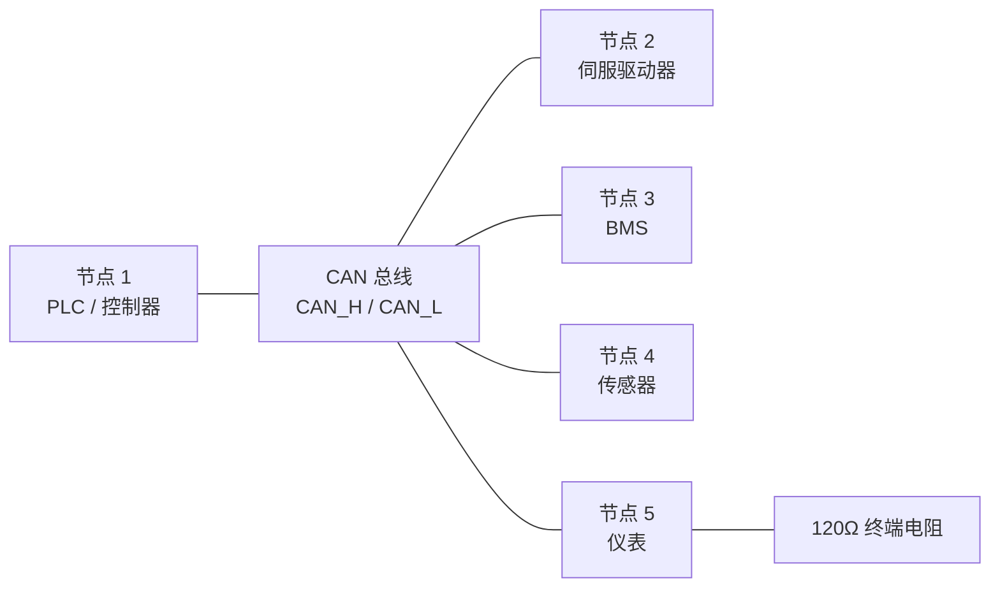
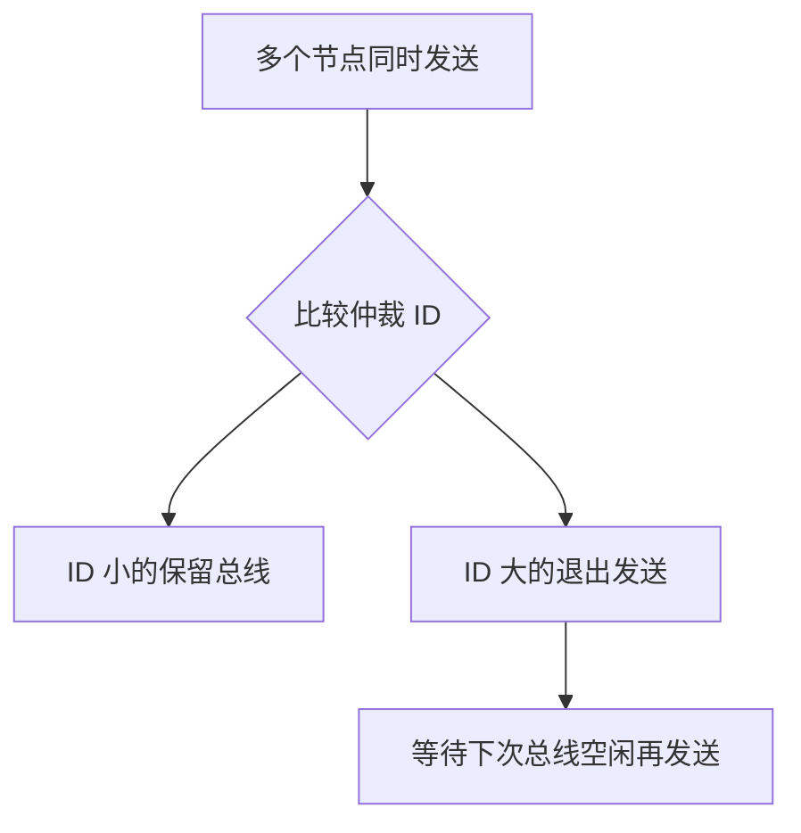
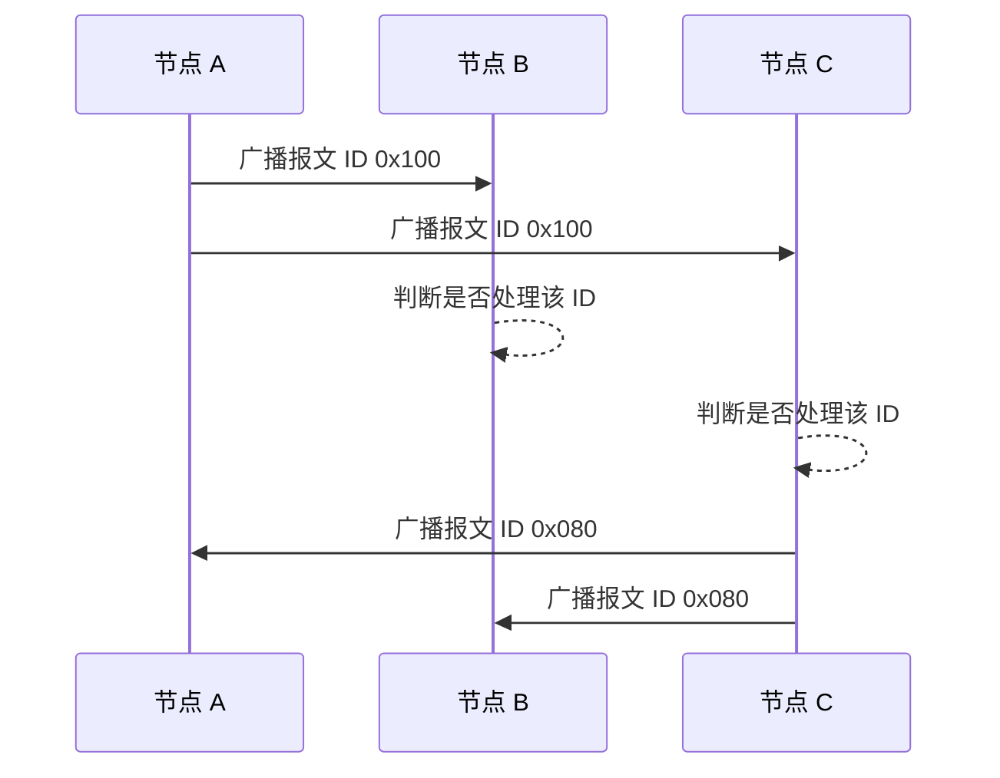
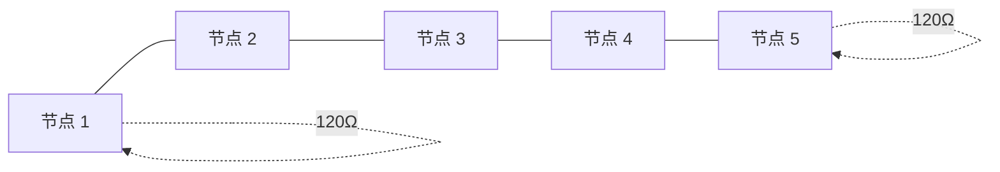
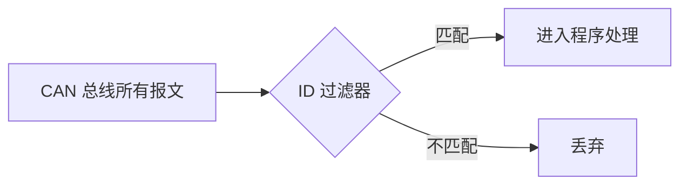
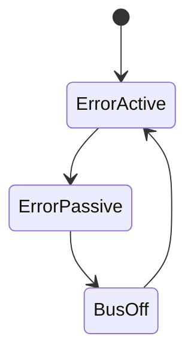
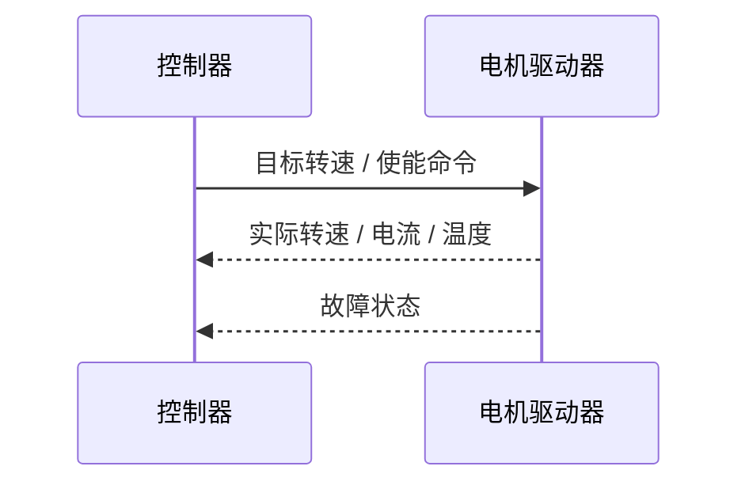
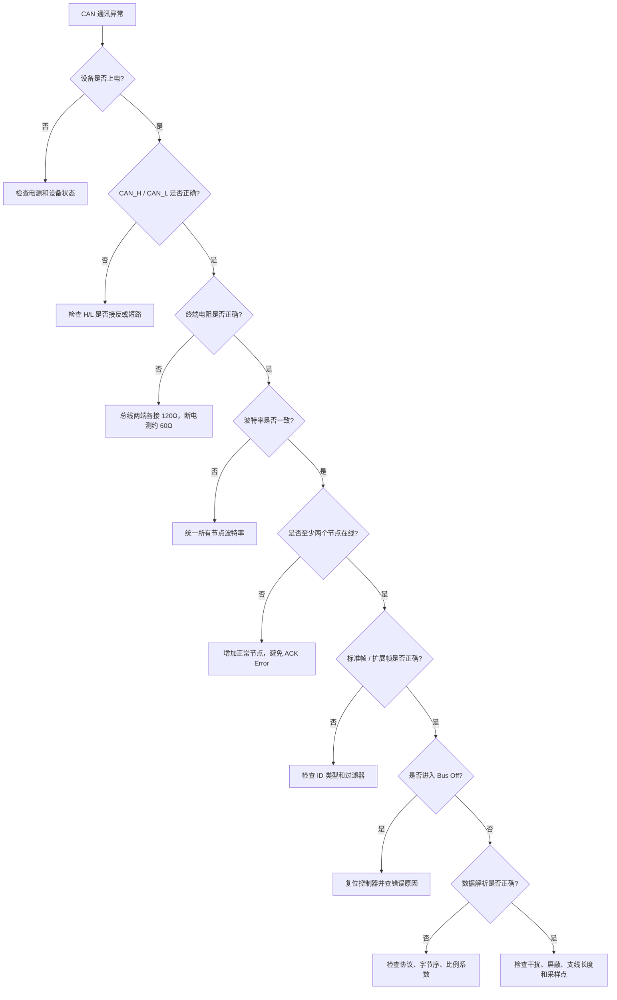
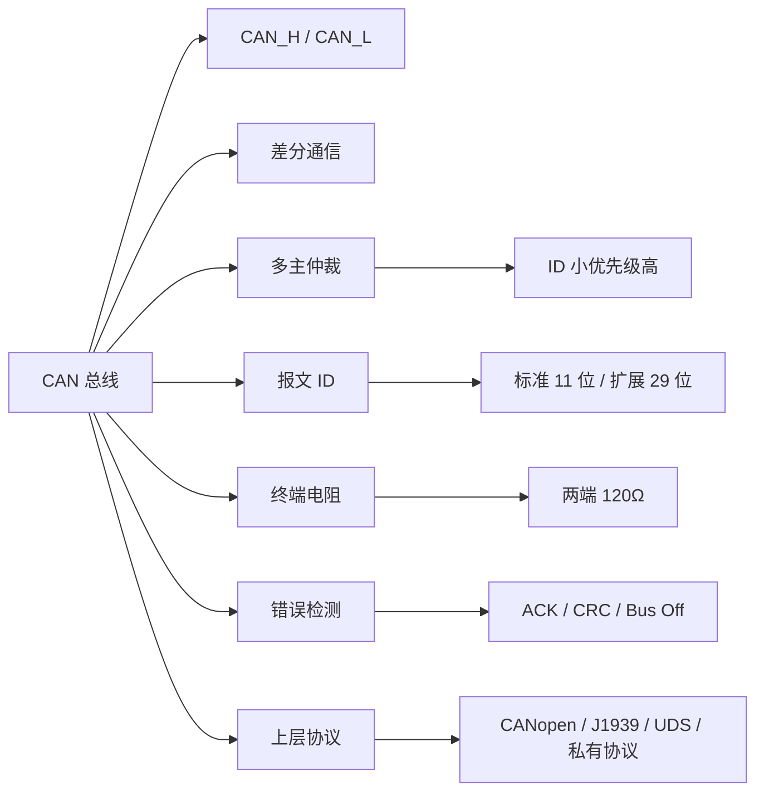

## 01｜核心概念

> [!info] 核心概念
> - **全称**：Controller Area Network
> - **中文名称**：控制器局域网络
> - **协议定位**：现场总线协议
> - **通讯方式**：多主通信、广播式发送
> - **物理信号**：CAN_H / CAN_L 差分信号
> - **典型线缆**：双绞线，建议屏蔽
> - **核心特点**：多主仲裁、优先级机制、强错误检测、抗干扰能力强
> - **典型应用**：汽车 ECU、BMS、伺服驱动、电机控制、传感器、仪表、移动机械

---

## 02｜CAN 总线系统结构图



> [!tip] 结构记忆
> **CAN 是一条总线，大家都能发言；谁的 ID 优先级高，谁先说。**

---

## 03｜CAN 与 CANopen 的关系

| 对比项 | CAN | CANopen |
|---|---|---|
| 类型 | 底层总线协议 | 基于 CAN 的高层应用协议 |
| 规定内容 | 帧格式、仲裁、错误检测、物理传输 | 对象字典、PDO、SDO、NMT、Heartbeat |
| 是否有对象字典 | 没有 | 有 |
| 是否有节点管理 | 基础 CAN 没有统一规定 | 有 NMT |
| 是否有 PDO / SDO | 没有 | 有 |
| 典型用途 | 自定义报文、汽车电子、设备内部通信 | 工业设备互联、伺服、编码器、I/O |

> [!warning] 易错点
> 设备写着“CAN 接口”，不代表它支持 CANopen。  
> 必须继续确认它使用的是 **CANopen、J1939、DeviceNet、UDS，还是厂家自定义协议**。

---

## 04｜关键参数速查表

| 参数 | 常见值 | 说明 | 易错点 |
|---|---|---|---|
| 信号线 | CAN_H / CAN_L | 差分通信线 | H / L 接反无法通讯 |
| 波特率 | 125k / 250k / 500k / 1M | 全网必须一致 | 波特率不同会无响应 |
| 终端电阻 | 120Ω × 2 | 总线两端各一个 | 中间节点不要加 |
| 标准帧 ID | 11 bit | CAN 2.0A | ID 范围 `0x000–0x7FF` |
| 扩展帧 ID | 29 bit | CAN 2.0B | ID 范围更大 |
| 数据长度 | 0–8 Byte | Classical CAN | CAN FD 可到 64 Byte |
| 仲裁机制 | ID 越小优先级越高 | 非破坏性仲裁 | 不是按节点地址抢占 |
| 通讯方式 | 广播 | 所有节点都能收到 | 是否处理由节点软件决定 |
| 拓扑结构 | 总线型 | 手拉手连接 | 不推荐星型 |
| 空闲电阻测量 | 约 60Ω | 两个 120Ω 并联 | 断电测量更安全 |

---

## 05｜CAN 差分信号原理

CAN 使用两根线传输差分信号：

```text
差分电压 = CAN_H - CAN_L
```

| 总线状态 | CAN_H | CAN_L | 差分电压 | 说明 |
|---|---|---|---|---|
| 隐性 Recessive | 约 2.5V | 约 2.5V | 接近 0V | 逻辑空闲状态 |
| 显性 Dominant | 约 3.5V | 约 1.5V | 约 2V | 主动驱动状态 |

> [!info] 工程理解
> CAN 不是看某一根线对地电压，而是看 **CAN_H 与 CAN_L 的电压差**。

---

## 06｜显性与隐性

CAN 总线有两个核心电平概念：

| 状态 | 英文 | 特点 |
|---|---|---|
| 显性 | Dominant | 能覆盖隐性，表示强驱动状态 |
| 隐性 | Recessive | 总线空闲或被显性覆盖 |

```text
显性 0  >  隐性 1
```

> [!tip] 记忆口诀
> **显性能压住隐性，0 能压住 1。**

---

## 07｜CAN 多主仲裁机制

CAN 支持多个节点同时尝试发送，但不会像普通总线那样直接冲突。

仲裁规则：

```text
ID 数值越小，优先级越高
```

### 示例

| 节点 | 报文 ID | 优先级 |
|---|---|---|
| 节点 A | `0x100` | 高 |
| 节点 B | `0x200` | 低 |
| 节点 C | `0x080` | 最高 |



> [!info] 工程理解
> CAN 仲裁是 **非破坏性仲裁**。  
> 低优先级节点退出，高优先级报文继续发送，不会破坏当前报文。

---

## 08｜CAN 报文 ID 不是设备地址

CAN 报文中的 ID 通常表示 **消息类型或优先级**，不一定表示目标节点地址。

| 理解方式 | 是否正确 | 说明 |
|---|---|---|
| ID 是报文优先级 | 正确 | ID 越小优先级越高 |
| ID 是消息编号 | 常见 | 不同 ID 表示不同数据 |
| ID 是目标设备地址 | 不一定 | 基础 CAN 没有统一目标地址 |
| ID 是源设备地址 | 不一定 | 取决于上层协议设计 |

> [!warning] 易错点
> CAN 是广播通信，所有节点都能收到报文。  
> 节点是否处理某个 ID，由软件过滤规则或上层协议决定。

---

## 09｜CAN 标准帧结构

Classical CAN 标准帧使用 11 位 ID。

```text
SOF + Arbitration ID + Control + Data + CRC + ACK + EOF
```

| 字段 | 说明 |
|---|---|
| SOF | 帧起始 |
| Arbitration ID | 仲裁 ID，决定优先级 |
| Control | 控制字段，包含 DLC |
| Data | 数据区，0–8 Byte |
| CRC | 循环冗余校验 |
| ACK | 应答位 |
| EOF | 帧结束 |

---

## 10｜标准帧与扩展帧

| 对比项 | 标准帧 | 扩展帧 |
|---|---|---|
| 名称 | CAN 2.0A | CAN 2.0B |
| ID 长度 | 11 bit | 29 bit |
| ID 范围 | `0x000–0x7FF` | `0x00000000–0x1FFFFFFF` |
| 报文开销 | 较小 | 较大 |
| 使用场景 | 工业控制、CANopen 常见 | J1939、车辆网络常见 |
| 配置重点 | 标准 ID | 扩展 ID |

> [!tip] 记忆口诀
> **标准 11 位，扩展 29 位。**

---

## 11｜CAN 数据长度 DLC

Classical CAN 单帧数据区最多 8 字节。

| DLC | 数据长度 |
|---|---|
| 0 | 0 Byte |
| 1 | 1 Byte |
| 2 | 2 Byte |
| 4 | 4 Byte |
| 8 | 8 Byte |

> [!warning] 易错点
> CAN 报文短小，单帧最多只有 `8 Byte`。  
> 如果要传输大量数据，需要上层协议进行分包。

---

## 12｜CAN FD 简单区分

CAN FD 是 CAN 的增强版本，FD 表示 Flexible Data-rate。

| 对比项 | Classical CAN | CAN FD |
|---|---|---|
| 数据长度 | 最多 8 Byte | 最多 64 Byte |
| 数据段速率 | 与仲裁段相同 | 数据段可更高速 |
| 兼容性 | 传统 CAN | 需要设备支持 CAN FD |
| 应用场景 | 普通控制、传感器 | 更大数据量、更高带宽 |
| 工程注意 | 配普通 CAN 参数 | 需配置仲裁速率和数据速率 |

> [!warning] 易错点
> CAN FD 设备不一定能和普通 CAN 设备直接混用。  
> 是否兼容要看设备和网络配置。

---

## 13｜CAN 通讯流程



> [!info] 通讯规则
> CAN 不是点对点点名通信，而是 **报文广播 + ID 过滤**。

---

## 14｜CAN 接线规范

### 推荐总线型接线



> [!check] 接线注意事项
> - [ ] CAN_H 接 CAN_H
> - [ ] CAN_L 接 CAN_L
> - [ ] 使用双绞线，强干扰现场使用屏蔽双绞线
> - [ ] 总线两端各接一个 `120Ω` 终端电阻
> - [ ] 中间节点不要加终端电阻
> - [ ] 不建议星型接线
> - [ ] 支线尽量短
> - [ ] 建议连接 CAN_GND 或参考地
> - [ ] 通讯线远离动力线、变频器输出线、伺服动力线

---

## 15｜终端电阻

CAN 总线两端需要终端电阻，一般为 `120Ω`。

```text
CAN_H ───[ 120Ω ]─── CAN_L
```

| 位置 | 是否接终端 |
|---|---|
| 总线起点 | 接 |
| 总线中间节点 | 不接 |
| 总线终点 | 接 |

### 断电测量判断

```text
CAN_H 与 CAN_L 之间电阻 ≈ 60Ω
```

> [!tip] 原理
> 两个 `120Ω` 终端电阻并联后约等于 `60Ω`。

> [!warning] 易错点
> 终端电阻不是每个节点都接。  
> 终端过多会导致总线负载过重，终端缺失会导致反射和通讯不稳定。

---

## 16｜CAN_GND 与屏蔽

| 项目 | 建议 |
|---|---|
| CAN_H / CAN_L | 必须连接 |
| CAN_GND | 建议提供参考地，尤其是长距离和多电源系统 |
| 屏蔽层 | 强干扰现场建议使用 |
| 接地方式 | 按现场规范处理，避免形成严重地环流 |
| 隔离 CAN | 地电位差大时优先使用隔离型 CAN 接口 |

> [!warning] 易错点
> 只接 CAN_H / CAN_L 在短距离实验中可能正常。  
> 现场长距离、多电源、强干扰环境下，参考地和隔离非常重要。

---

## 17｜波特率与距离

CAN 通讯距离与波特率、线缆质量、支线长度、节点数量有关。

| 波特率 | 参考距离 |
|---|---|
| 1 Mbps | 约 25–40 m |
| 500 kbps | 约 100 m |
| 250 kbps | 约 250 m |
| 125 kbps | 约 500 m |
| 50 kbps | 约 1000 m |
| 20 kbps | 可达更长距离 |

> [!tip] 选择建议
> 距离越长，波特率越低。  
> 现场干扰大、节点多、支线长时，不要盲目使用 `1 Mbps`。

---

## 18｜采样点与位时序

CAN 波特率不仅是一个数值，还包含位时序参数。

| 参数 | 说明 |
|---|---|
| Bit Rate | 波特率 |
| Sample Point | 采样点位置 |
| SJW | 同步跳转宽度 |
| Prop Segment | 传播时间段 |
| Phase Segment | 相位补偿段 |
| Prescaler | 分频系数 |

> [!info] 工程理解
> 普通调试通常只设置波特率。  
> 高速、长距离、不同控制器互联时，采样点和位时序不一致也可能导致通讯异常。

---

## 19｜CAN 过滤器

CAN 控制器通常支持 ID 过滤，只接收需要的报文。



| 过滤方式 | 说明 |
|---|---|
| 精确过滤 | 只接收指定 ID |
| 掩码过滤 | 接收一组 ID |
| 接收全部 | 调试时常用 |
| 硬件过滤 | 减轻 CPU 负担 |

> [!tip] 工程建议
> 调试阶段可以先接收全部报文，确认 ID 后再设置过滤器。

---

## 20｜CAN 错误检测机制

CAN 具有较强的错误检测和故障隔离能力。

| 错误类型 | 说明 |
|---|---|
| Bit Error | 发送位与总线实际电平不一致 |
| Stuff Error | 位填充错误 |
| CRC Error | CRC 校验错误 |
| Form Error | 固定格式字段错误 |
| ACK Error | 没有其他节点应答 |

> [!warning] 易错点
> 如果只有一个节点在总线上发送报文，可能会出现 ACK Error。  
> 因为 CAN 报文需要至少有其他正常节点应答。

---

## 21｜错误计数与节点状态

CAN 控制器会根据错误情况调整节点状态。

| 状态 | 含义 |
|---|---|
| Error Active | 正常参与通信 |
| Error Passive | 错误较多，通信能力受限 |
| Bus Off | 严重错误，节点退出总线 |



> [!info] 工程理解
> Bus Off 表示节点错误太多，被迫退出总线。  
> 常见原因是波特率错误、H/L 接反、终端不对、干扰严重。

---

## 22｜ACK 应答机制

CAN 报文发送后，其他正确接收的节点会在 ACK 位进行应答。

| 情况 | 结果 |
|---|---|
| 至少一个节点正确接收 | 发送方收到 ACK |
| 没有其他节点应答 | 发送方报 ACK Error |
| 只有一个节点接总线 | 可能持续 ACK Error |
| 其他节点波特率不同 | 无法正确 ACK |

> [!tip] 调试建议
> 测试 CAN 通讯时，至少要有两个正常节点在同一波特率下工作。

---

## 23｜常见上层协议

| 协议 | 典型应用 | 特点 |
|---|---|---|
| CANopen | 工业自动化、伺服、编码器 | 对象字典、PDO、SDO、NMT |
| J1939 | 商用车、工程机械、柴油机 | 29 位扩展帧、PGN、SA |
| DeviceNet | 工业现场设备 | 基于 CAN 的工业网络 |
| UDS | 汽车诊断 | 诊断服务、刷写、故障码 |
| OBD-II | 汽车排放诊断 | 车载诊断接口 |
| 厂家私有协议 | BMS、电机控制、传感器 | 由厂家定义 ID 和数据含义 |

> [!warning] 易错点
> CAN 报文 ID 和数据含义没有统一固定标准。  
> 必须查看对应上层协议或厂家协议文档。

---

## 24｜实战报文示例：基础 CAN

### 示例目标

节点发送电机状态报文：

```text
ID：0x180
DLC：8
Data：01 2C 00 64 00 00 00 00
```

### 字段解释

| 字段 | 含义 |
|---|---|
| `0x180` | 报文 ID |
| `8` | 数据长度 8 字节 |
| `01` | 电机状态 |
| `2C 00` | 转速数据 |
| `64 00` | 电流数据 |
| `00 00 00` | 预留 |

> [!warning] 注意
> 上面数据含义是假设示例。  
> 真实项目中，每个字节含义必须以设备协议手册为准。

---

## 25｜实战示例：BMS CAN 数据

### 常见 BMS 报文字段

| 数据 | 说明 |
|---|---|
| 总电压 | 电池包总电压 |
| 总电流 | 充放电电流 |
| SOC | 剩余电量百分比 |
| SOH | 电池健康度 |
| 单体最高电压 | 最高单体电芯电压 |
| 单体最低电压 | 最低单体电芯电压 |
| 最高温度 | 电池最高温度 |
| 故障状态 | 过压、欠压、过流、过温 |

### 示例报文

```text
ID：0x351
Data：0B B8 00 C8 64 5A 00 00
```

| 字节 | 示例含义 |
|---|---|
| `0B B8` | 总电压 300.0V，比例 0.1V |
| `00 C8` | 电流 20.0A，比例 0.1A |
| `64` | SOC = 100% |
| `5A` | SOH = 90% |
| `00 00` | 状态预留 |

> [!info] 工程理解
> BMS CAN 多数使用厂家协议，ID、比例系数、字节序必须查协议表。

---

## 26｜实战示例：电机控制 CAN

| 控制方向 | 典型内容 |
|---|---|
| 控制器 → 电机驱动器 | 使能、目标转速、目标转矩 |
| 电机驱动器 → 控制器 | 实际转速、实际电流、温度、故障码 |



> [!tip] 工程建议
> 电机类 CAN 调试重点看：使能条件、心跳报文、控制周期、故障码、急停状态。

---

## 27｜CAN 常见故障现象

| 现象 | 可能原因 | 排查方向 |
|---|---|---|
| 完全无报文 | 电源、接线、波特率错误 | 查供电、H/L、波特率 |
| 只有发送无接收 | ID 过滤设置错误 | 临时关闭过滤器 |
| ACK Error | 只有一个节点、对方波特率错 | 增加正常节点，查波特率 |
| Bus Off | 严重错误累计 | 查 H/L、终端、波特率、干扰 |
| 通讯偶发中断 | 干扰、终端不对、支线过长 | 查屏蔽、终端、拓扑 |
| 数据解析错误 | 字节序或比例系数错误 | 查协议文档 |
| 某节点接入后全网异常 | 节点故障或终端错误 | 单独断开排查 |
| 距离短正常，距离长异常 | 波特率太高或线缆差 | 降低波特率、换线 |
| CAN_H / CAN_L 电压异常 | 短路、接反、终端过多 | 万用表和示波器检查 |
| 扩展帧收不到 | 标准帧 / 扩展帧配置错 | 检查 IDE 设置 |

---

## 28｜CAN 排查流程



---

> [!check] 排查清单
> - [ ] 设备是否上电
> - [ ] CAN_H / CAN_L 是否接反
> - [ ] 是否使用双绞线
> - [ ] 是否有屏蔽和接地
> - [ ] 总线两端是否各有 `120Ω`
> - [ ] 断电测 CAN_H 与 CAN_L 是否约 `60Ω`
> - [ ] 中间节点是否误加终端
> - [ ] 波特率是否一致
> - [ ] 位时序 / 采样点是否兼容
> - [ ] 是否至少两个节点在线
> - [ ] 标准帧 / 扩展帧是否配置正确
> - [ ] ID 过滤器是否挡掉报文
> - [ ] 是否有 ACK Error
> - [ ] 是否 Bus Off
> - [ ] 报文 ID 是否正确
> - [ ] 数据字节序和比例系数是否正确
> - [ ] 支线是否过长
> - [ ] 线缆是否靠近强干扰源

---

## 29｜CAN 与 RS-485 对比

| 对比项 | CAN | RS-485 |
|---|---|---|
| 类型 | 总线协议 + 物理层 | 物理层标准 |
| 通讯机制 | 多主仲裁 | 由上层协议决定 |
| 错误处理 | 自带错误检测和 Bus Off | 依赖上层协议 |
| 数据帧 | 标准化 CAN 帧 | 不规定帧格式 |
| 多主能力 | 支持 | 取决于协议 |
| 常见协议 | CANopen、J1939、UDS | Modbus RTU、私有协议 |
| 数据长度 | Classical CAN 8 Byte | 上层协议决定 |
| 典型应用 | 汽车、BMS、伺服、移动机械 | 仪表、变频器、传感器 |
| 学习重点 | ID、仲裁、终端、错误状态 | A/B、串口参数、终端、协议 |

> [!tip] 记忆口诀
> **RS-485 更像电气通道，CAN 自带总线规则。**

---

## 30｜CAN 与 LIN 对比

| 对比项 | CAN | LIN |
|---|---|---|
| 通讯方式 | 多主仲裁 | 主从轮询 |
| 速率 | 较高 | 较低 |
| 成本 | 较高 | 较低 |
| 可靠性 | 更强 | 一般 |
| 线缆 | CAN_H / CAN_L 双线 | 单线 |
| 典型应用 | 动力、底盘、BMS、工业控制 | 车窗、座椅、空调小节点 |

> [!info] 工程理解
> CAN 用于更重要、更高速、更可靠的通信；LIN 多用于低成本简单控制。

---

## 31｜CAN 与以太网对比

| 对比项 | CAN | 工业以太网 |
|---|---|---|
| 物理介质 | 双线差分总线 | 网线 / 光纤 |
| 速率 | Classical CAN 最高常见 1Mbps | 常见 100Mbps / 1Gbps |
| 单帧数据 | 8 Byte | 以太网帧更大 |
| 实时性 | 小数据实时性好 | 取决于协议 |
| 网络规模 | 中小型总线 | 大规模网络更适合 |
| 抗干扰 | 强 | 取决于线缆和设备 |
| 典型应用 | 汽车、驱动器、传感器 | PLC、远程 I/O、上位机 |

---

## 32｜工程应用建议

> [!tip] 初次调试建议
> - 先只接两个节点
> - 波特率先用设备默认值
> - 断电测 CAN_H / CAN_L 电阻是否约 `60Ω`
> - 使用 CAN 分析仪先接收所有报文
> - 先确认是否有 ACK，再看数据含义
> - 标准帧和扩展帧要分清
> - 调试时先关闭严格过滤器
> - 记录 ID、周期、DLC、数据变化规律
> - 数据解析前先确认字节序和比例系数

---

> [!warning] 现场注意事项
> - CAN_H / CAN_L 接反会导致通讯失败
> - 总线两端必须有终端电阻
> - 终端电阻过多或缺失都会导致不稳定
> - 只有一个节点发送时可能 ACK Error
> - 波特率和位时序必须一致
> - 标准帧和扩展帧不能混淆
> - 支线过长会导致反射
> - 强干扰现场建议使用隔离 CAN 和屏蔽线
> - 报文 ID 含义必须查协议，不能凭空猜

---

## 33｜常用调试工具

| 工具 | 作用 |
|---|---|
| CAN 分析仪 | 收发 CAN 报文 |
| USB-CAN | 电脑调试 CAN 网络 |
| 示波器 | 查看 CAN_H / CAN_L 波形 |
| 万用表 | 测终端电阻、电源、短路 |
| 协议解析软件 | 解析 DBC、J1939、CANopen |
| DBC 文件 | 描述 CAN 报文和信号 |
| CANopen 主站工具 | 调试 CANopen 设备 |
| J1939 分析工具 | 调试工程机械 / 商用车网络 |

> [!tip] 调试顺序
> **先测电阻，再看波形，再抓报文，再按协议解析。**

---

## 34｜DBC 文件简单理解

DBC 文件常用于汽车和 BMS 项目，用来描述 CAN 报文含义。

| 内容 | 说明 |
|---|---|
| Message ID | 报文 ID |
| Signal | 信号名称 |
| Start Bit | 起始位 |
| Length | 信号长度 |
| Byte Order | 字节序 |
| Factor | 比例系数 |
| Offset | 偏移量 |
| Unit | 单位 |

> [!info] 工程理解
> DBC 就像 CAN 报文的“翻译字典”。  
> 没有 DBC 或协议表，只能看到原始十六进制数据，无法准确知道含义。

---

## 35｜CAN 快速记忆图



---

## 36｜记忆口诀

> [!tip] CAN 口诀
> **H L 两根线，差分抗干扰。**
>
> **两端一百二，断电测六十。**
>
> **ID 越小，优先级越高。**
>
> **显性能压隐性，0 能压住 1。**
>
> **标准十一位，扩展二十九。**
>
> **只有一个节点，容易 ACK 错。**
>
> **看懂 CAN 数据，必须要协议表。**

---

## 37｜最终速记卡

- CAN 是 Controller Area Network，常用于汽车、BMS、电机控制、伺服、传感器和工业设备。
- CAN 使用 `CAN_H / CAN_L` 差分信号，抗干扰能力强。
- CAN 是广播通信，所有节点都能收到报文，是否处理由 ID 过滤和协议决定。
- CAN 报文 ID 通常不是设备地址，而是消息编号和优先级。
- ID 数值越小，仲裁优先级越高。
- Classical CAN 单帧数据最多 `8 Byte`，CAN FD 最多可到 `64 Byte`。
- 标准帧 ID 是 `11 bit`，扩展帧 ID 是 `29 bit`。
- 总线两端各接一个 `120Ω` 终端电阻，断电测 CAN_H 与 CAN_L 通常约 `60Ω`。
- CAN 有错误检测、ACK、错误计数、Bus Off 等机制。
- 只有一个节点在总线上发送时，可能因为没有其他节点 ACK 而报错。
- CANopen、J1939、UDS、DeviceNet 都是基于 CAN 的上层协议。
- 排查顺序：电源 → H/L → 终端电阻 → 波特率 → 标准/扩展帧 → 过滤器 → ACK → Bus Off → 协议解析。