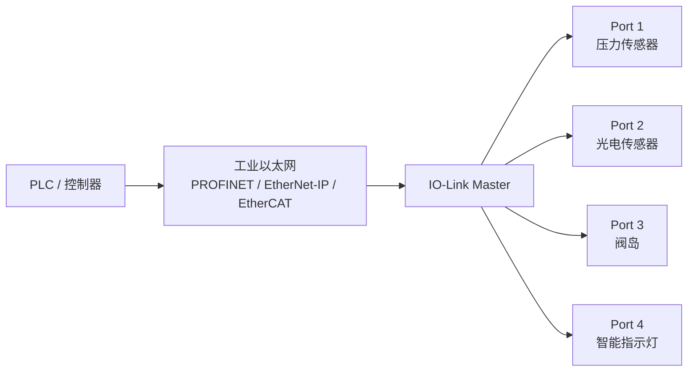
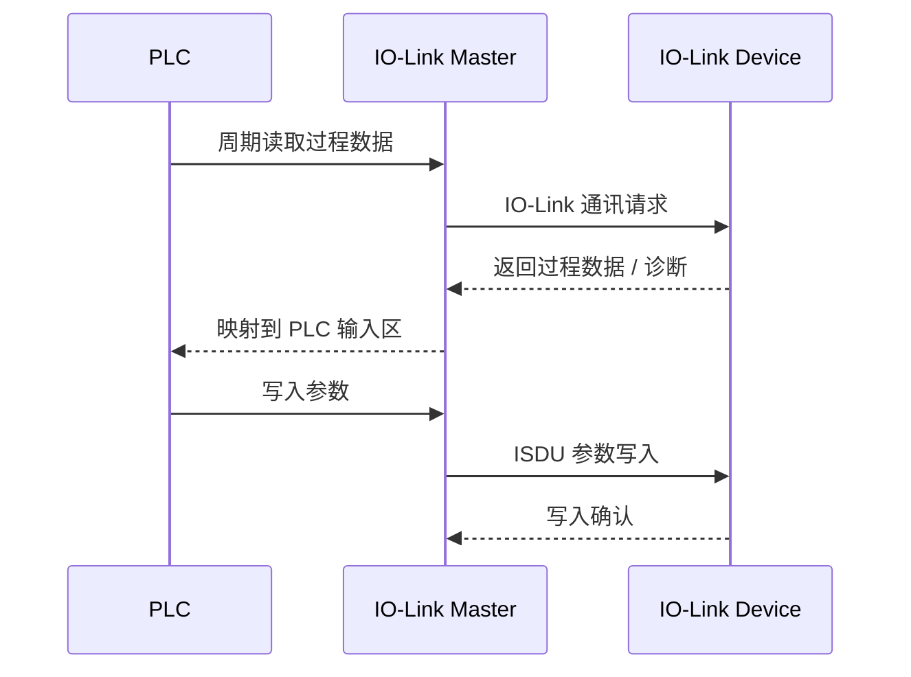
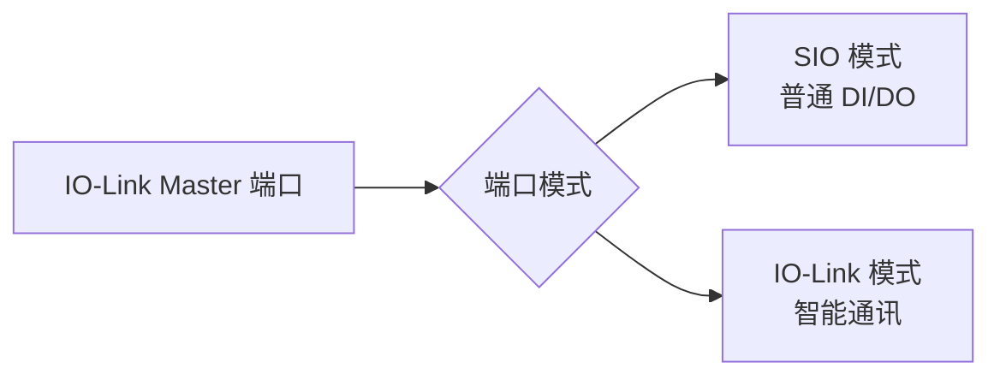
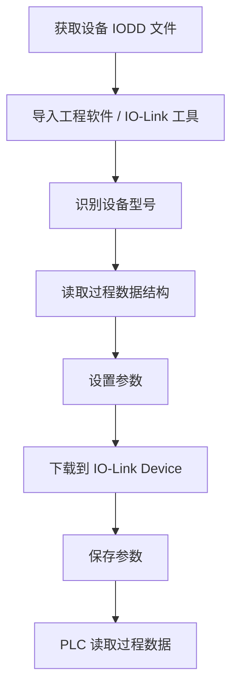
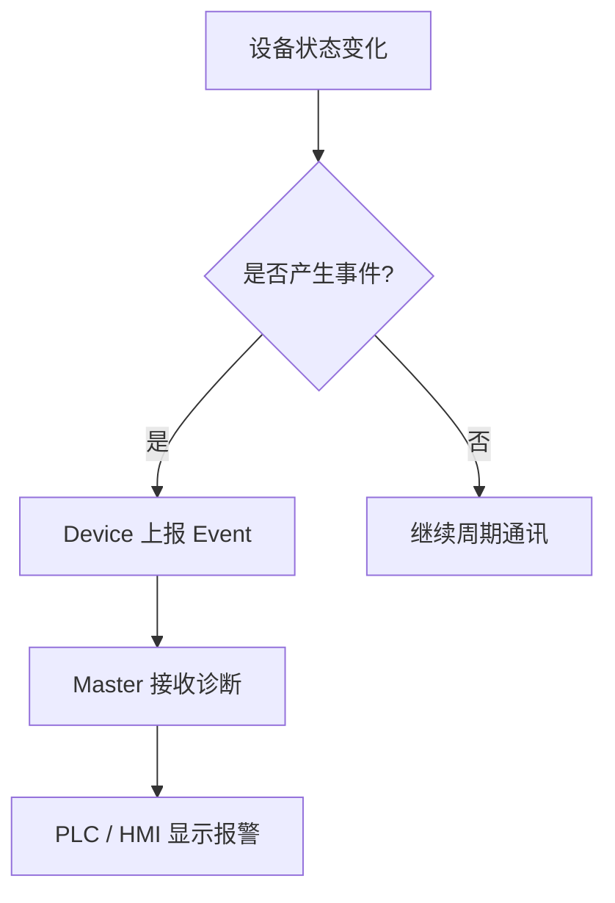
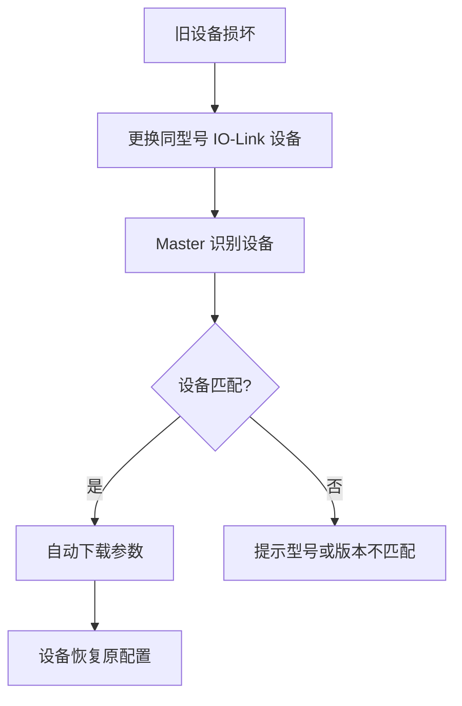
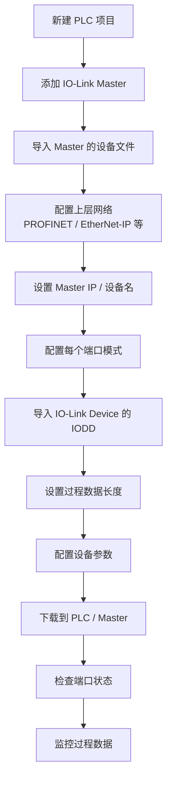
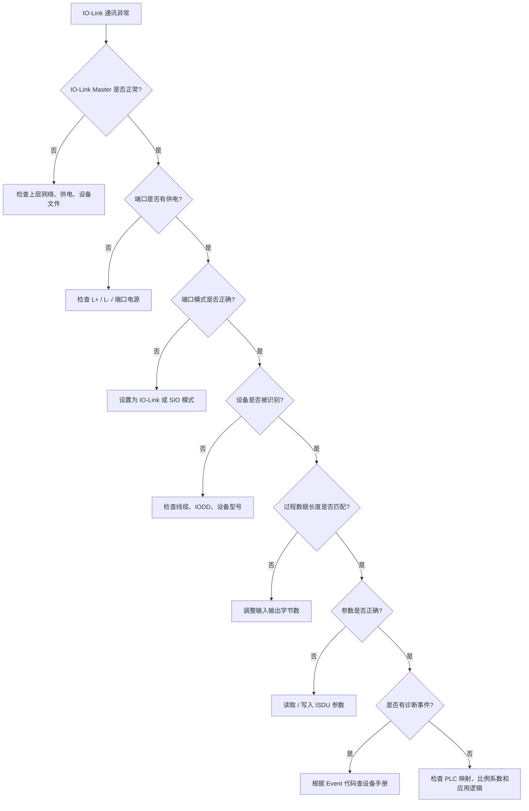
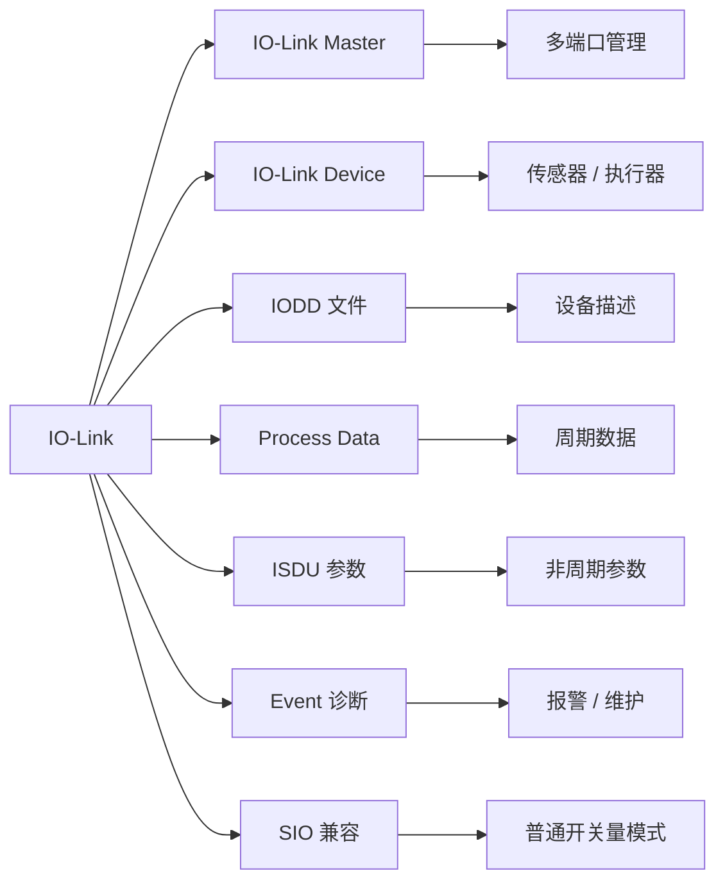

## 01｜核心概念

> [!info] 核心概念
> - **协议定位**：传感器 / 执行器级通讯技术
> - **通讯结构**：Master 与 Device 点对点连接
> - **典型设备**：接近开关、光电传感器、压力传感器、流量计、阀岛、指示灯、执行器
> - **连接方式**：每个 IO-Link 设备单独连接到 IO-Link Master 的一个端口
> - **线缆形式**：常用标准 M12 传感器线
> - **核心能力**：过程数据、参数配置、诊断报警、设备识别、远程参数化
> - **上层网络**：IO-Link Master 通常再接入 PROFINET、EtherNet/IP、EtherCAT、Modbus TCP 等工业网络

---

## 02｜IO-Link 系统结构图



> [!tip] 结构记忆
> **PLC 不直接管每个智能传感器，先接 IO-Link Master，再由 Master 管 Device。**

---

## 03｜IO-Link 与普通开关量传感器的区别

| 对比项 | 普通开关量传感器 | IO-Link 传感器 |
|---|---|---|
| 输出信号 | 0 / 1 开关信号 | 数字过程数据 |
| 参数设置 | 旋钮、按键、现场调节 | 远程参数化 |
| 诊断信息 | 基本没有 | 支持诊断和事件 |
| 设备识别 | 人工看型号 | 可读取设备信息 |
| 更换设备 | 需要重新手动设置 | 可自动写入参数 |
| 数据量 | 少 | 多 |
| 应用灵活性 | 一般 | 高 |
| 接线复杂度 | 简单 | 仍然较简单 |

> [!info] 工程理解
> 普通传感器只告诉 PLC “有没有”。  
> IO-Link 传感器还能告诉 PLC “数值是多少、状态如何、设备是谁、参数是什么”。

---

## 04｜关键参数速查表

| 参数 | 常见值 | 说明 | 易错点 |
|---|---|---|---|
| 通讯方式 | 点对点 | 一个 Master 端口连接一个 Device | 不是多点总线 |
| 线缆 | 3 芯 / 4 芯 / 5 芯 | 常见 M12 传感器线 | 不需要专用屏蔽通讯线 |
| 电源 | 24V DC | 工业现场常用 | 电源不足会导致掉线 |
| 端口类型 | Class A / Class B | 供电方式不同 | 执行器常注意 Class B |
| 传输模式 | SIO / IO-Link | 普通开关量 / 数字通讯 | 端口模式要设置正确 |
| 通讯速率 | COM1 / COM2 / COM3 | 三档速率 | 由设备能力决定 |
| 过程数据 | Process Data | 周期性数据 | 长度要与组态一致 |
| 参数数据 | ISDU | 非周期参数访问 | Index / Subindex 要查手册 |
| 设备描述 | IODD | 设备描述文件 | IODD 不匹配会识别不完整 |
| 最大线长 | 常见 20m | Master 到 Device | 过长可能不稳定 |

---

## 05｜IO-Link 网络组成

| 角色 | 英文 | 作用 | 典型设备 |
|---|---|---|---|
| 控制器 | PLC / Controller | 控制整套设备 | PLC、工控机 |
| 主站 | IO-Link Master | 管理多个 IO-Link 端口 | 远程 I/O 模块、主站模块 |
| 设备 | IO-Link Device | 传感器或执行器 | 压力传感器、光电、阀岛 |
| 设备文件 | IODD | 描述设备参数和数据 | XML 文件 |
| 工程软件 | Engineering Tool | 组态和参数化 | TIA、Studio、厂家软件 |
| 上层网络 | Fieldbus / Ethernet | Master 与 PLC 通讯 | PROFINET、EtherNet/IP 等 |

> [!tip] 记忆口诀
> **Master 管端口，Device 给数据；IODD 描设备，PLC 做控制。**

---

## 06｜IO-Link 通讯逻辑

IO-Link Master 一边通过工业以太网和 PLC 通讯，一边通过 IO-Link 端口和现场设备通讯。



> [!info] 通讯规则
> IO-Link Device 不直接接入 PLC 网络，而是通过 IO-Link Master 转换和映射数据。

---

## 07｜IO-Link 三类数据

| 数据类型 | 英文 | 通讯特点 | 典型用途 |
|---|---|---|---|
| 过程数据 | Process Data | 周期性刷新 | 测量值、开关状态、输出控制 |
| 参数数据 | Parameter Data / ISDU | 非周期访问 | 量程、阈值、滤波、输出模式 |
| 事件数据 | Event Data | 异常或状态变化触发 | 断线、短路、污染、温度过高 |

> [!tip] 快速理解
> **过程数据跑现场，参数数据改设置，事件数据报故障。**

---

## 08｜SIO 模式与 IO-Link 模式

| 模式 | 全称 | 说明 | 应用 |
|---|---|---|---|
| SIO | Standard Input Output | 普通开关量输入输出模式 | 兼容普通传感器 |
| IO-Link | IO-Link 通讯模式 | 数字通讯模式 | 智能传感器和执行器 |



> [!warning] 易错点
> IO-Link 设备接上后没数据，先检查 Master 端口是否设置为 **IO-Link 模式**，而不是普通 DI 模式。

---

## 09｜端口类型：Class A 与 Class B

| 类型 | 特点 | 典型用途 |
|---|---|---|
| Class A | 常规传感器端口，供电和信号简单 | 传感器、开关、测量设备 |
| Class B | 额外提供执行器电源 | 阀岛、执行器、负载较大的设备 |

### M12 常见引脚理解

| 引脚 | 常见定义 | 说明 |
|---|---|---|
| Pin 1 | L+ | 24V 电源 |
| Pin 3 | L- | 0V |
| Pin 4 | C/Q | IO-Link 通讯 / SIO 信号 |
| Pin 2 | DI / DO / 额外信号 | 取决于设备和端口 |
| Pin 5 | 额外电源或功能 | 取决于 Class B 或设备定义 |

> [!warning] 易错点
> Class B 端口常用于执行器供电，接线和供电能力必须看 Master 与 Device 手册。

---

## 10｜COM1 / COM2 / COM3 通讯速率

| 模式 | 速率 | 说明 |
|---|---:|---|
| COM1 | 4.8 kbps | 低速 |
| COM2 | 38.4 kbps | 中速 |
| COM3 | 230.4 kbps | 高速，常见 |

> [!info] 工程理解
> 通讯速率通常由 IO-Link Master 自动识别设备支持能力。  
> 现场调试重点不是手动设置速率，而是确认设备是否被 Master 正确识别。

---

## 11｜IODD 文件详解

IODD 是 IO-Link 设备描述文件。

> [!info] IODD 文件作用
> - 描述设备厂家、型号、版本
> - 描述过程数据结构
> - 描述参数列表
> - 描述诊断事件
> - 描述数据单位、范围、比例
> - 供工程软件识别和配置设备
> - 便于可视化参数化

---

### IODD 使用流程



> [!warning] 易错点
> 没有 IODD 文件时，设备可能仍能通讯，但参数名称、数据含义、诊断信息可能显示不完整。

---

## 12｜过程数据 Process Data

过程数据是 IO-Link 设备周期性传输的数据。

### 示例：压力传感器过程数据

| 字节 | 数据 | 含义 |
|---|---|---|
| Byte 0–1 | 压力值 | 当前压力 |
| Byte 2 | 状态位 | 超限、报警、输出状态 |
| Byte 3 | 诊断位 | 设备状态 |

```text
过程数据示例：
07 D0 01 00

解释：
07 D0 = 2000
如果比例系数 = 0.001 MPa
实际压力 = 2000 × 0.001 = 2.000 MPa
```

> [!warning] 易错点
> IO-Link 过程数据不是固定格式。  
> 每个设备的数据结构必须看 IODD 或设备手册。

---

## 13｜参数数据 ISDU

ISDU 用于非周期读写设备参数。

```text
参数访问 = Index + Subindex + 数据
```

| 项目 | 说明 |
|---|---|
| Index | 参数索引 |
| Subindex | 子索引 |
| Read | 读取参数 |
| Write | 写入参数 |
| 数据类型 | UINT、INT、String、Record 等 |

### 示例：读取设备参数

```text
读取 Index 0x0010，Subindex 0x00
返回设备参数值
```

> [!tip] 工程理解
> IO-Link 的 ISDU 类似 CANopen 的 SDO，也类似“按地址读写设备参数”。

---

## 14｜常见参数类型

| 参数 | 作用 | 示例 |
|---|---|---|
| 测量范围 | 设置量程 | 0–10 bar |
| 开关点 | 设置动作阈值 | 5.0 bar |
| 回差 | 防止频繁抖动 | 0.2 bar |
| 滤波时间 | 平滑测量值 | 100 ms |
| 输出模式 | 常开 / 常闭 | NO / NC |
| 单位设置 | 工程单位 | bar / MPa / °C |
| 设备锁定 | 防止误操作 | 参数锁 |
| 诊断阈值 | 异常报警条件 | 污染、过温、过载 |

> [!tip] 工程建议
> IO-Link 最大价值之一，就是传感器参数可以在 PLC 或工程软件中统一管理，不必现场拧旋钮。

---

## 15｜事件与诊断

IO-Link 设备可以上报事件和诊断信息。

| 事件类型 | 说明 | 示例 |
|---|---|---|
| Notification | 提示信息 | 污染程度升高 |
| Warning | 警告 | 接近量程上限 |
| Error | 错误 | 传感器故障、短路 |
| Maintenance | 维护信息 | 需要清洁、需要校准 |



> [!info] 工程理解
> IO-Link 不只是传输测量值，还能告诉你设备为什么异常。

---

## 16｜设备更换与参数自动下载

很多 IO-Link Master 支持参数存储和自动恢复。



> [!tip] 工程优势
> 设备坏了换新后，参数可自动下发，减少现场重新调试时间。

> [!warning] 易错点
> 自动参数恢复通常要求设备型号、Vendor ID、Device ID 或版本匹配，不能随便换不同型号设备。

---

## 17｜IO-Link Master 数据映射

IO-Link Master 通常把每个端口的数据映射到 PLC 的输入输出区。

### 示例：8 口 IO-Link Master

| 端口 | 设备 | 输入数据 | 输出数据 |
|---|---|---|---|
| Port 1 | 压力传感器 | 4 Byte | 0 Byte |
| Port 2 | 流量传感器 | 4 Byte | 0 Byte |
| Port 3 | 智能灯 | 2 Byte | 2 Byte |
| Port 4 | 阀岛 | 2 Byte | 2 Byte |
| Port 5 | 光电传感器 | 1 Byte | 0 Byte |
| Port 6 | 空 | 0 Byte | 0 Byte |
| Port 7 | 接近开关 | 1 Byte | 0 Byte |
| Port 8 | 温度传感器 | 4 Byte | 0 Byte |

> [!warning] 易错点
> IO-Link Master 的上层组态中，输入输出字节长度必须与实际端口配置一致，否则 PLC 侧可能数据错位或模块故障。

---

## 18｜典型应用：压力传感器

### 过程数据

| 数据 | 说明 |
|---|---|
| 当前压力值 | 实时测量值 |
| 开关输出状态 | 是否达到阈值 |
| 设备状态 | 正常、报警、故障 |
| 峰值记录 | 最大 / 最小压力 |

### 参数设置

| 参数 | 说明 |
|---|---|
| 单位 | bar / MPa / psi |
| 量程 | 0–10 bar |
| 开关点 | 目标压力阈值 |
| 回差 | 防止抖动 |
| 滤波 | 平滑压力波动 |

```text
示例：
原始值 = 2500
比例系数 = 0.001 MPa

实际压力 = 2500 × 0.001 = 2.500 MPa
```

> [!example] 应用场景
> - 气压监控
> - 液压站压力检测
> - 泄漏检测
> - 过滤器堵塞判断

---

## 19｜典型应用：光电传感器

| 数据 | 说明 |
|---|---|
| 检测状态 | 有无物体 |
| 信号强度 | 光强余量 |
| 污染程度 | 镜头污染诊断 |
| 阈值 | 动作点 |
| 工作模式 | 对射、反射、背景抑制等 |

> [!tip] 工程优势
> 普通光电只能给开关信号。  
> IO-Link 光电还能读取光强和污染状态，提前预防误检。

---

## 20｜典型应用：智能阀岛

| PLC → 阀岛 | 阀岛 → PLC |
|---|---|
| 电磁阀控制位 | 阀状态反馈 |
| 复位命令 | 短路诊断 |
| 模式设置 | 电源诊断 |
| 输出控制 | 模块状态 |


> [!warning] 易错点
> 阀岛、电磁阀、指示灯等执行器类设备，要特别注意端口供电能力和 Class B 电源接线。

---

## 21｜典型应用：智能指示灯

| 控制数据 | 说明 |
|---|---|
| 颜色 | 红、黄、绿、蓝、白 |
| 闪烁模式 | 常亮、闪烁、呼吸 |
| 蜂鸣器 | 开关、音调 |
| 亮度 | 亮度等级 |
| 段位控制 | 多段灯柱控制 |

> [!example] 应用场景
> - 设备状态显示
> - 工位报警提示
> - 生产节拍指示
> - 安灯系统 Andon

---

## 22｜IO-Link 配置流程



> [!check] 配置检查清单
> - [ ] IO-Link Master 是否被 PLC 正确识别
> - [ ] Master 的上层网络是否正常
> - [ ] 端口是否设置为 IO-Link 模式
> - [ ] Device 是否被识别
> - [ ] IODD 文件是否正确
> - [ ] 过程数据长度是否匹配
> - [ ] 参数是否下载到设备
> - [ ] 端口供电是否满足
> - [ ] PLC 输入输出地址是否正确
> - [ ] HMI 显示单位和比例是否正确

---

## 23｜IO-Link 常见指示灯

| 指示灯 | 常见含义 | 状态说明 |
|---|---|---|
| PWR | 电源 | Master 或端口供电 |
| RUN | 运行 | Master 正常运行 |
| ERR | 错误 | 模块或通讯异常 |
| BF / NS | 网络状态 | 上层网络通讯状态 |
| Port LED | 端口状态 | 每个 IO-Link 端口状态 |
| C/Q | 通讯状态 | IO-Link 或 SIO 信号 |
| DIAG | 诊断 | 设备事件或报警 |

> [!tip] 快速判断
> **Master 网络灯正常，但某个端口异常，重点查端口模式、设备线缆、电源和 IODD。**

---

## 24｜常见故障现象

| 现象 | 可能原因 | 排查方向 |
|---|---|---|
| Master 不上线 | 上层网络问题 | 查 IP、设备名、GSDML / EDS |
| 某个端口无设备 | 线缆断、端口模式错误 | 查 M12 线、端口配置 |
| 设备识别失败 | IODD 不匹配、设备型号不对 | 查 Vendor ID / Device ID |
| 过程数据不更新 | 端口未进入 IO-Link 模式 | 查端口状态 |
| 数据显示错误 | 字节序、比例、单位错误 | 查 IODD 和手册 |
| 执行器不动作 | 端口供电不足、输出数据错 | 查 Class B 电源和输出映射 |
| 参数写不进去 | 设备锁定或权限限制 | 查参数访问权限 |
| 更换设备后异常 | 型号不匹配或参数未恢复 | 查参数存储设置 |
| 偶发掉线 | 电源不稳、线缆接触不良 | 查供电、M12 接头 |
| PLC 模块故障 | 输入输出长度不一致 | 查 Master 组态和端口长度 |

---

## 25｜IO-Link 排查流程



---

> [!check] 排查清单
> - [ ] IO-Link Master 是否上电
> - [ ] 上层网络是否正常
> - [ ] Master 是否被 PLC 识别
> - [ ] 端口是否有 24V 电源
> - [ ] M12 接头是否插紧
> - [ ] 线缆是否损坏
> - [ ] 端口是否设为 IO-Link 模式
> - [ ] Device 是否支持 IO-Link
> - [ ] IODD 文件是否正确
> - [ ] 设备型号是否匹配
> - [ ] 过程数据长度是否正确
> - [ ] 输入输出方向是否正确
> - [ ] 参数是否写入成功
> - [ ] 是否有设备锁定
> - [ ] 是否有诊断事件
> - [ ] 执行器端口供电是否足够
> - [ ] PLC 地址映射是否正确
> - [ ] 单位、比例、字节序是否正确

---

## 26｜IO-Link 与普通数字量 I/O 对比

| 对比项 | 普通数字量 I/O | IO-Link |
|---|---|---|
| 数据类型 | 0 / 1 | 数值、状态、诊断 |
| 参数化 | 现场手动 | 远程自动 |
| 设备识别 | 人工 | 自动识别 |
| 诊断能力 | 弱 | 强 |
| 线缆 | 普通传感器线 | 普通传感器线 |
| 成本 | 低 | 较高 |
| 维护效率 | 一般 | 高 |
| 典型应用 | 简单开关量 | 智能传感器、执行器 |

> [!tip] 选择建议
> 简单按钮、普通限位可以用普通 DI。  
> 需要测量值、参数化、诊断和快速换型时，优先 IO-Link。

---

## 27｜IO-Link 与现场总线对比

| 对比项 | IO-Link | PROFINET / EtherNet-IP 等 |
|---|---|---|
| 定位 | 传感器 / 执行器级连接 | 控制器与远程设备网络 |
| 拓扑 | 点对点 | 星型、线型、环网等 |
| 连接对象 | 单个传感器或执行器 | 远程 I/O、驱动器、机器人 |
| 是否直接接 PLC 网络 | 通常不直接 | 是 |
| 数据量 | 小到中等 | 中到大 |
| 工程重点 | 端口、IODD、过程数据 | 设备文件、网络、I/O 映射 |
| 典型作用 | 把普通传感器变智能 | 连接自动化设备 |

> [!info] 工程理解
> IO-Link 不是用来替代 PROFINET、EtherNet/IP 的。  
> 它通常是这些工业网络下面的“最后一米智能传感器连接”。

---

## 28｜IO-Link 与 AS-i 对比

| 对比项 | IO-Link | AS-i |
|---|---|---|
| 全称 | IO-Link | Actuator Sensor Interface |
| 定位 | 智能传感器点对点通讯 | 低层传感器执行器总线 |
| 拓扑 | Master 端口点对点 | 总线型 |
| 设备连接 | 一个端口一个设备 | 一条黄线挂多个设备 |
| 数据能力 | 参数、诊断、过程数据丰富 | 偏简单 I/O |
| 线缆 | 普通传感器线 | AS-i 专用扁平电缆常见 |
| 典型优势 | 智能设备参数化 | 大量简单 I/O 布线简化 |

---

## 29｜IO-Link 与 Modbus RTU 对比

| 对比项 | IO-Link | Modbus RTU |
|---|---|---|
| 典型对象 | 智能传感器、执行器 | 仪表、变频器、传感器 |
| 物理连接 | 点对点传感器线 | RS-485 总线 |
| 组网方式 | Master 多端口 | 一主多从 |
| 数据模型 | 过程数据 + ISDU 参数 | 功能码 + 寄存器 |
| 设备描述 | IODD | 通常看手册 |
| 诊断能力 | 强 | 一般 |
| 参数化 | 方便 | 需要寄存器表 |
| 接线 | 简单 | 需总线、终端、电阻 |

> [!tip] 记忆口诀
> **IO-Link 管最后一米智能传感器，Modbus RTU 管串口设备寄存器。**

---

## 30｜工程应用建议

> [!tip] 初次调试建议
> - 先确认 IO-Link Master 已经和 PLC 正常通讯
> - 再逐个端口接入 Device
> - 每次只调一个端口，避免数据混乱
> - 端口先设为 IO-Link 模式
> - 导入正确 IODD 文件
> - 先看设备是否识别，再看过程数据
> - 先读参数，再写参数
> - 执行器设备重点检查 Class B 供电
> - HMI 显示前先确认比例系数和单位

---

> [!warning] 现场注意事项
> - IO-Link 是点对点，不是一条总线挂多个设备
> - IO-Link Master 的每个端口数据长度要配置正确
> - 普通传感器接 IO-Link 端口时可能只能工作在 SIO 模式
> - IO-Link 设备不一定能直接接普通 DI 输入读取全部数据
> - 更换设备时要确认型号和版本是否匹配
> - 执行器类设备要注意端口供电能力
> - 过程数据含义必须看 IODD 或设备手册
> - 参数自动恢复功能要提前配置，不是默认一定生效

---

## 31｜IO-Link 快速记忆图



---

## 32｜记忆口诀

> [!tip] IO-Link 口诀
> **Master 管端口，Device 给数据。**
>
> **一口接一物，点对点通讯。**
>
> **过程数据跑现场，ISDU 参数改设置。**
>
> **IODD 描设备，诊断报状态。**
>
> **SIO 兼容普通点，IO-Link 才有智能量。**
>
> **换件要省心，参数先存好。**

---

## 33｜最终速记卡

- IO-Link 是面向智能传感器和执行器的点对点数字通讯技术。
- IO-Link 不是现场总线，一般通过 IO-Link Master 接入 PROFINET、EtherNet/IP、EtherCAT 等上层网络。
- 一个 IO-Link Master 端口通常连接一个 IO-Link Device。
- IO-Link 使用普通传感器线缆，常见 M12 接头。
- IO-Link 支持两种模式：`SIO` 普通开关量模式，`IO-Link` 数字通讯模式。
- 核心数据包括：`Process Data` 过程数据、`ISDU` 参数数据、`Event` 事件诊断。
- IODD 是 IO-Link 设备描述文件，用于识别设备、解释数据、配置参数。
- Class A 常用于传感器，Class B 常用于需要额外供电的执行器。
- COM1 / COM2 / COM3 是 IO-Link 三种通讯速率。
- 常见优势：远程参数化、自动设备识别、诊断信息丰富、快速更换设备。
- 常见故障：端口模式错误、IODD 不匹配、过程数据长度错误、供电不足、线缆接触不良。
- 排查顺序：Master 上线 → 端口供电 → 端口模式 → 设备识别 → IODD → 数据长度 → 参数 → 诊断事件。