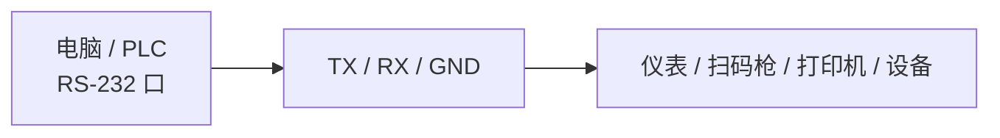
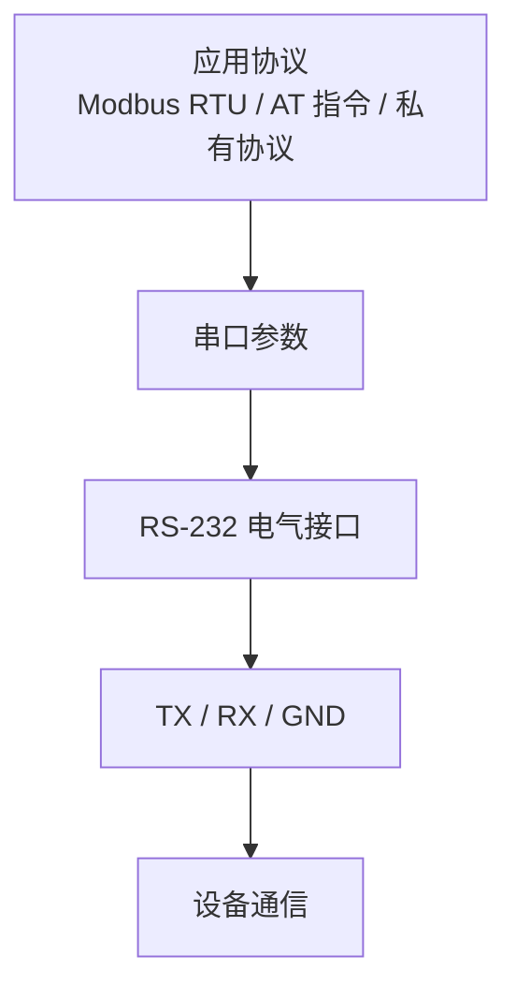
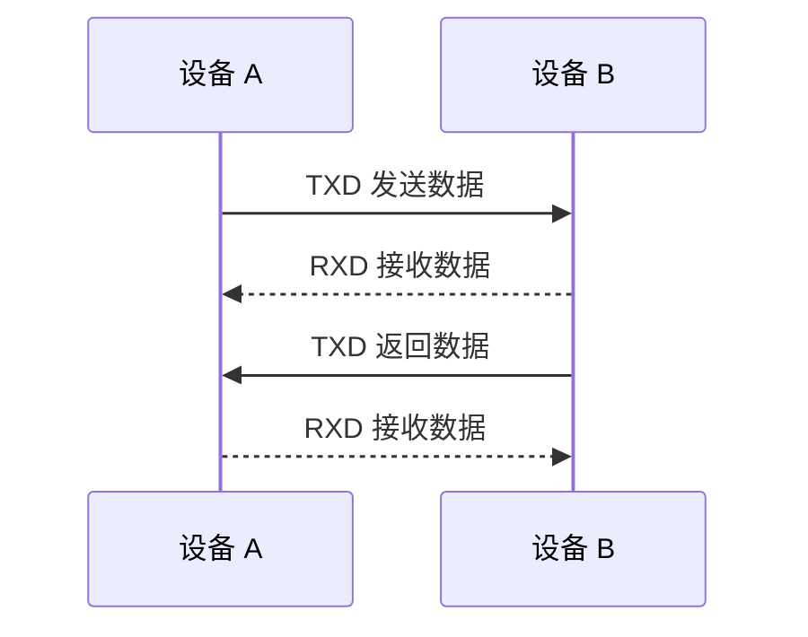
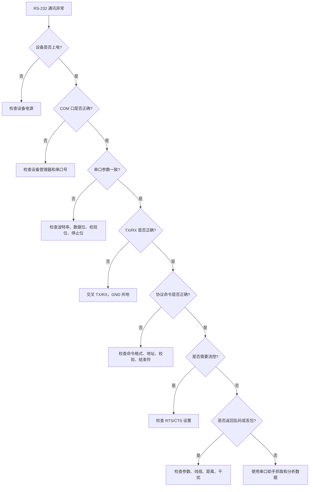
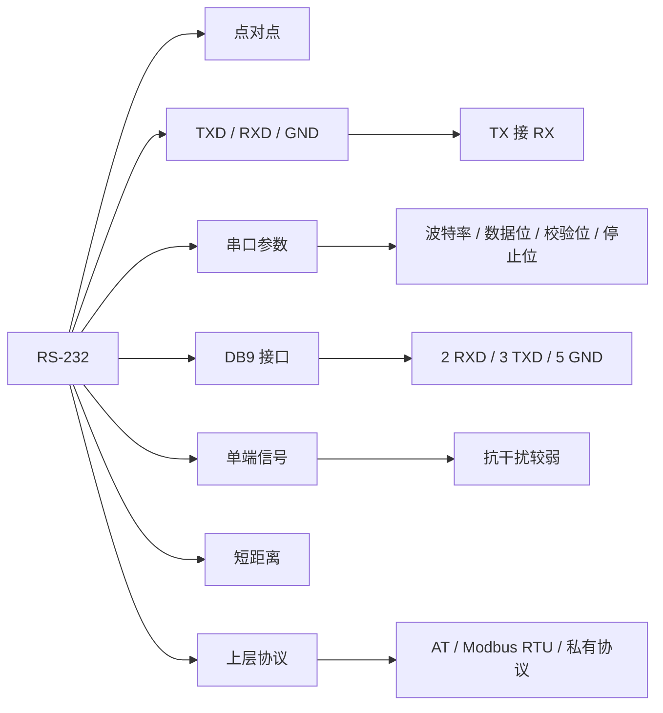

## 01｜核心概念

> [!info] 核心概念
> - **协议定位**：物理层 / 电气层接口标准
> - **通讯方式**：串行通信
> - **典型结构**：点对点通信
> - **信号方式**：单端信号
> - **常见接口**：DB9、DB25、接线端子、RJ45 串口口
> - **典型协议**：自由口协议、Modbus RTU、设备私有协议、AT 指令
> - **典型设备**：电脑、PLC、HMI、仪表、扫码枪、打印机、称重仪、老式数控设备

---

## 02｜RS-232 系统结构图



> [!tip] 结构记忆
> **RS-232 是一对一短距离串口通信，TX 发，RX 收，GND 做参考。**

---

## 03｜RS-232 与通讯协议的关系

| 层级 | 内容 | 说明 |
|---|---|---|
| 物理层 | RS-232 | 规定电气信号、电平、接口线 |
| 串口参数 | 波特率、数据位、校验位、停止位 | 决定字节如何传输 |
| 应用协议 | Modbus RTU、AT 指令、厂家协议 | 决定数据内容和含义 |
| 设备应用 | 仪表、扫码枪、PLC、打印机 | 按协议解析数据 |



> [!warning] 易错点
> 设备有 RS-232 接口，不代表它一定支持 Modbus。  
> 还要确认它使用的具体通讯协议。

---

## 04｜关键参数速查表

| 参数 | 常见值 | 说明 | 易错点 |
|---|---|---|---|
| 通讯方式 | 点对点 | 一般一台设备对一台设备 | 不适合多设备总线 |
| 信号方式 | 单端信号 | 相对 GND 判断电平 | 抗干扰弱于 RS-485 |
| 常用线 | TX / RX / GND | 最基本三线制 | TX/RX 要交叉 |
| 波特率 | 9600 / 19200 / 115200 | 通讯速度 | 双方必须一致 |
| 数据位 | 7 / 8 | 常见 8 位 | 与设备手册一致 |
| 校验位 | None / Odd / Even | 无校验 / 奇校验 / 偶校验 | 双方必须一致 |
| 停止位 | 1 / 2 | 帧结束位 | 参数不一致会乱码 |
| 接口 | DB9 / DB25 | 常见串口接头 | 引脚定义要确认 |
| 距离 | 常见 15m 以内 | 适合短距离 | 距离远建议 RS-485 |
| 电平 | ±3V 到 ±15V 常见 | 不同于 TTL | 不能直接接 MCU TTL 串口 |

---

## 05｜RS-232 信号电平

RS-232 使用正负电压表示逻辑状态，和 TTL 串口电平不同。

| 逻辑状态 | RS-232 电平 | TTL 串口电平 |
|---|---|---|
| 逻辑 1 | 负电压 | 高电平 |
| 逻辑 0 | 正电压 | 低电平 |

> [!warning] 易错点
> RS-232 不能直接接单片机的 TTL UART。  
> 必须通过 MAX232、USB 转串口模块或隔离转换器进行电平转换。

---

## 06｜TX / RX / GND 三线制

RS-232 最常见的基本接线是三根线：

| 信号 | 含义 | 说明 |
|---|---|---|
| TXD | Transmit Data | 发送数据 |
| RXD | Receive Data | 接收数据 |
| GND | Signal Ground | 信号地 |

### 两台设备互联

```text
设备 A TXD  ─────  设备 B RXD
设备 A RXD  ─────  设备 B TXD
设备 A GND  ─────  设备 B GND
```

> [!tip] 记忆口诀
> **发送接接收，接收接发送，地线要相通。**

---

## 07｜DB9 常见引脚定义

RS-232 常见 DB9 接头引脚如下：

| DB9 引脚 | 信号 | 说明 |
|---:|---|---|
| 1 | DCD | 载波检测 |
| 2 | RXD | 接收数据 |
| 3 | TXD | 发送数据 |
| 4 | DTR | 数据终端准备 |
| 5 | GND | 信号地 |
| 6 | DSR | 数据设备准备 |
| 7 | RTS | 请求发送 |
| 8 | CTS | 清除发送 |
| 9 | RI | 振铃指示 |

> [!info] 工程理解
> 大多数简单设备只用 `2、3、5` 三个脚。  
> 即：`RXD、TXD、GND`。

---

## 08｜直通线与交叉线

RS-232 接线最容易出错的是直通线和交叉线。

| 类型 | 接法 | 用途 |
|---|---|---|
| 直通线 | 2 对 2，3 对 3，5 对 5 | DTE 对 DCE 常用 |
| 交叉线 | 2 对 3，3 对 2，5 对 5 | 两个同类设备互联常用 |
| Null Modem 线 | 交叉 TX/RX，可能交叉握手线 | 电脑对电脑、PLC 对电脑 |

```text
交叉线：
DB9-2  ─────  DB9-3
DB9-3  ─────  DB9-2
DB9-5  ─────  DB9-5
```

> [!warning] 易错点
> 串口不通时，除了参数错误，最常见就是 **TX/RX 没有交叉**。

---

## 09｜DTE 与 DCE

RS-232 中常见两个角色：DTE 和 DCE。

| 类型 | 中文理解 | 典型设备 |
|---|---|---|
| DTE | 数据终端设备 | 电脑、PLC、终端 |
| DCE | 数据通信设备 | 调制解调器、部分仪表 |

> [!info] 工程理解
> 传统 RS-232 设计中，DTE 与 DCE 用直通线连接。  
> 但现场很多设备定义不同，所以最终要以设备手册为准。

---

## 10｜硬件流控 RTS / CTS

RS-232 除了 TX/RX/GND，还可以使用硬件流控线。

| 信号 | 含义 | 作用 |
|---|---|---|
| RTS | Request To Send | 请求发送 |
| CTS | Clear To Send | 允许发送 |
| DTR | Data Terminal Ready | 终端准备好 |
| DSR | Data Set Ready | 设备准备好 |
| DCD | Data Carrier Detect | 载波检测 |
| RI | Ring Indicator | 振铃提示 |

> [!tip] 工程建议
> 大多数工业仪表和简单串口设备不需要硬件流控。  
> 如果设备要求 RTS/CTS，串口助手和 PLC 通讯设置中必须开启对应流控。

---

## 11｜串口参数详解

串口通信常写成类似：

```text
9600, 8, N, 1
```

| 字段 | 含义 | 示例 |
|---|---|---|
| 9600 | 波特率 | 每秒传输位数 |
| 8 | 数据位 | 8 位数据 |
| N | 校验位 | None，无校验 |
| 1 | 停止位 | 1 位停止位 |

> [!tip] 快速记忆
> **波特率、数据位、校验位、停止位，四个参数必须双方一致。**

---

## 12｜异步串口帧格式

RS-232 常用异步串口传输。

```text
起始位 + 数据位 + 校验位 + 停止位
```

```text
空闲状态 → 起始位 → D0 D1 D2 D3 D4 D5 D6 D7 → 校验位 → 停止位
```

| 字段 | 说明 |
|---|---|
| 起始位 | 表示一个字符开始 |
| 数据位 | 实际数据 |
| 校验位 | 可选，用于简单错误检测 |
| 停止位 | 表示字符结束 |
| 空闲状态 | 线路保持空闲电平 |

> [!warning] 易错点
> 参数不同会导致乱码。  
> 例如一边 `9600 8N1`，另一边 `9600 7E1`，通常无法正常解析。

---

## 13｜RS-232 通讯流程



> [!info] 通讯规则
> RS-232 是全双工物理连接，理论上 TX 和 RX 可以同时工作。  
> 但具体是否请求-响应，要看上层协议。

---

## 14｜RS-232 与 Modbus RTU

Modbus RTU 可以运行在 RS-232 上，也可以运行在 RS-485 上。

| 对比项 | RS-232 | Modbus RTU |
|---|---|---|
| 类型 | 物理接口标准 | 通讯协议 |
| 规定内容 | 电平、引脚、传输方式 | 地址、功能码、数据区、CRC |
| 是否有寄存器 | 没有 | 有 |
| 是否有功能码 | 没有 | 有 |
| 是否有 CRC | 没有 | 有 |
| 典型作用 | 负责传输字节 | 规定字节含义 |

> [!tip] 记忆口诀
> **RS-232 管线，Modbus RTU 管话。**

---

## 15｜典型 Modbus RTU over RS-232 示例

### 请求报文

读取从站 `01` 的保持寄存器 `0000`，读取 1 个寄存器。

```text
01 03 00 00 00 01 84 0A
```

| 字节 | 含义 |
|---|---|
| `01` | 从站地址 |
| `03` | 功能码，读保持寄存器 |
| `00 00` | 起始地址 |
| `00 01` | 读取数量 |
| `84 0A` | CRC 校验 |

> [!info] 工程理解
> RS-232 只是把这串字节发送出去。  
> Modbus RTU 才决定这串字节的具体含义。

---

## 16｜典型应用：电脑调试仪表


### 调试步骤

> [!check] 调试流程
> - [ ] 安装 USB 转 RS-232 驱动
> - [ ] 确认 COM 口号
> - [ ] 设置波特率、数据位、校验位、停止位
> - [ ] 确认 TX/RX/GND 接线
> - [ ] 使用串口助手发送测试命令
> - [ ] 查看设备是否返回数据
> - [ ] 根据协议解析返回内容

---

## 17｜典型应用：扫码枪 RS-232

| 数据 | 说明 |
|---|---|
| 条码内容 | 扫码结果 |
| 结束符 | CR、LF、CRLF 常见 |
| 触发方式 | 手动触发、命令触发 |
| 输出格式 | ASCII 字符串 |
| 参数设置 | 扫配置码或串口命令 |

### 示例输出

```text
ABC123456\r\n
```

> [!warning] 易错点
> 扫码枪经常带结束符。  
> PLC 或上位机解析时要处理 `CR`、`LF` 或 `CRLF`。

---

## 18｜典型应用：AT 指令设备

很多模块使用 RS-232 或 TTL 串口传输 AT 指令。

### 示例

```text
发送：
AT\r\n

返回：
OK\r\n
```

| 指令 | 作用 |
|---|---|
| `AT` | 测试通信 |
| `AT+...` | 设置或查询参数 |
| `OK` | 执行成功 |
| `ERROR` | 执行失败 |

> [!tip] 工程建议
> AT 指令类设备要特别注意命令结束符，常见是 `\r\n`。

---

## 19｜RS-232 转换器

| 转换类型 | 用途 |
|---|---|
| USB 转 RS-232 | 电脑调试串口设备 |
| RS-232 转 RS-485 | 与 RS-485 总线设备通信 |
| Ethernet 转 RS-232 | 通过网络访问串口设备 |
| TTL 转 RS-232 | 单片机 UART 与 RS-232 设备连接 |
| 隔离型 RS-232 | 强干扰或地电位差环境 |

> [!warning] 易错点
> USB 转串口分为 USB-RS232、USB-RS485、USB-TTL。  
> 三者电气接口不同，不能随便混用。

---

## 20｜RS-232 与 TTL 串口区别

| 对比项 | RS-232 | TTL UART |
|---|---|---|
| 电平 | 正负电压 | 0–3.3V 或 0–5V |
| 逻辑关系 | 逻辑反相 | 常规 TTL 逻辑 |
| 距离 | 较短 | 板级短距离 |
| 接口设备 | 电脑串口、仪表 | 单片机、模块 |
| 是否能直连 | 不能直接接 TTL | 不能直接接 RS-232 |
| 转换芯片 | MAX232 等 | USB-TTL 模块 |

> [!warning] 重要提醒
> 把 RS-232 直接接到 MCU UART 引脚，可能损坏单片机。

---

## 21｜RS-232 与 RS-485 对比

| 对比项 | RS-232 | RS-485 |
|---|---|---|
| 通讯方式 | 点对点 | 多点总线 |
| 信号方式 | 单端信号 | 差分信号 |
| 抗干扰能力 | 较弱 | 强 |
| 通讯距离 | 短 | 长 |
| 节点数量 | 一对一 | 一主多从常见 |
| 常用线 | TX / RX / GND | A / B |
| 典型应用 | 调试口、扫码枪、打印机 | 仪表、变频器、远程设备 |
| 常见协议 | 私有协议、AT、Modbus RTU | Modbus RTU、私有协议 |

> [!tip] 记忆口诀
> **RS-232 适合近距离一对一，RS-485 适合远距离多设备。**

---

## 22｜RS-232 与 USB 对比

| 对比项 | RS-232 | USB |
|---|---|---|
| 通讯定位 | 串行接口标准 | 通用高速总线 |
| 拓扑 | 点对点 | 主机控制多个设备 |
| 工业现场 | 老设备常见 | 电脑外设常见 |
| 线缆距离 | 较短 | 更短，常见 5m 以内 |
| 协议复杂度 | 简单 | 较复杂 |
| 调试方式 | 串口助手 | 需要驱动或虚拟串口 |
| 典型用途 | 仪表、PLC 调试口 | 电脑、下载线、USB 转串口 |

---

## 23｜常见故障现象

| 现象 | 可能原因 | 排查方向 |
|---|---|---|
| 完全无响应 | TX/RX 未交叉、COM 口错、参数错 | 查接线、COM 口、波特率 |
| 返回乱码 | 波特率、数据位、校验位不一致 | 查串口参数 |
| 只能发不能收 | RX 线错误或设备未返回 | 查 RXD 和协议 |
| 只能收不能发 | TX 线错误或设备不识别命令 | 查 TXD 和命令格式 |
| 串口打不开 | COM 口被占用 | 关闭其他软件 |
| 偶尔丢数据 | 流控、缓冲区、线缆干扰 | 查 RTS/CTS、程序读取 |
| 设备无反应 | 缺少结束符 | 查 CR / LF |
| 通讯距离长不稳定 | 单端信号抗干扰弱 | 缩短距离或转 RS-485 |
| 接上后设备异常 | 电平不匹配 | 查是否误接 TTL / RS-232 |

---

## 24｜RS-232 排查流程



---

> [!check] 排查清单
> - [ ] 设备是否上电
> - [ ] USB 转串口驱动是否正常
> - [ ] COM 口号是否正确
> - [ ] COM 口是否被其他软件占用
> - [ ] 波特率是否一致
> - [ ] 数据位是否一致
> - [ ] 校验位是否一致
> - [ ] 停止位是否一致
> - [ ] TXD 是否接对方 RXD
> - [ ] RXD 是否接对方 TXD
> - [ ] GND 是否连接
> - [ ] 是否需要 RTS / CTS 流控
> - [ ] 命令是否需要 CR / LF 结束符
> - [ ] 协议地址是否正确
> - [ ] 校验码是否正确
> - [ ] 设备是否处于正确通讯模式
> - [ ] 是否误把 TTL 串口当 RS-232
> - [ ] 线缆距离是否过长
> - [ ] 现场是否有强干扰

---

## 25｜常用调试工具

| 工具 | 作用 |
|---|---|
| 串口助手 | 发送和接收串口数据 |
| USB-RS232 转换器 | 电脑连接 RS-232 设备 |
| 万用表 | 检查线缆和 GND |
| 逻辑分析仪 | 分析 TTL UART，不适合直接接 RS-232 |
| 示波器 | 查看 TX/RX 波形 |
| DB9 转接端子 | 方便接线测试 |
| 串口监控软件 | 查看软件与设备之间的数据 |
| 协议手册 | 解析命令和返回数据 |

> [!tip] 调试顺序
> **先确认 COM 口，再确认参数，再确认接线，再确认协议。**

---

## 26｜串口助手设置重点

| 设置项 | 建议 |
|---|---|
| COM 口 | 选择实际识别到的端口 |
| 波特率 | 按设备手册 |
| 数据位 | 常用 8 |
| 校验位 | None / Odd / Even |
| 停止位 | 常用 1 |
| 显示模式 | ASCII 或 HEX |
| 发送模式 | ASCII 或 HEX |
| 结束符 | CR / LF / CRLF |
| 流控 | None / RTS-CTS |

> [!warning] 易错点
> ASCII 发送和 HEX 发送不是一回事。  
> 发送 `01` 的 ASCII，是两个字符 `0x30 0x31`；发送 HEX `01`，才是一个字节 `0x01`。

---

## 27｜ASCII 与 HEX 发送区别

### ASCII 发送

```text
发送内容：
01

实际字节：
30 31
```

### HEX 发送

```text
发送内容：
01

实际字节：
01
```

| 模式 | 适合场景 |
|---|---|
| ASCII | AT 指令、扫码枪文本、打印机命令 |
| HEX | Modbus RTU、二进制协议、设备私有帧 |

> [!tip] 记忆口诀
> **文本命令用 ASCII，二进制报文用 HEX。**

---

## 28｜工程应用建议

> [!tip] 初次调试建议
> - 先用电脑串口助手测试设备
> - 确认设备手册中的默认串口参数
> - 先短线连接，排除线缆问题
> - TX/RX 不通时尝试交叉
> - GND 必须连接
> - 先发送最简单查询命令
> - ASCII 协议注意 CR / LF
> - Modbus RTU 协议注意 HEX 模式和 CRC
> - 长距离或强干扰场景改用 RS-485

---

> [!warning] 现场注意事项
> - RS-232 距离短，不适合长距离现场布线
> - 单端信号抗干扰弱，强干扰现场慎用
> - 不要把 RS-232 直接接 TTL 串口
> - DB9 引脚定义要看设备手册
> - TX/RX 接反是最常见故障
> - COM 口被占用会导致软件打不开串口
> - 串口参数错误会出现乱码
> - 协议命令缺少结束符会导致设备不响应

---

## 29｜RS-232 快速记忆图



---

## 30｜记忆口诀

> [!tip] RS-232 口诀
> **TX 接 RX，RX 接 TX，GND 要共地。**
>
> **波特率要同，校验位要同，停止位也要同。**
>
> **近距离一对一，远距离用 485。**
>
> **ASCII 看字符，HEX 看字节。**
>
> **RS-232 是电平接口，不是通信协议。**
>
> **不通先查线，乱码先查参。**

---

## 31｜最终速记卡

- RS-232 是常见点对点串行通信接口标准。
- RS-232 本身不是协议，不规定寄存器、功能码或命令格式。
- 最基本三根线：`TXD`、`RXD`、`GND`。
- 两个设备互联时，通常 `TXD 接 RXD`，`RXD 接 TXD`。
- DB9 常用引脚：`2 = RXD`，`3 = TXD`，`5 = GND`。
- 串口参数必须一致：波特率、数据位、校验位、停止位。
- RS-232 是单端信号，适合短距离通信，抗干扰能力弱于 RS-485。
- RS-232 电平不同于 TTL UART，不能直接连接单片机串口。
- ASCII 协议常见于 AT 指令、扫码枪、打印机。
- HEX 报文常见于 Modbus RTU 和二进制私有协议。
- 常见故障：TX/RX 未交叉、COM 口错误、参数不一致、缺少结束符、COM 口被占用。
- 排查顺序：电源 → COM 口 → 串口参数 → TX/RX/GND → 结束符 → 协议命令 → 流控 → 干扰。